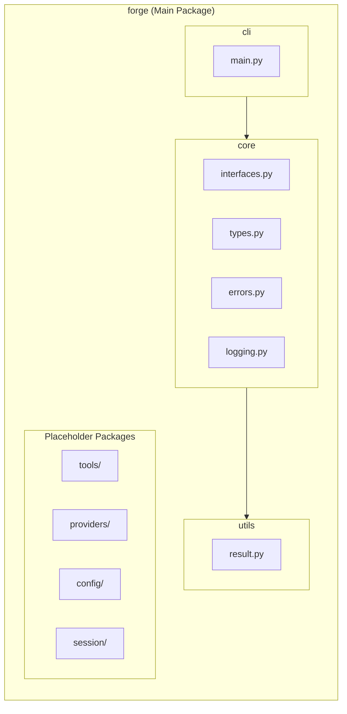
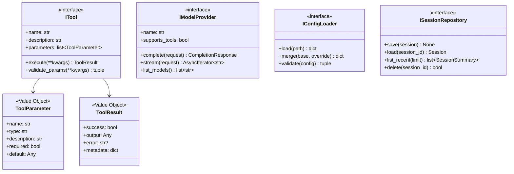
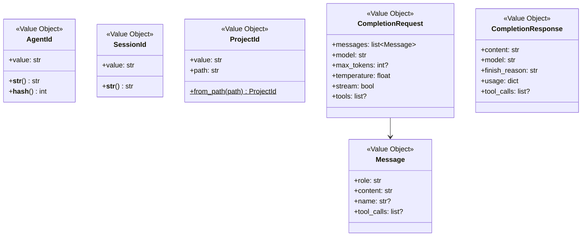
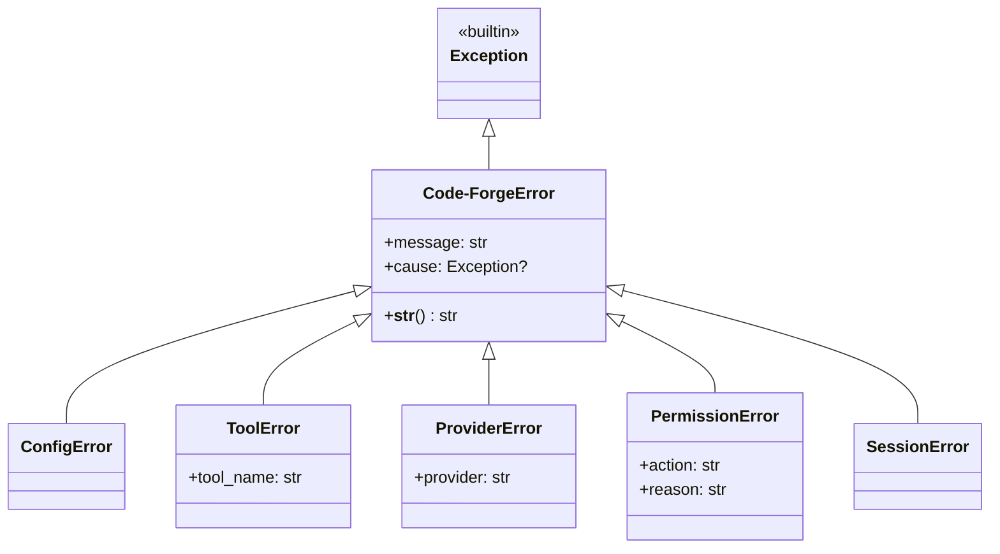
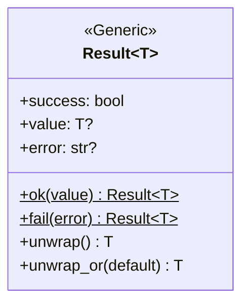
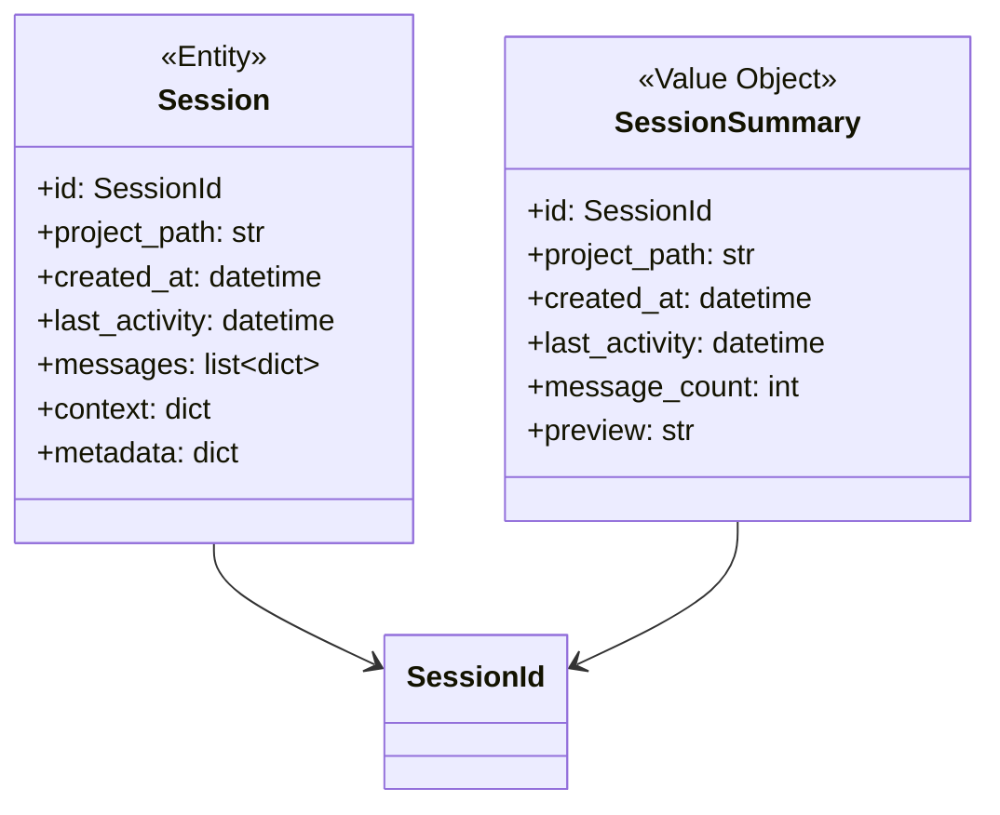
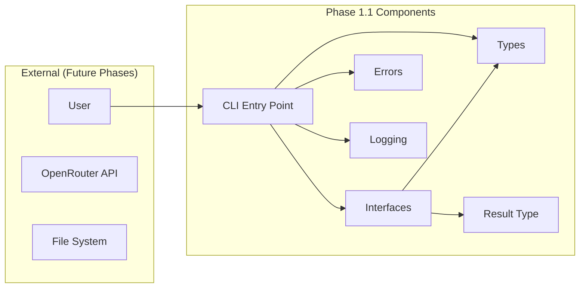
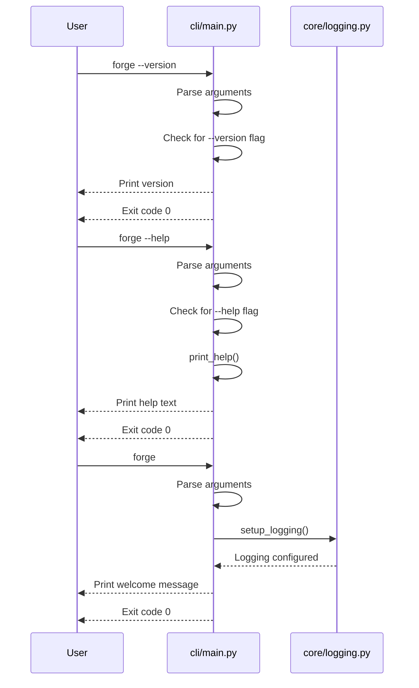
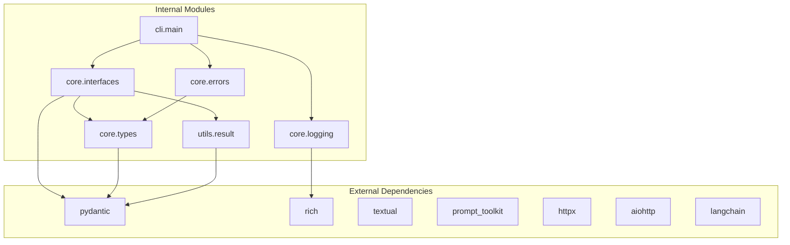

# Phase 1.1: Project Foundation - UML Diagrams

**Phase:** 1.1
**Name:** Project Foundation
**Scope:** Core interfaces, types, and project structure

---

## 1. Package Diagram



---

## 2. Class Diagram - Core Interfaces



---

## 3. Class Diagram - Value Objects



---

## 4. Class Diagram - Exception Hierarchy



---

## 5. Class Diagram - Result Type



---

## 6. Class Diagram - Session Entities



---

## 7. Component Diagram



---

## 8. Sequence Diagram - CLI Startup



---

## 9. Dependency Diagram



---

## 10. File Structure Diagram

```
src/forge/
│
├── __init__.py           # __version__ = "0.1.0"
├── __main__.py           # from cli.main import main; main()
│
├── cli/
│   ├── __init__.py
│   └── main.py           # main(), print_help()
│
├── core/
│   ├── __init__.py       # Export all public symbols
│   ├── interfaces.py     # ITool, IModelProvider, IConfigLoader, ISessionRepository
│   ├── types.py          # AgentId, SessionId, ProjectId, Message, etc.
│   ├── errors.py         # Code-ForgeError hierarchy
│   └── logging.py        # setup_logging(), get_logger()
│
├── utils/
│   ├── __init__.py
│   └── result.py         # Result[T]
│
├── tools/
│   └── __init__.py       # Empty placeholder
│
├── providers/
│   └── __init__.py       # Empty placeholder
│
├── config/
│   └── __init__.py       # Empty placeholder
│
└── session/
    └── __init__.py       # Empty placeholder
```

---

## Notes

This phase creates only interfaces and types - no implementations except:
1. CLI entry point (minimal --version, --help)
2. Logging setup
3. Result type utility

All boxes marked as interfaces (`<<interface>>`) will have concrete implementations in future phases.
