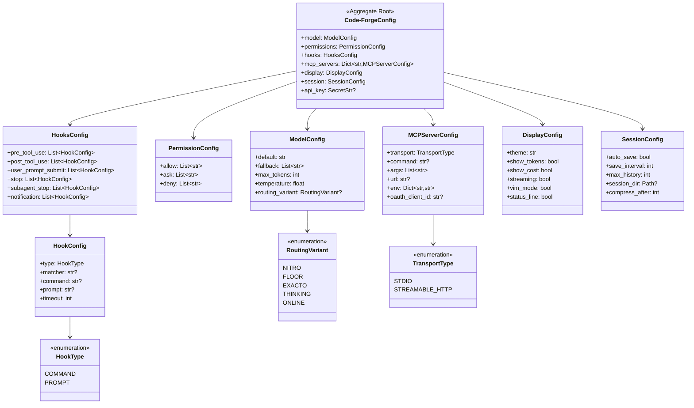
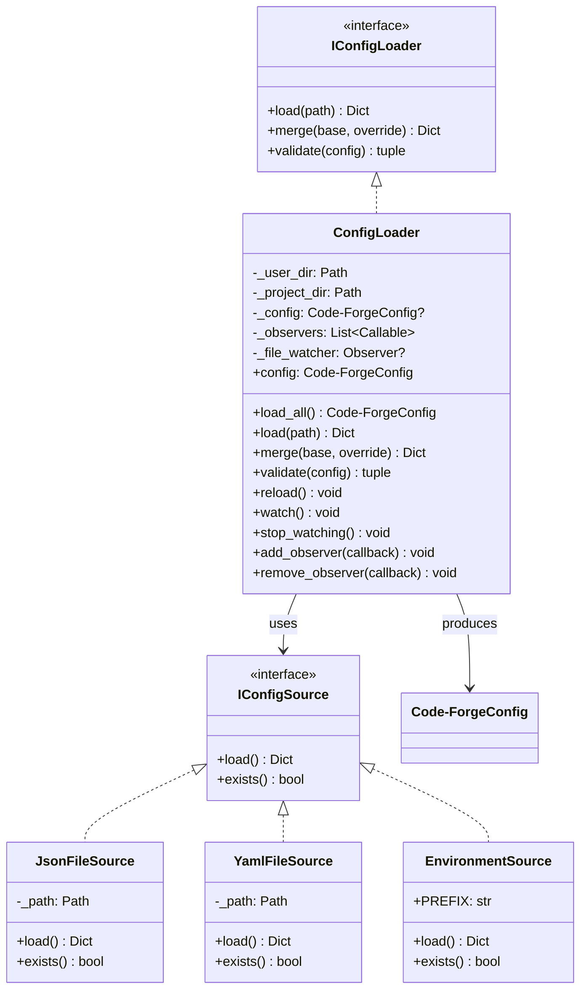
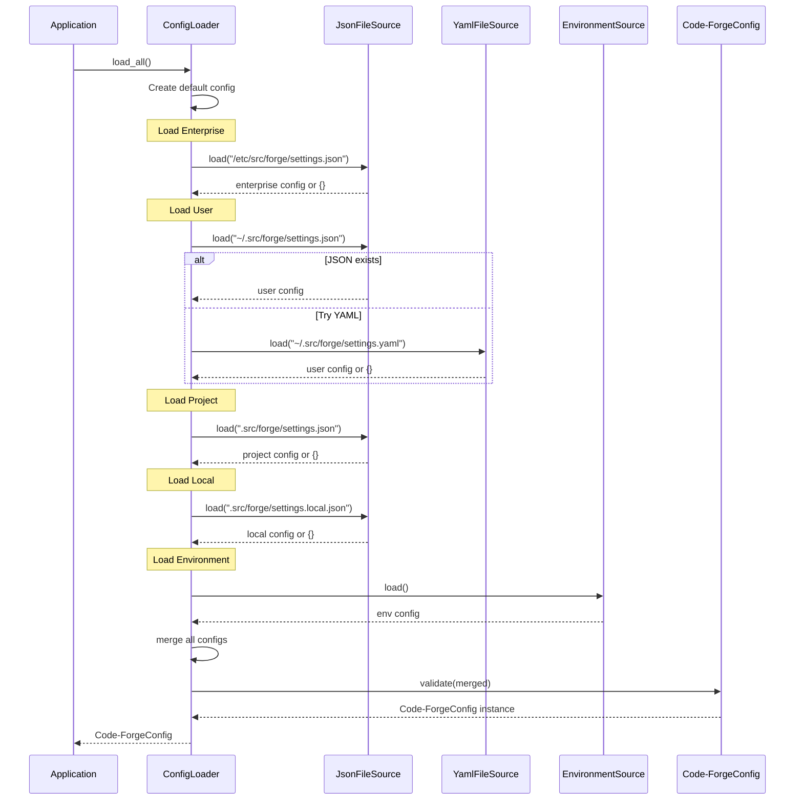
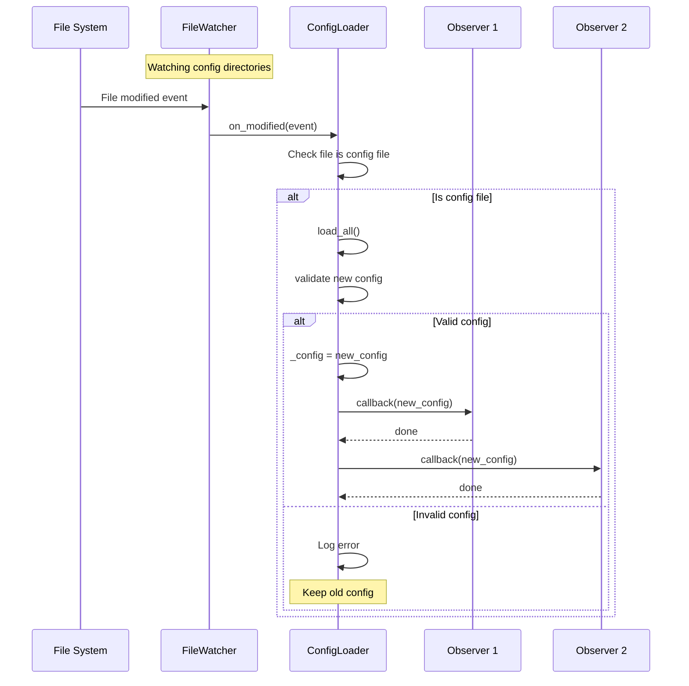
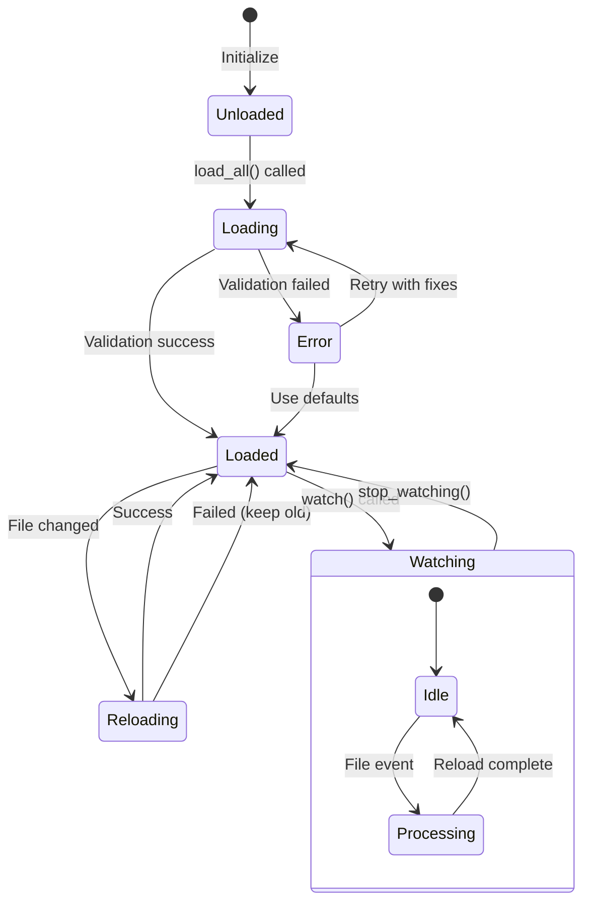
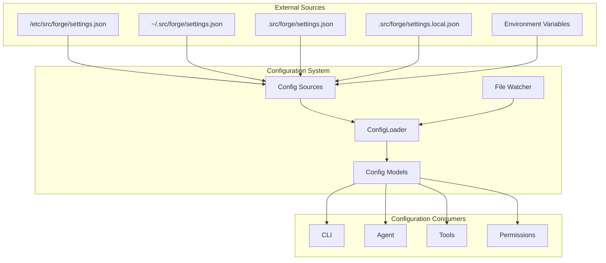
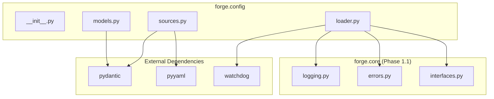

# Phase 1.2: Configuration System - UML Diagrams

**Phase:** 1.2
**Name:** Configuration System
**Dependencies:** Phase 1.1

---

## 1. Class Diagram - Configuration Models



---

## 2. Class Diagram - Configuration Loading



---

## 3. Sequence Diagram - Configuration Loading



---

## 4. Sequence Diagram - Live Reload



---

## 5. State Diagram - Configuration State



---

## 6. Component Diagram



---

## 7. Activity Diagram - Merge Algorithm

```mermaid
flowchart TD
    START([Start Merge]) --> INPUT[/base, override/]
    INPUT --> COPY[result = copy of base]

    COPY --> LOOP{For each key in override}

    LOOP -->|Has key| CHECK{Key exists in result?}
    LOOP -->|Done| RETURN[/Return result/]

    CHECK -->|Yes| BOTH_DICT{Both values are dicts?}
    CHECK -->|No| SET[result[key] = override[key]]

    BOTH_DICT -->|Yes| RECURSE[result[key] = merge recursive]
    BOTH_DICT -->|No| OVERRIDE[result[key] = override[key]]

    SET --> LOOP
    RECURSE --> LOOP
    OVERRIDE --> LOOP

    RETURN --> END([End])
```

---

## 8. Package Diagram



---

## 9. File Hierarchy Diagram

```
Configuration Loading Order (Priority: Low → High)
═══════════════════════════════════════════════════

┌─────────────────────────────────────────────────┐
│  6. Environment Variables (FORGE_*)          │ ← Highest Priority
├─────────────────────────────────────────────────┤
│  5. Local Overrides                             │
│     .src/forge/settings.local.json               │
├─────────────────────────────────────────────────┤
│  4. Project Settings                            │
│     .src/forge/settings.json                     │
├─────────────────────────────────────────────────┤
│  3. User Settings                               │
│     ~/.src/forge/settings.json                   │
├─────────────────────────────────────────────────┤
│  2. Enterprise Settings                         │
│     /etc/src/forge/settings.json                 │
├─────────────────────────────────────────────────┤
│  1. Default Values (in code)                    │ ← Lowest Priority
└─────────────────────────────────────────────────┘
```

---

## Notes

- Configuration models use Pydantic v2 for validation
- `SecretStr` is used for API keys to prevent logging
- File watcher uses `watchdog` library
- Deep merge preserves nested structures
- Invalid configuration logs error but uses fallback
