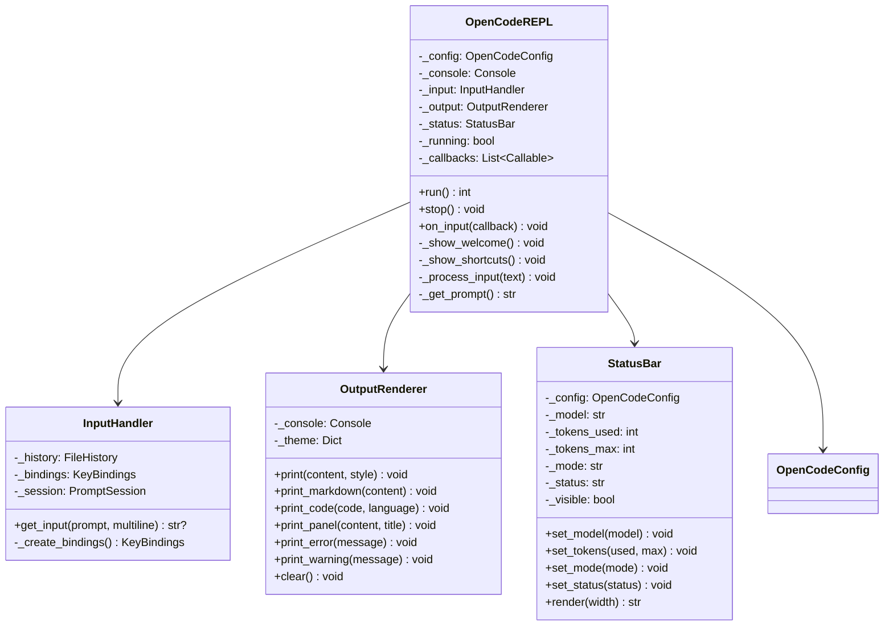
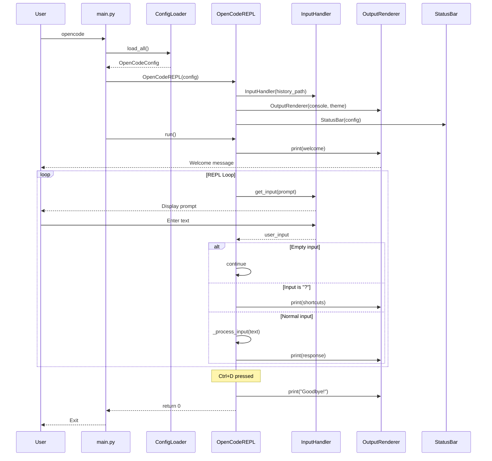
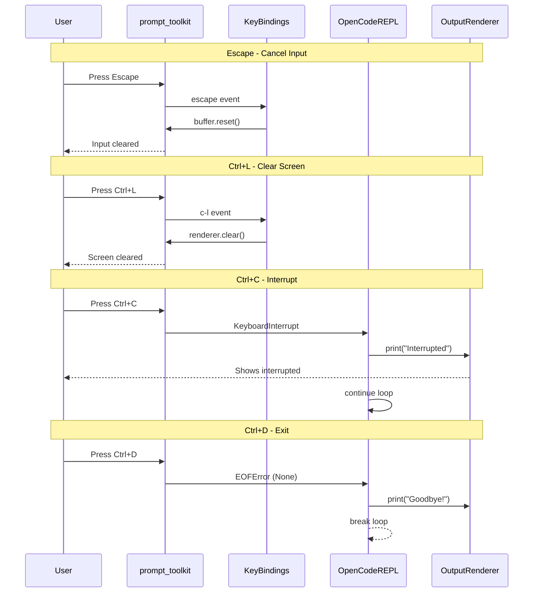
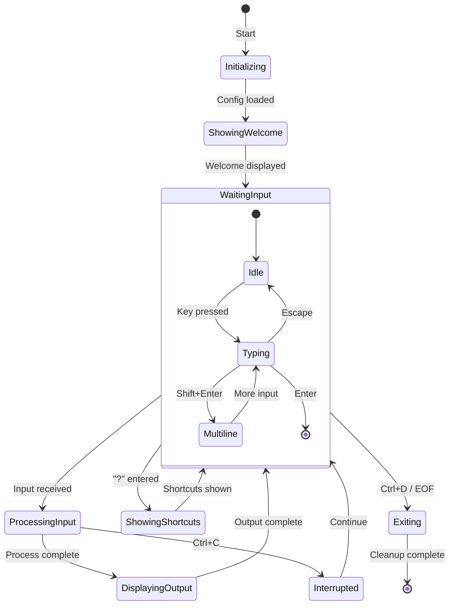
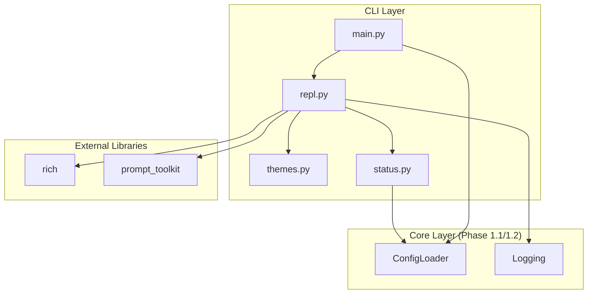
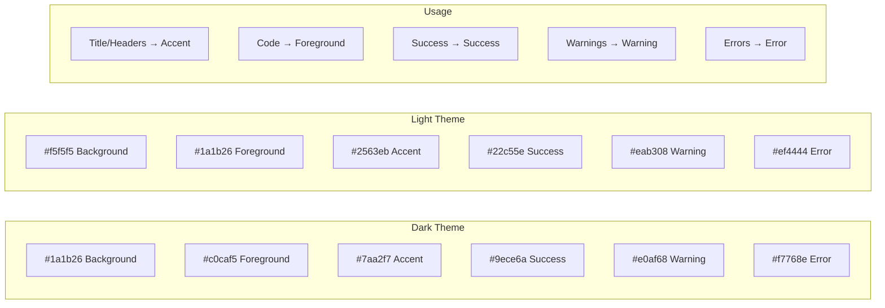
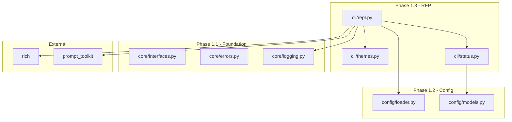

# Phase 1.3: Basic REPL Shell - UML Diagrams

**Phase:** 1.3
**Name:** Basic REPL Shell
**Dependencies:** Phase 1.1, Phase 1.2

---

## 1. Class Diagram - REPL Components



---

## 2. Sequence Diagram - REPL Startup



---

## 3. Sequence Diagram - Keyboard Shortcuts



---

## 4. State Diagram - REPL State



---

## 5. Component Diagram



---

## 6. Activity Diagram - Input Processing

```mermaid
flowchart TD
    START([Start REPL]) --> WELCOME[Show Welcome]
    WELCOME --> PROMPT[Display Prompt]

    PROMPT --> INPUT{Wait for Input}

    INPUT -->|Text entered| CHECK_EMPTY{Is empty?}
    INPUT -->|Ctrl+D| EXIT[Show Goodbye]
    INPUT -->|Ctrl+C| INTERRUPT[Show Interrupted]

    CHECK_EMPTY -->|Yes| PROMPT
    CHECK_EMPTY -->|No| CHECK_HELP{Is "?"?}

    CHECK_HELP -->|Yes| SHORTCUTS[Show Shortcuts]
    CHECK_HELP -->|No| PROCESS[Process Input]

    SHORTCUTS --> PROMPT
    PROCESS --> OUTPUT[Display Output]
    OUTPUT --> PROMPT

    INTERRUPT --> PROMPT

    EXIT --> END([Exit with 0])
```

---

## 7. Status Bar Layout

```
┌─────────────────────────────────────────────────────────────────────┐
│                         Terminal Width                              │
├─────────────────────────────────────────────────────────────────────┤
│ [Model]          [Tokens: used/max]          [Mode] | [Status]      │
│ ◀─ Left ─▶       ◀──── Center ────▶         ◀────── Right ──────▶  │
└─────────────────────────────────────────────────────────────────────┘

Example (80 columns):
┌──────────────────────────────────────────────────────────────────────────────┐
│ gpt-5                    Tokens: 1,234/128,000                Normal | Ready │
└──────────────────────────────────────────────────────────────────────────────┘
```

---

## 8. Theme Color Mapping



---

## 9. Package Dependencies



---

## Notes

- Phase 1.3 creates the UI shell without AI integration
- Callbacks system allows future phases to plug in processing
- Status bar is prepared but token values are placeholders
- Theme system supports future customization
