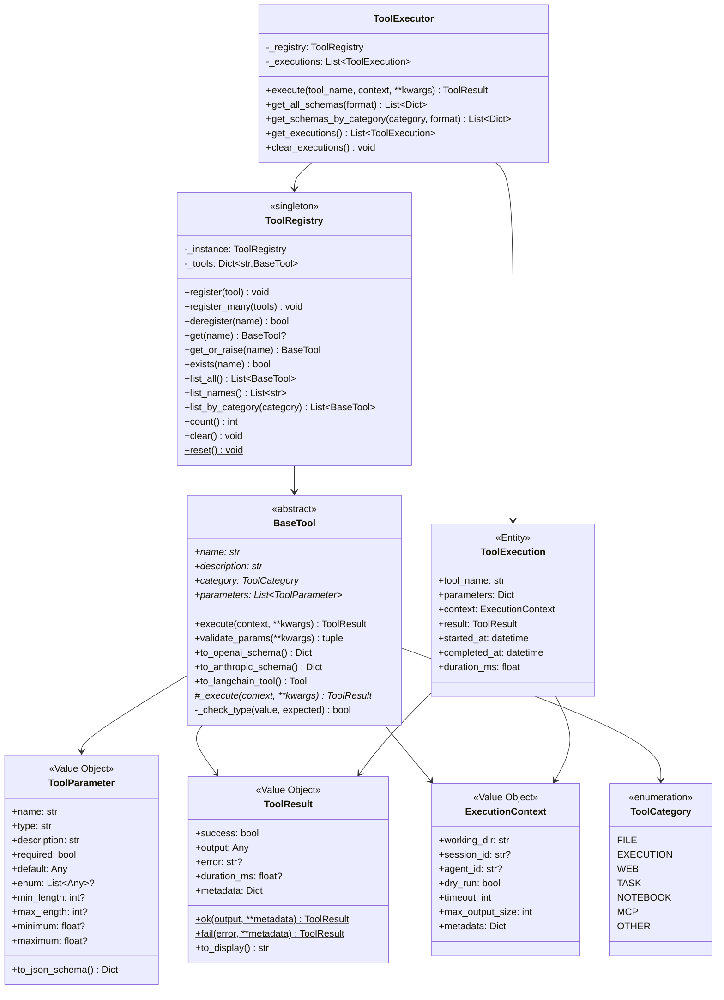
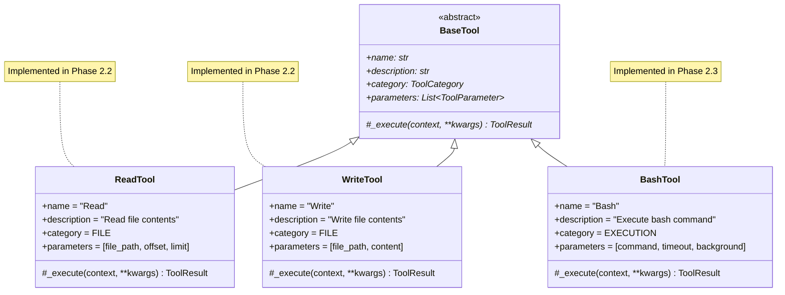
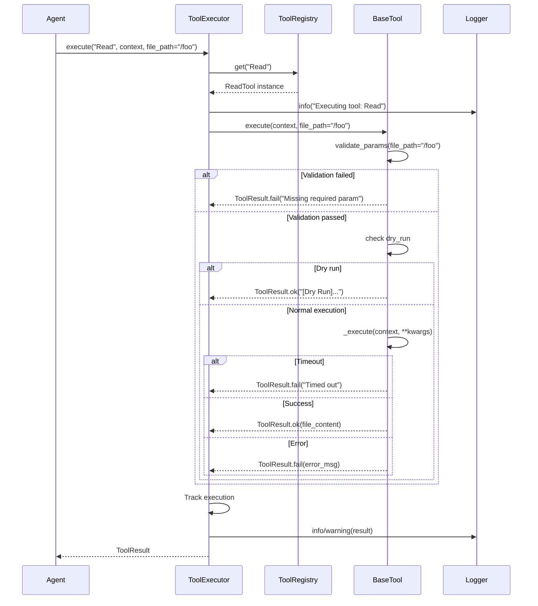
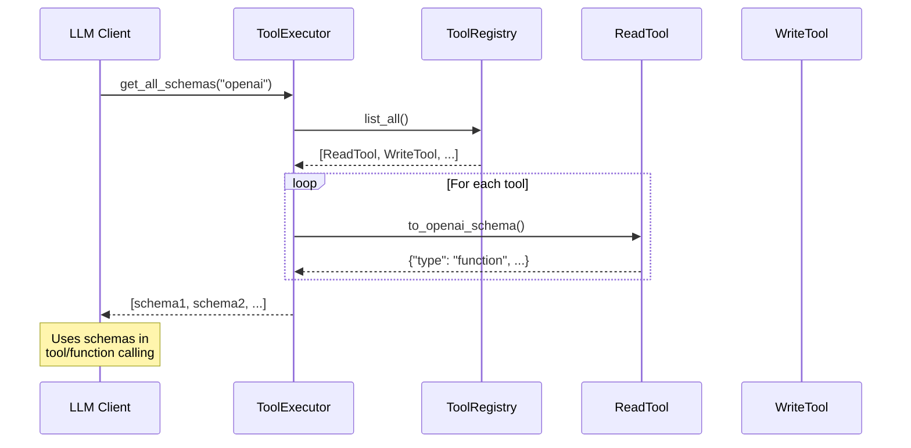
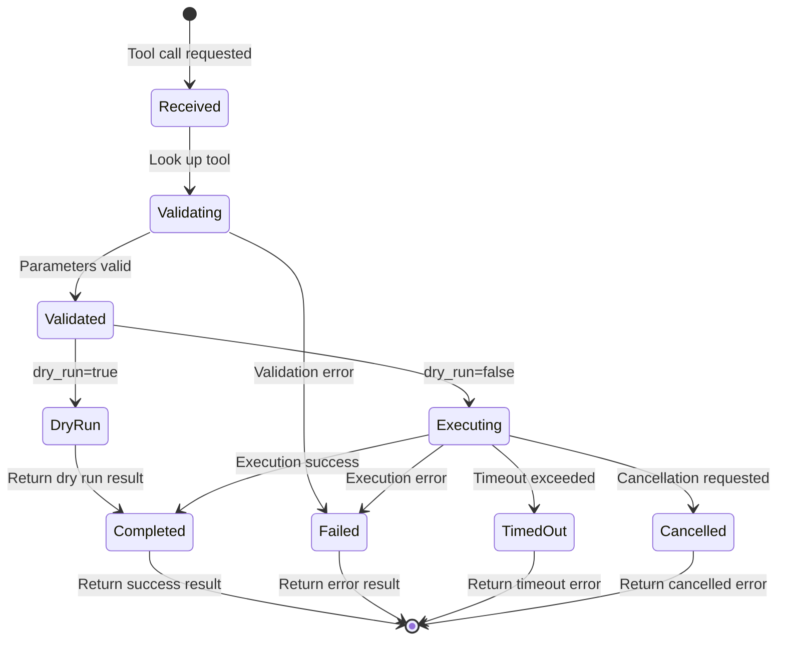
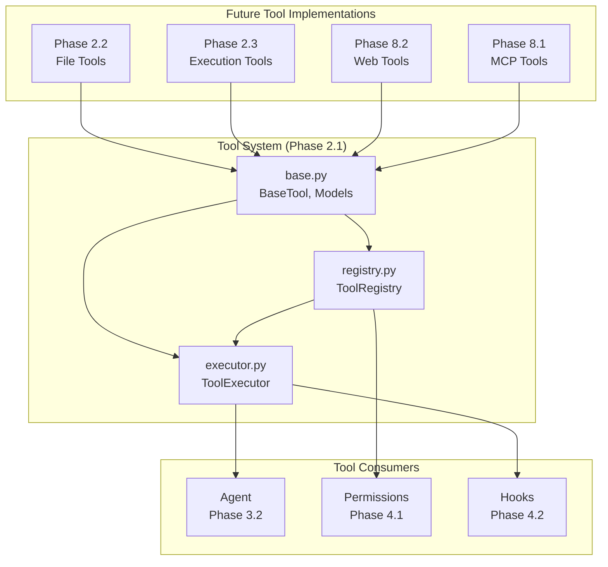
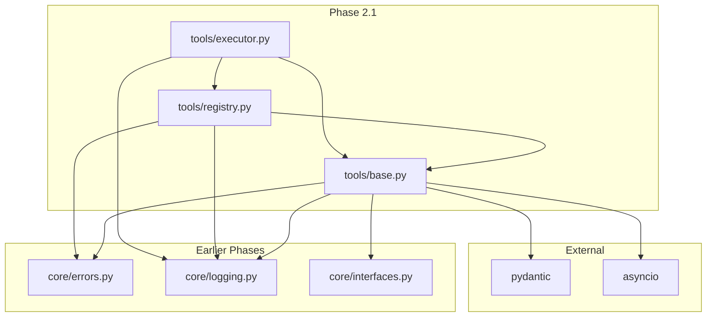

# Phase 2.1: Tool System Foundation - UML Diagrams

**Phase:** 2.1
**Name:** Tool System Foundation
**Dependencies:** Phase 1.1, Phase 1.2, Phase 1.3

---

## 1. Class Diagram - Tool System Overview



---

## 2. Class Diagram - Concrete Tool Example



---

## 3. Sequence Diagram - Tool Execution Flow



---

## 4. Sequence Diagram - Schema Generation



---

## 5. State Diagram - Tool Execution States



---

## 6. Component Diagram



---

## 7. Activity Diagram - Parameter Validation

```mermaid
flowchart TD
    START([validate_params]) --> LOOP{For each parameter}

    LOOP -->|Has param| CHECK_REQ{Required?}
    LOOP -->|Done| RETURN_OK[Return True, None]

    CHECK_REQ -->|Yes| CHECK_PRESENT{Provided?}
    CHECK_REQ -->|No| CHECK_IF_PROVIDED{Provided?}

    CHECK_PRESENT -->|No| RETURN_MISSING[Return False,<br/>"Missing required"]
    CHECK_PRESENT -->|Yes| VALIDATE

    CHECK_IF_PROVIDED -->|No| LOOP
    CHECK_IF_PROVIDED -->|Yes| VALIDATE

    VALIDATE --> CHECK_TYPE{Type matches?}
    CHECK_TYPE -->|No| RETURN_TYPE[Return False,<br/>"Invalid type"]
    CHECK_TYPE -->|Yes| CHECK_ENUM{Has enum?}

    CHECK_ENUM -->|No| CHECK_RANGE{Numeric range?}
    CHECK_ENUM -->|Yes| VALUE_IN_ENUM{Value in enum?}

    VALUE_IN_ENUM -->|No| RETURN_ENUM[Return False,<br/>"Invalid value"]
    VALUE_IN_ENUM -->|Yes| CHECK_RANGE

    CHECK_RANGE -->|Yes| RANGE_OK{In range?}
    CHECK_RANGE -->|No| LOOP

    RANGE_OK -->|No| RETURN_RANGE[Return False,<br/>"Out of range"]
    RANGE_OK -->|Yes| LOOP

    RETURN_OK --> END([End])
    RETURN_MISSING --> END
    RETURN_TYPE --> END
    RETURN_ENUM --> END
    RETURN_RANGE --> END
```

---

## 8. JSON Schema Output Examples

### OpenAI Format
```json
{
  "type": "function",
  "function": {
    "name": "Read",
    "description": "Read contents of a file from the filesystem",
    "parameters": {
      "type": "object",
      "properties": {
        "file_path": {
          "type": "string",
          "description": "Absolute path to the file to read"
        },
        "offset": {
          "type": "integer",
          "description": "Line number to start reading from",
          "minimum": 0
        },
        "limit": {
          "type": "integer",
          "description": "Maximum number of lines to read",
          "minimum": 1,
          "maximum": 10000
        }
      },
      "required": ["file_path"]
    }
  }
}
```

### Anthropic Format
```json
{
  "name": "Read",
  "description": "Read contents of a file from the filesystem",
  "input_schema": {
    "type": "object",
    "properties": {
      "file_path": {
        "type": "string",
        "description": "Absolute path to the file to read"
      },
      "offset": {
        "type": "integer",
        "description": "Line number to start reading from",
        "minimum": 0
      },
      "limit": {
        "type": "integer",
        "description": "Maximum number of lines to read",
        "minimum": 1,
        "maximum": 10000
      }
    },
    "required": ["file_path"]
  }
}
```

---

## 9. Package Dependency Diagram



---

## Notes

- All tools inherit from BaseTool
- ToolRegistry is a singleton for global tool access
- ToolExecutor wraps execution with tracking and logging
- Schema generation supports multiple LLM formats
- Parameter validation is type-safe and comprehensive
