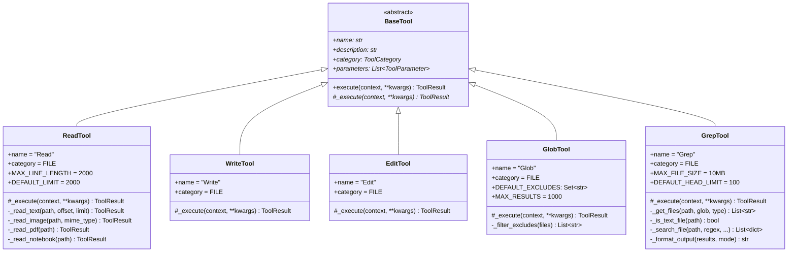
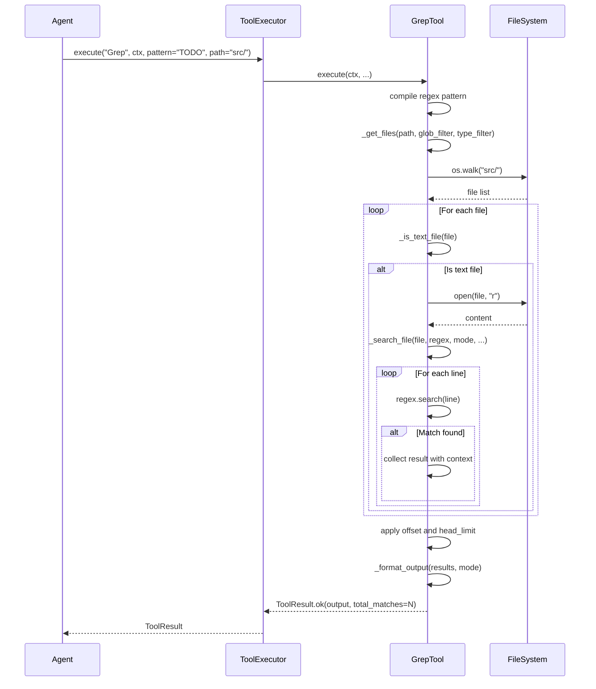

# Phase 2.2: File Tools - UML Diagrams

**Phase:** 2.2
**Name:** File Tools
**Dependencies:** Phase 2.1 (Tool System Foundation)

---

## 1. Class Diagram - File Tools Overview



---

## 2. Class Diagram - ReadTool Details


---

## 3. Class Diagram - GrepTool Details


---

## 4. Sequence Diagram - Read File Flow


---

## 5. Sequence Diagram - Edit File Flow


---

## 6. Sequence Diagram - Grep Search Flow



---

## 7. Sequence Diagram - Glob Search Flow


---

## 8. State Diagram - File Read States


---

## 9. State Diagram - Edit Operation States


---

## 10. Component Diagram - File Tools


---

## 11. Activity Diagram - Grep File Search


---

## 12. Package Structure Diagram


---

## 13. Tool Parameter Schemas

### ReadTool Parameters
```json
{
  "type": "object",
  "properties": {
    "file_path": {
      "type": "string",
      "description": "The absolute path to the file to read",
      "minLength": 1
    },
    "offset": {
      "type": "integer",
      "description": "Line number to start reading from",
      "minimum": 1
    },
    "limit": {
      "type": "integer",
      "description": "Maximum number of lines to read",
      "minimum": 1,
      "maximum": 10000
    }
  },
  "required": ["file_path"]
}
```

### EditTool Parameters
```json
{
  "type": "object",
  "properties": {
    "file_path": {
      "type": "string",
      "description": "The absolute path to the file to modify"
    },
    "old_string": {
      "type": "string",
      "description": "The text to replace"
    },
    "new_string": {
      "type": "string",
      "description": "The text to replace it with"
    },
    "replace_all": {
      "type": "boolean",
      "description": "Replace all occurrences",
      "default": false
    }
  },
  "required": ["file_path", "old_string", "new_string"]
}
```

### GrepTool Parameters
```json
{
  "type": "object",
  "properties": {
    "pattern": {
      "type": "string",
      "description": "Regular expression pattern"
    },
    "path": {
      "type": "string",
      "description": "File or directory to search"
    },
    "glob": {
      "type": "string",
      "description": "Glob pattern to filter files"
    },
    "output_mode": {
      "type": "string",
      "enum": ["content", "files_with_matches", "count"],
      "default": "files_with_matches"
    },
    "-i": {
      "type": "boolean",
      "description": "Case insensitive",
      "default": false
    },
    "-A": {
      "type": "integer",
      "description": "Lines after match",
      "minimum": 0
    },
    "-B": {
      "type": "integer",
      "description": "Lines before match",
      "minimum": 0
    }
  },
  "required": ["pattern"]
}
```

---

## Notes

- All file tools inherit from BaseTool (Phase 2.1)
- ReadTool handles multiple file types (text, image, PDF, notebook)
- EditTool requires the file to be read first (enforced by workflow)
- GlobTool and GrepTool exclude common directories by default
- All tools support dry_run mode through ExecutionContext
- Security validations prevent path traversal attacks
