# Phase 2.3: Execution Tools - UML Diagrams

**Phase:** 2.3
**Name:** Execution Tools
**Dependencies:** Phase 2.1 (Tool System Foundation)

---

## 1. Class Diagram - Execution Tools Overview

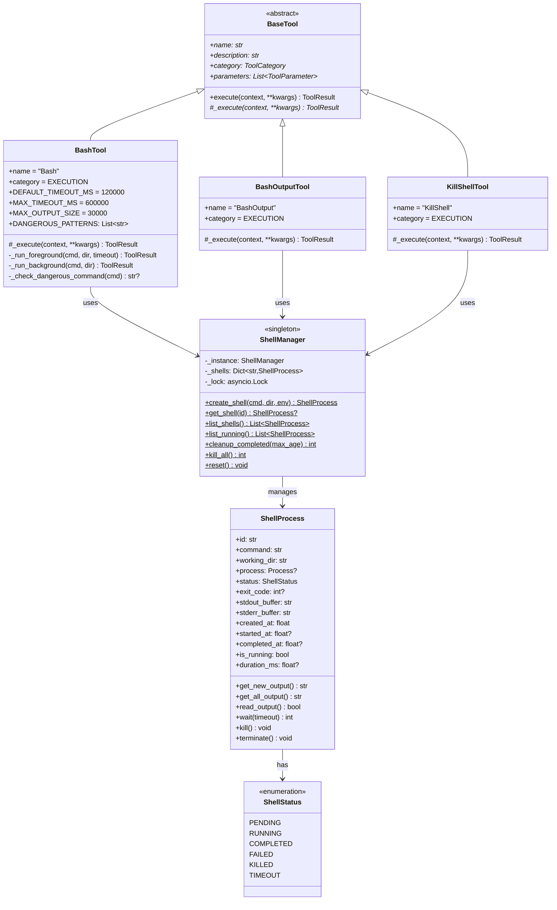

---

## 2. Class Diagram - BashTool Details

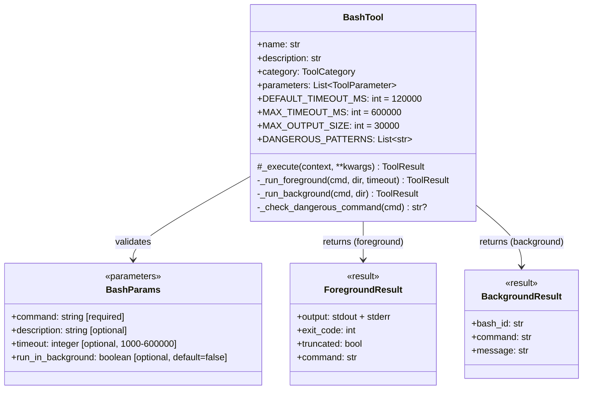

---

## 3. Class Diagram - ShellProcess Details

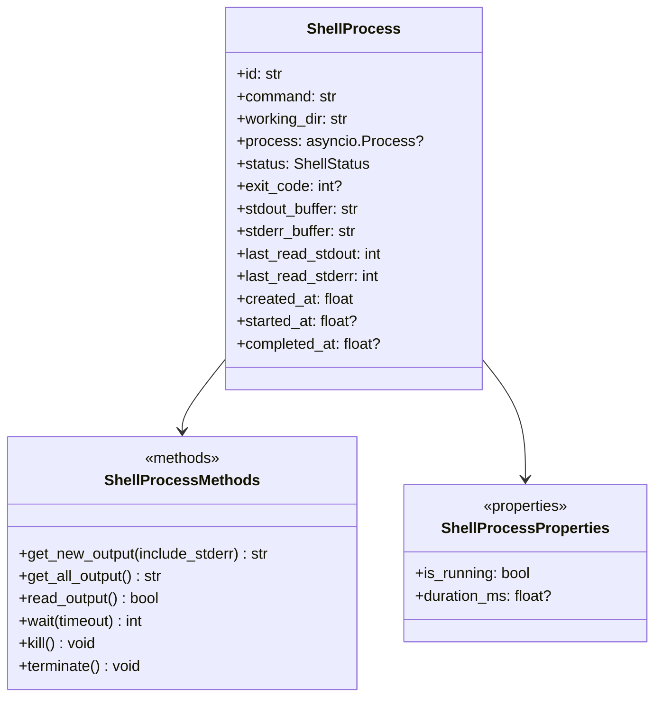

---

## 4. Sequence Diagram - Foreground Command Execution

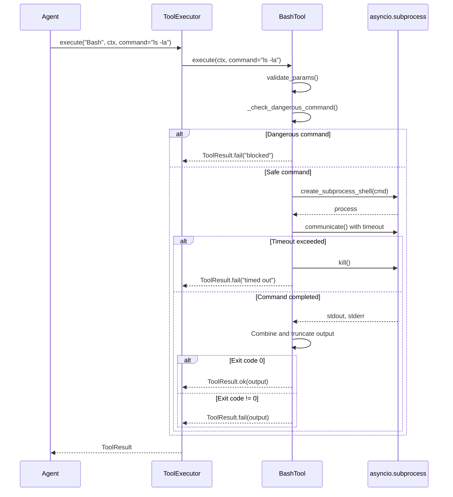

---

## 5. Sequence Diagram - Background Command Execution

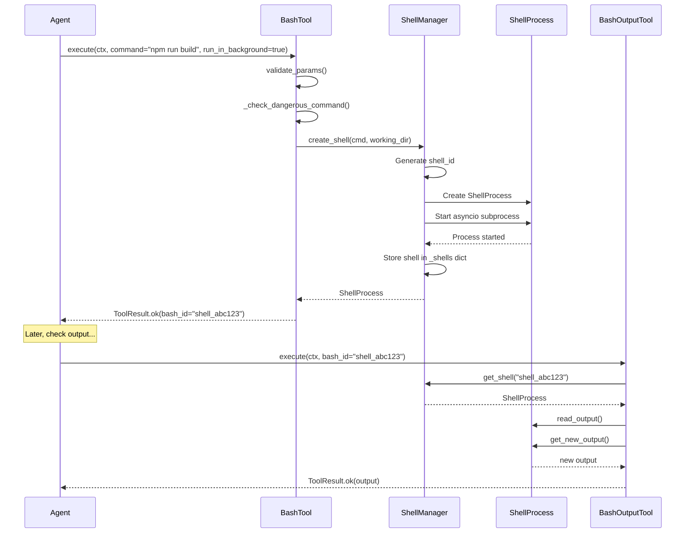

---

## 6. Sequence Diagram - Kill Shell

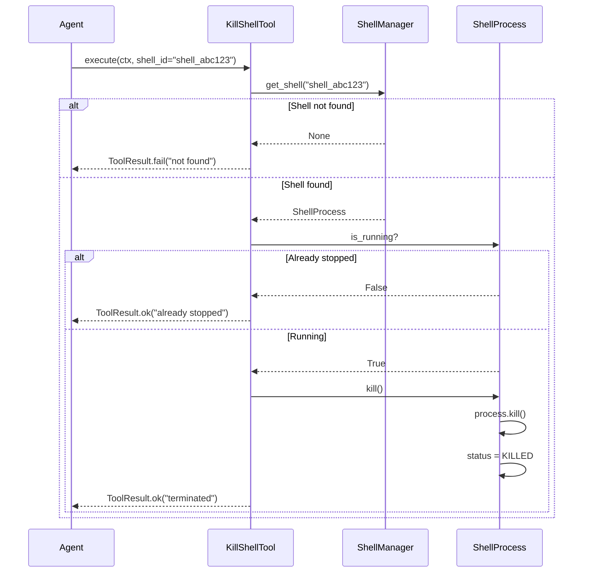

---

## 7. State Diagram - Shell Process Lifecycle

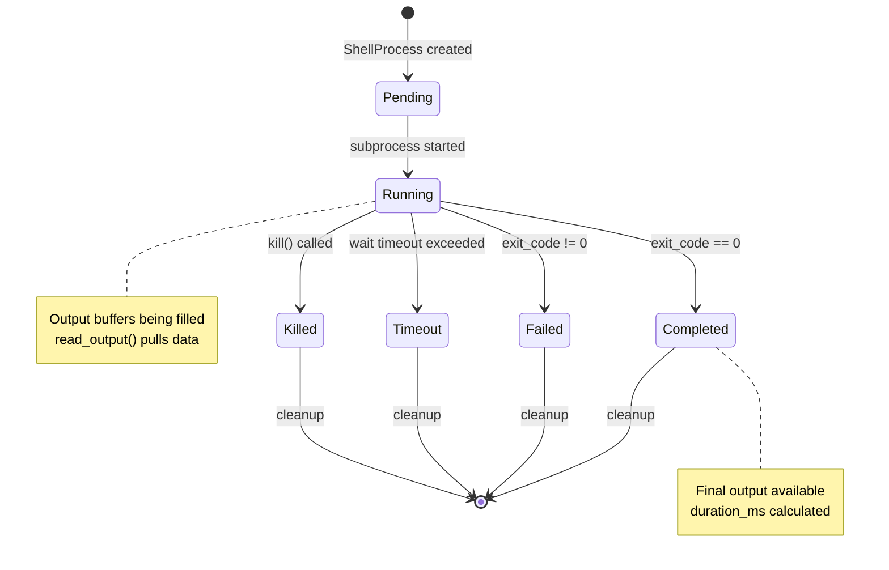

---

## 8. State Diagram - Bash Execution Flow

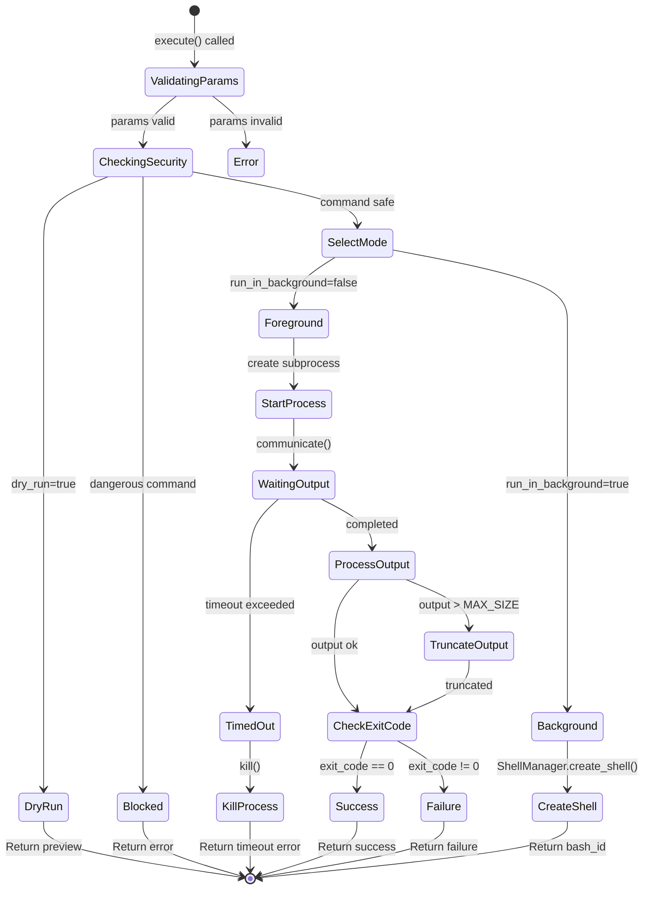

---

## 9. Component Diagram - Execution Tools

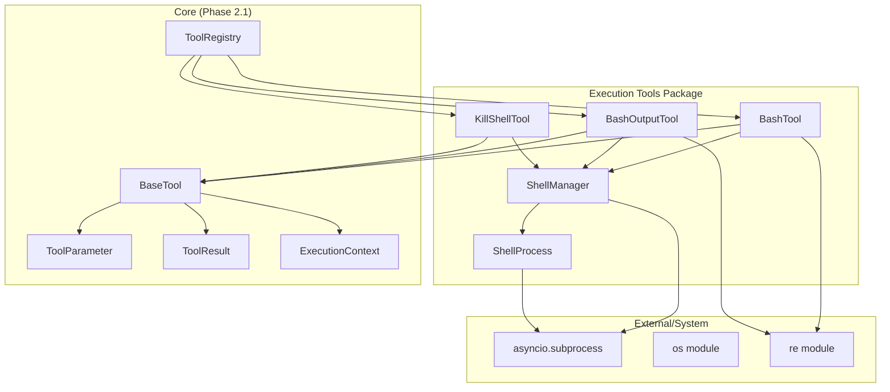

---

## 10. Activity Diagram - Background Shell Monitoring

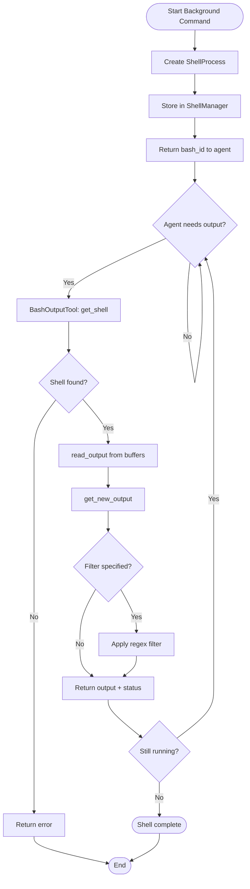

---

## 11. Package Structure Diagram

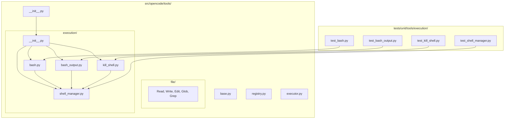

---

## 12. Tool Parameter Schemas

### BashTool Parameters
```json
{
  "type": "object",
  "properties": {
    "command": {
      "type": "string",
      "description": "The command to execute",
      "minLength": 1
    },
    "description": {
      "type": "string",
      "description": "Clear, concise description (5-10 words)"
    },
    "timeout": {
      "type": "integer",
      "description": "Timeout in milliseconds",
      "minimum": 1000,
      "maximum": 600000
    },
    "run_in_background": {
      "type": "boolean",
      "description": "Run in background",
      "default": false
    }
  },
  "required": ["command"]
}
```

### BashOutputTool Parameters
```json
{
  "type": "object",
  "properties": {
    "bash_id": {
      "type": "string",
      "description": "ID of the background shell"
    },
    "filter": {
      "type": "string",
      "description": "Regex to filter output lines"
    }
  },
  "required": ["bash_id"]
}
```

### KillShellTool Parameters
```json
{
  "type": "object",
  "properties": {
    "shell_id": {
      "type": "string",
      "description": "ID of the shell to kill"
    }
  },
  "required": ["shell_id"]
}
```

---

## 13. Dangerous Command Patterns

```
┌─────────────────────────────────────────────────────────────────────┐
│ Blocked Command Patterns                                            │
├─────────────────────────────────────────────────────────────────────┤
│ Pattern              │ Description                                  │
├─────────────────────────────────────────────────────────────────────┤
│ rm -rf /             │ Delete entire filesystem                     │
│ rm -rf /*            │ Delete root contents                         │
│ mkfs.*               │ Format filesystem                            │
│ dd if=* of=/dev/sd*  │ Direct disk write                           │
│ > /dev/sd*           │ Redirect to disk device                      │
│ chmod -R 777 /       │ Open permissions on root                     │
│ :(){:|:&};:          │ Fork bomb                                    │
│ mv / *               │ Move root directory                          │
│ chown -R * /         │ Change ownership of root                     │
└─────────────────────────────────────────────────────────────────────┘
```

---

## Notes

- BashTool supports both foreground and background execution
- ShellManager is a singleton for global shell tracking
- Background shells can be monitored with BashOutputTool
- Output is incrementally read to avoid memory issues
- Dangerous command patterns are blocked at execution time
- Timeouts prevent runaway processes
- Shell cleanup happens automatically for old completed shells
