# Phase 3.1: OpenRouter Client - UML Diagrams

**Phase:** 3.1
**Name:** OpenRouter Client
**Dependencies:** Phase 1.1 (Project Foundation), Phase 1.2 (Configuration)

---

## 1. Class Diagram - LLM Package Overview

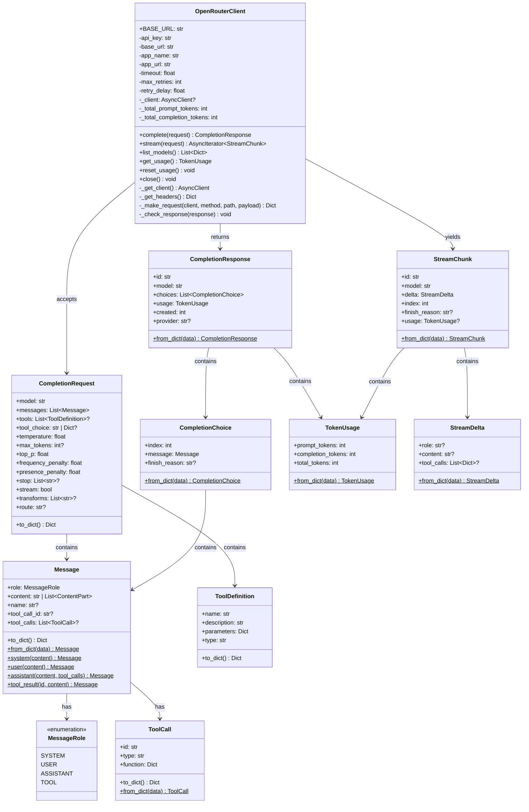

---

## 2. Class Diagram - Error Hierarchy

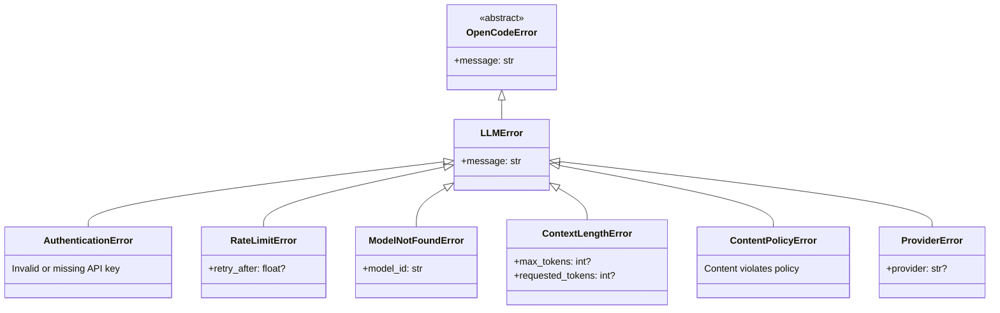

---

## 3. Class Diagram - Routing

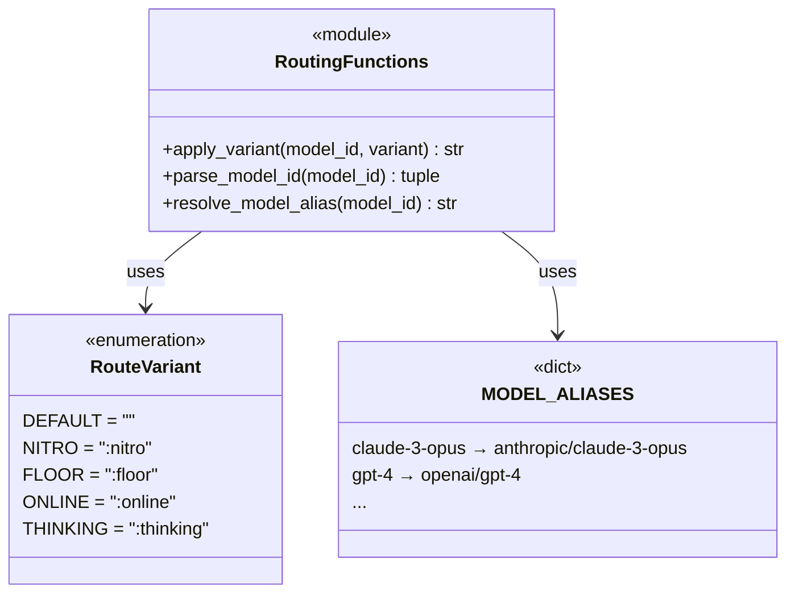

---

## 4. Class Diagram - Stream Collector

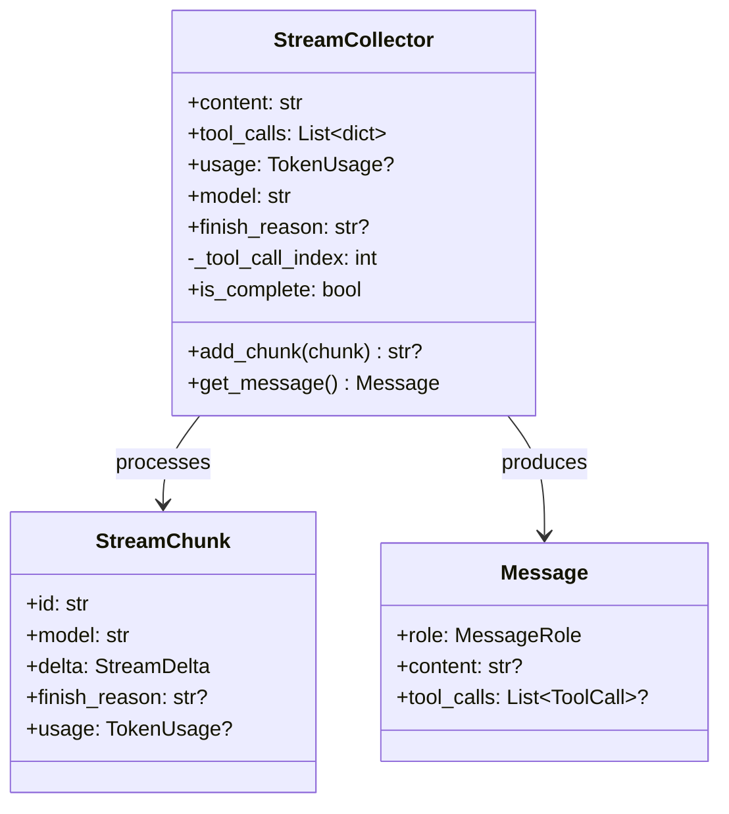

---

## 5. Sequence Diagram - Chat Completion

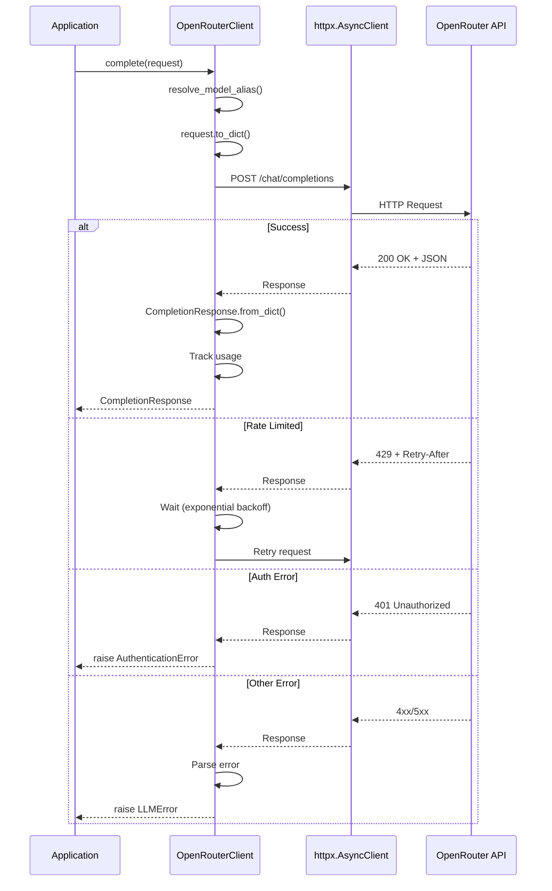

---

## 6. Sequence Diagram - Streaming Response

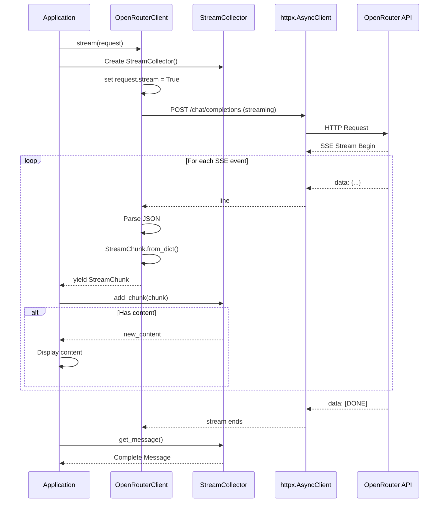

---

## 7. Sequence Diagram - Tool Calling

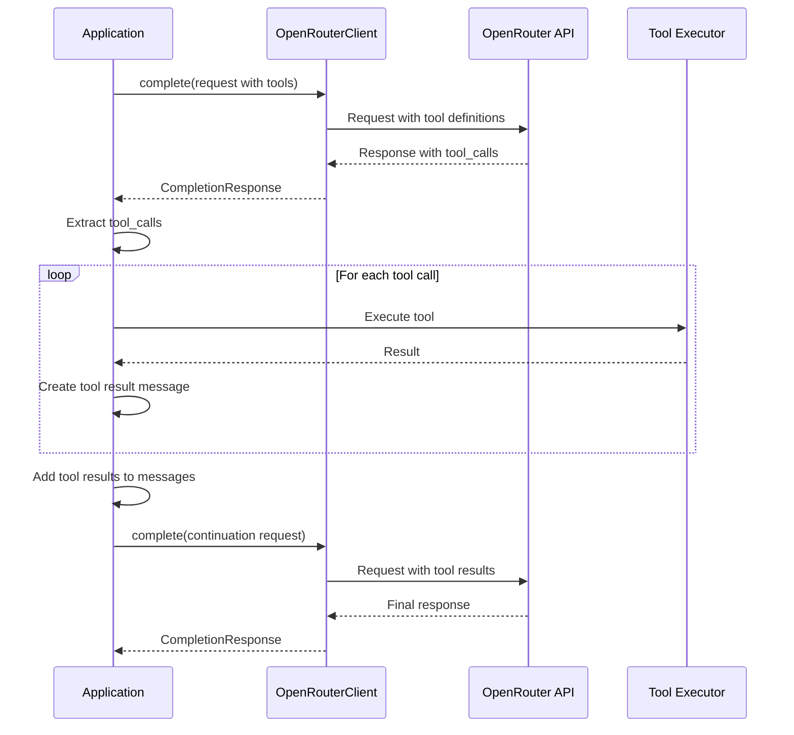

---

## 8. State Diagram - Request Lifecycle

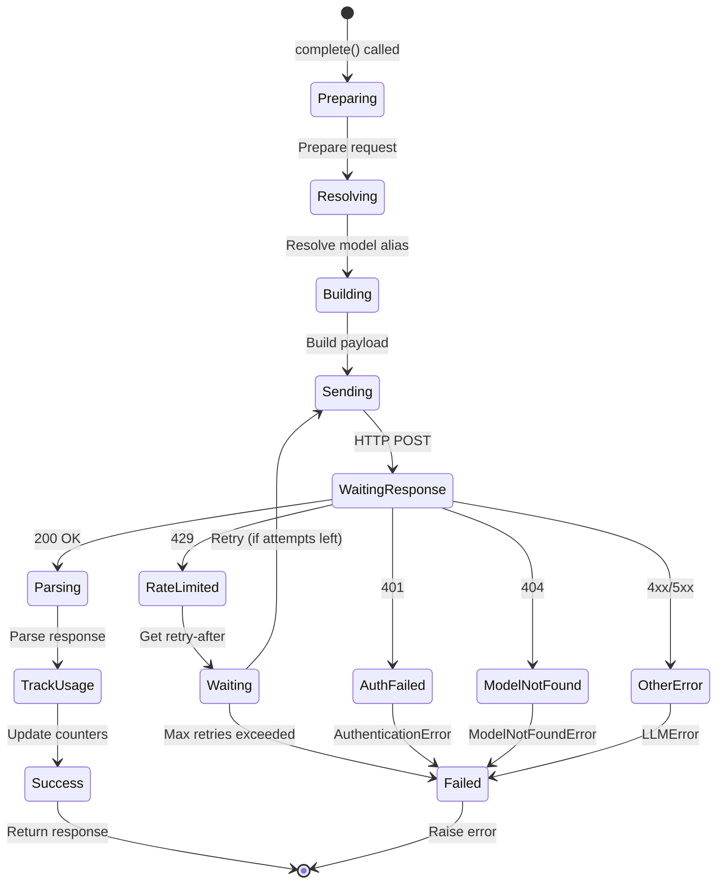

---

## 9. State Diagram - Streaming Lifecycle

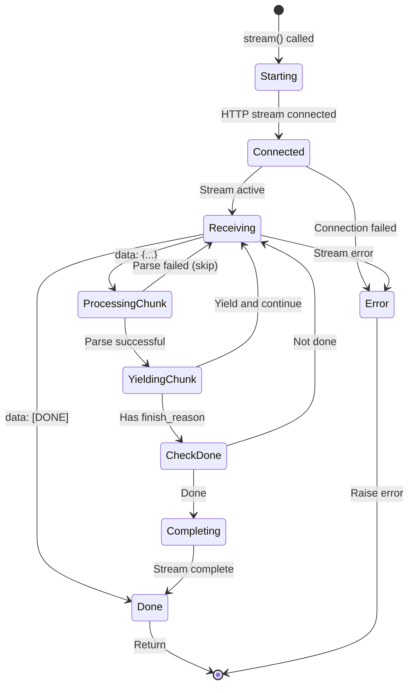

---

## 10. Component Diagram - LLM Package

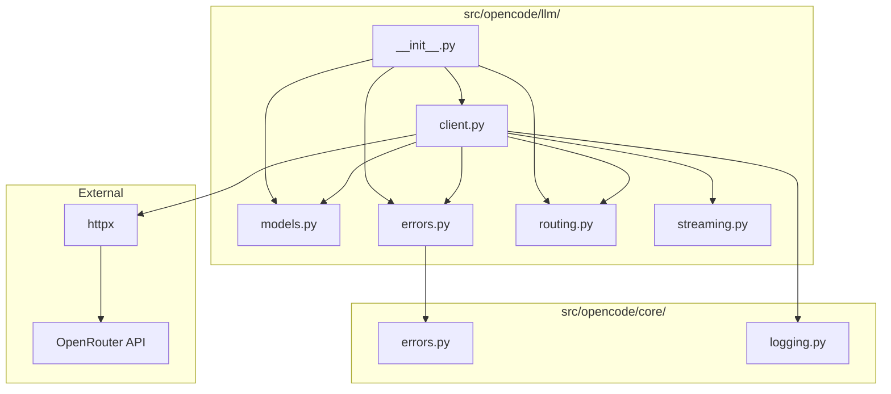

---

## 11. Activity Diagram - Retry Logic

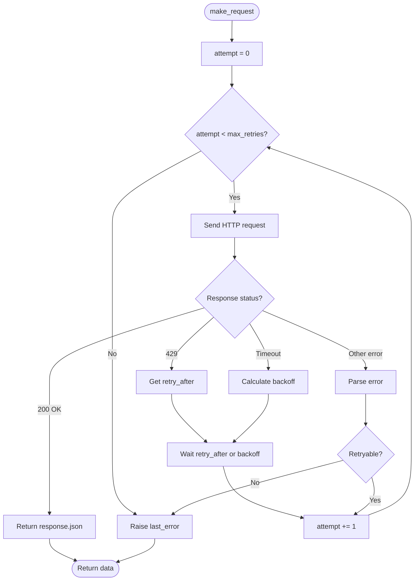

---

## 12. Package Structure Diagram

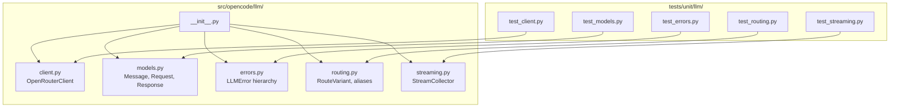

---

## 13. Data Flow Diagram - Message Formats

### Request Message Format
```json
{
  "model": "anthropic/claude-3-opus",
  "messages": [
    {
      "role": "system",
      "content": "You are a helpful assistant."
    },
    {
      "role": "user",
      "content": "Hello!"
    }
  ],
  "tools": [
    {
      "type": "function",
      "function": {
        "name": "read_file",
        "description": "Read a file",
        "parameters": {
          "type": "object",
          "properties": {
            "path": {"type": "string"}
          },
          "required": ["path"]
        }
      }
    }
  ],
  "temperature": 0.7,
  "max_tokens": 1000,
  "stream": false
}
```

### Response Format
```json
{
  "id": "gen-abc123",
  "model": "anthropic/claude-3-opus",
  "choices": [
    {
      "index": 0,
      "message": {
        "role": "assistant",
        "content": null,
        "tool_calls": [
          {
            "id": "call_xyz",
            "type": "function",
            "function": {
              "name": "read_file",
              "arguments": "{\"path\": \"/home/user/file.txt\"}"
            }
          }
        ]
      },
      "finish_reason": "tool_calls"
    }
  ],
  "usage": {
    "prompt_tokens": 150,
    "completion_tokens": 25,
    "total_tokens": 175
  },
  "created": 1705312345
}
```

### Streaming Chunk Format
```json
{
  "id": "gen-abc123",
  "model": "anthropic/claude-3-opus",
  "choices": [
    {
      "index": 0,
      "delta": {
        "content": "Hello"
      },
      "finish_reason": null
    }
  ]
}
```

---

## Notes

- OpenRouterClient uses httpx for async HTTP requests
- Streaming uses Server-Sent Events (SSE) format
- Tool calls are accumulated across multiple streaming chunks
- Retry logic uses exponential backoff
- All models are accessed through unified OpenRouter API
- Route variants modify model selection behavior
