# Phase 3.2: LangChain Integration - UML Diagrams

**Phase:** 3.2
**Name:** LangChain Integration
**Dependencies:** Phase 2.1 (Tool System Foundation), Phase 3.1 (OpenRouter Client)

---

## 1. Class Diagram - LangChain Package Overview

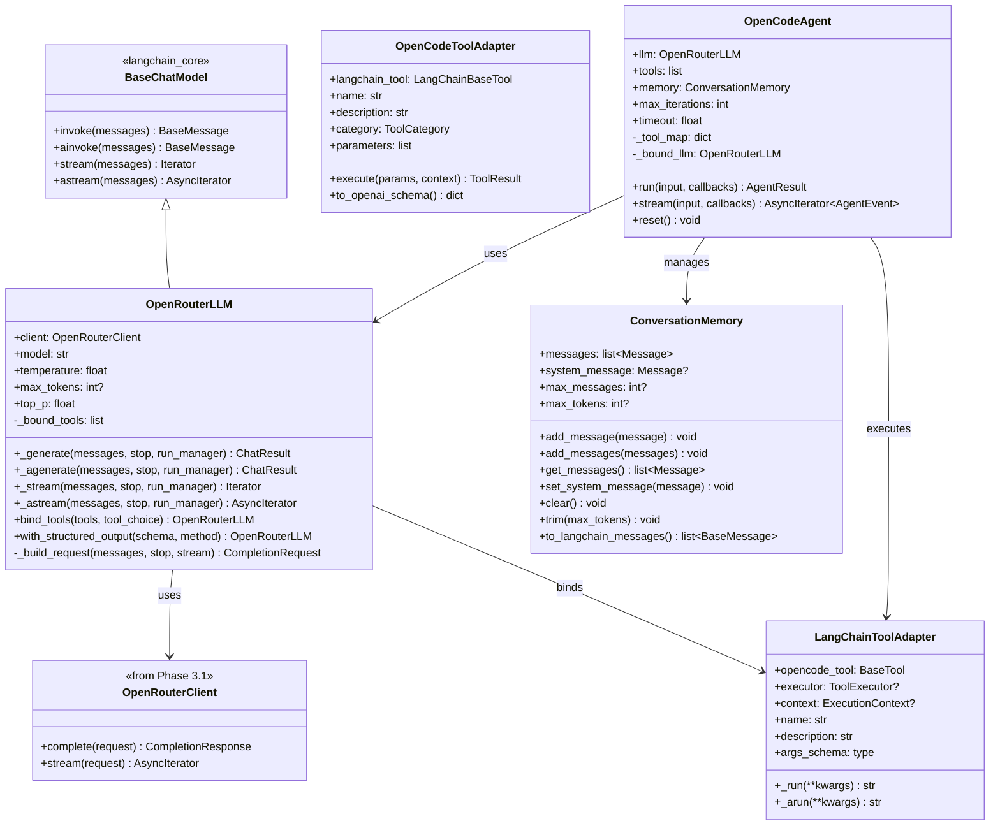

---

## 2. Class Diagram - Memory Hierarchy

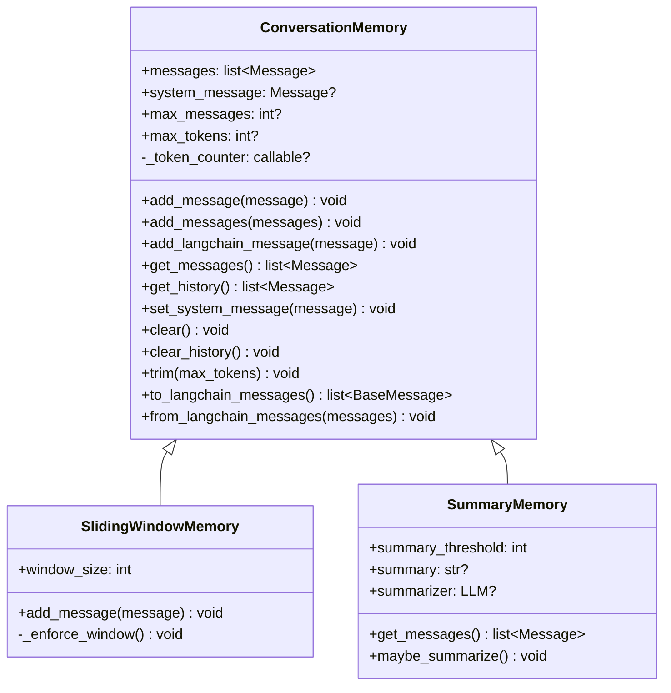

---

## 3. Class Diagram - Callback Hierarchy

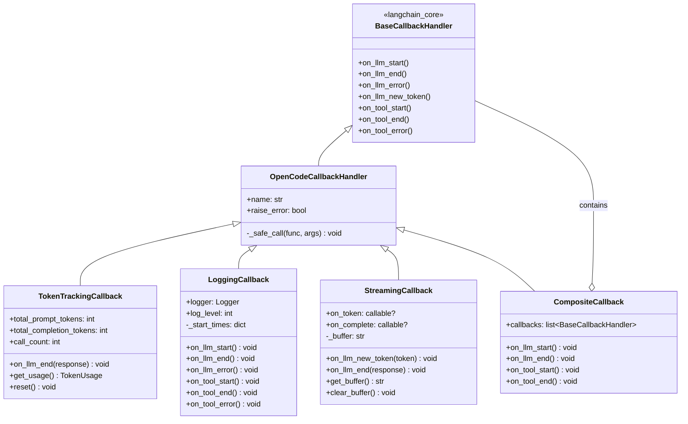

---

## 4. Class Diagram - Agent Result Types

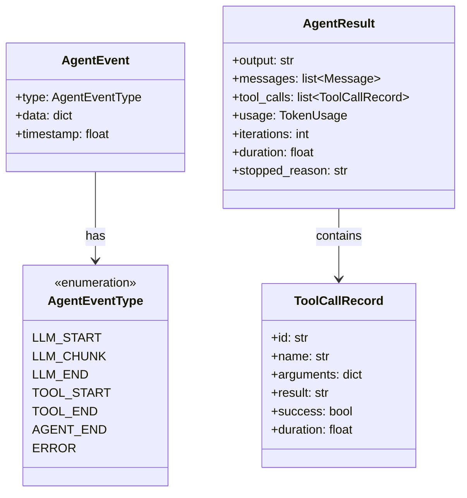

---

## 5. Sequence Diagram - LLM Invocation

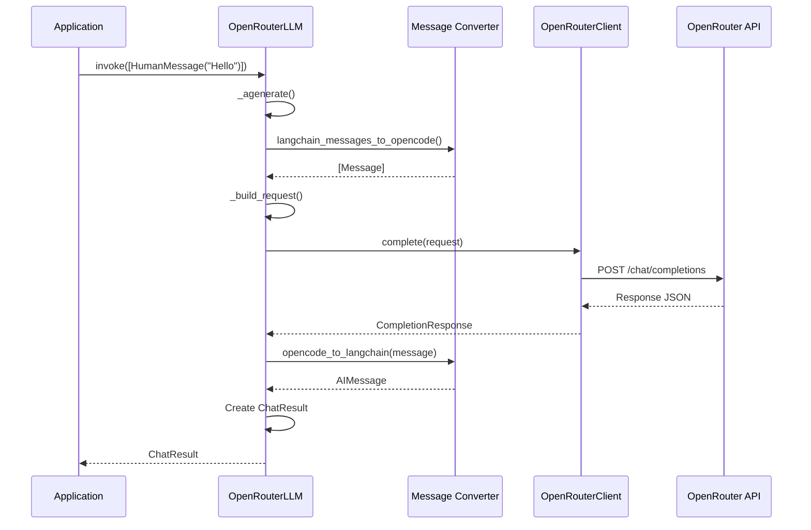

---

## 6. Sequence Diagram - Streaming Response

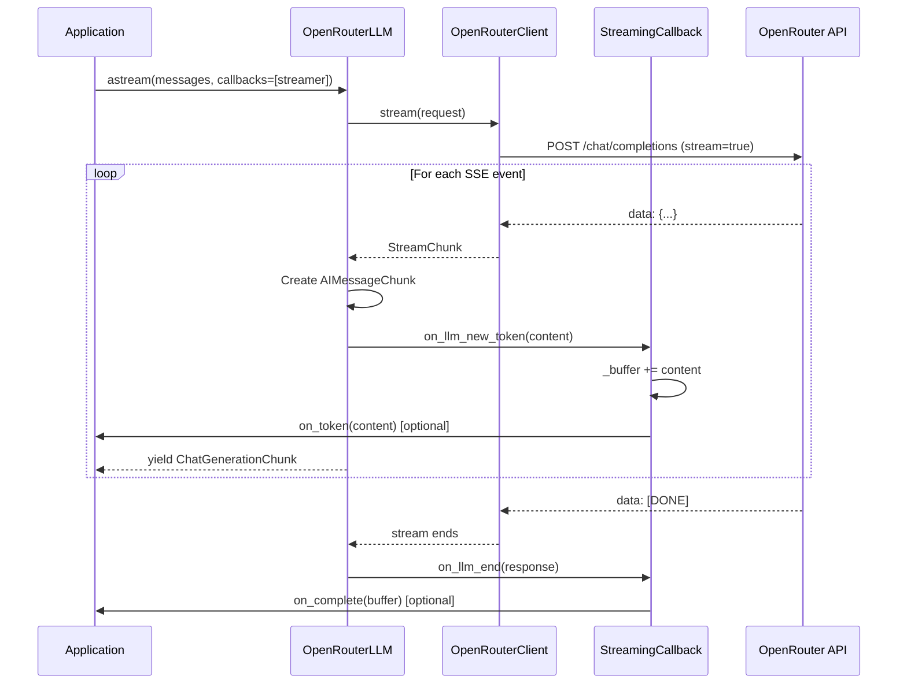

---

## 7. Sequence Diagram - Agent Tool Execution

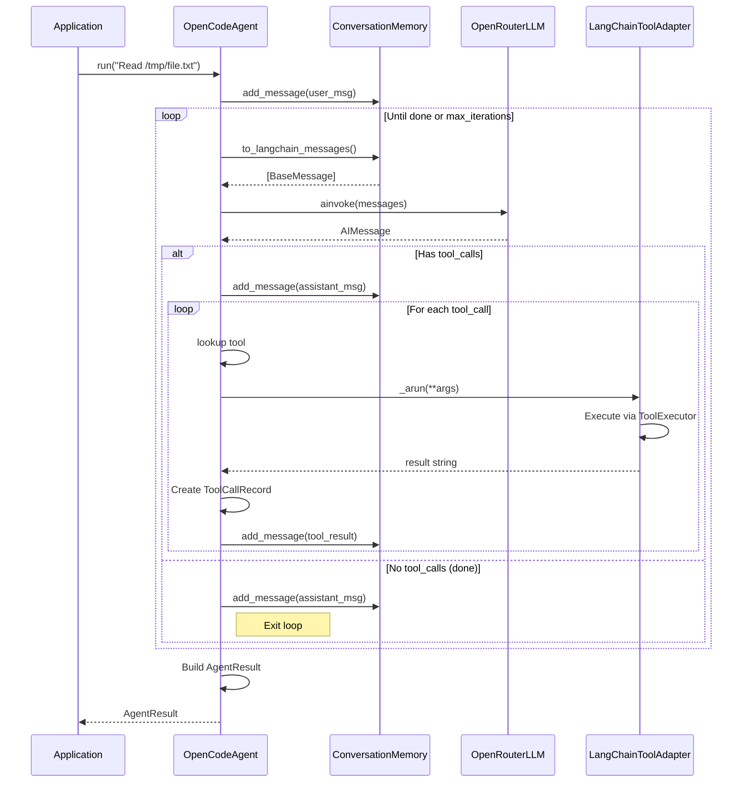

---

## 8. Sequence Diagram - Tool Adaptation

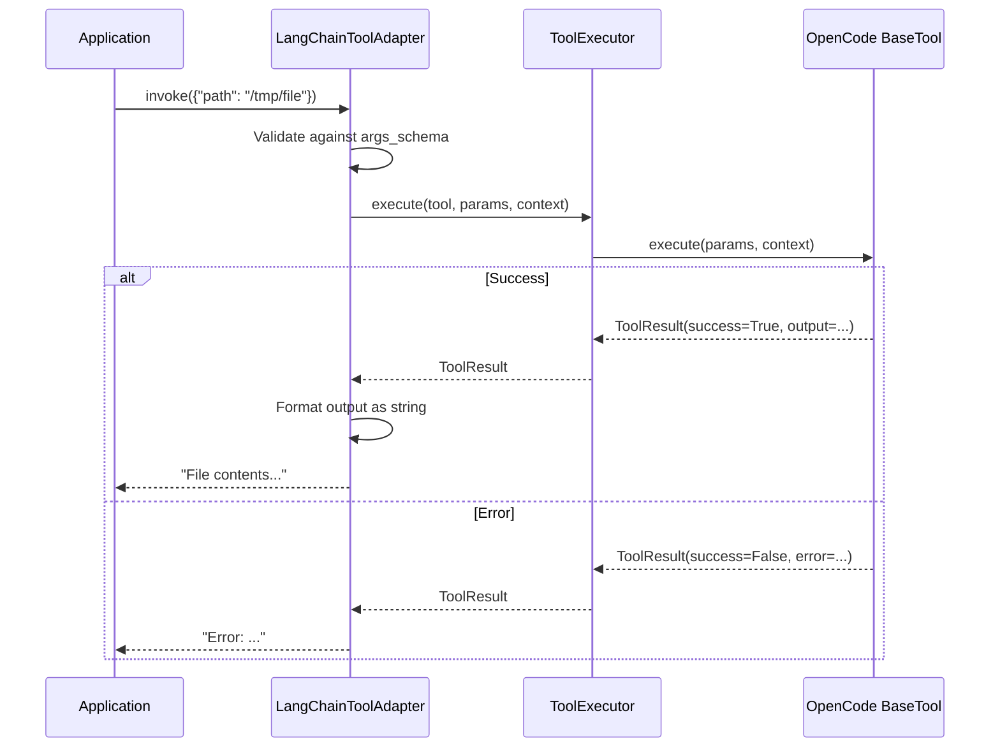

---

## 9. State Diagram - Agent Execution

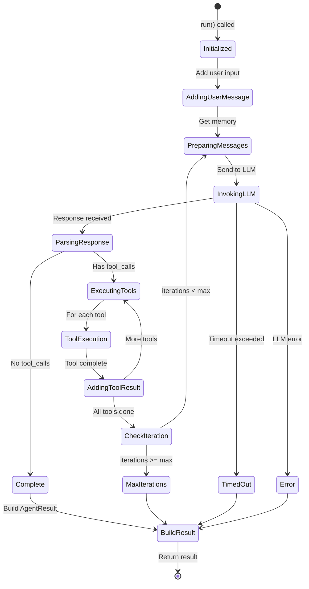

---

## 10. State Diagram - Memory Management

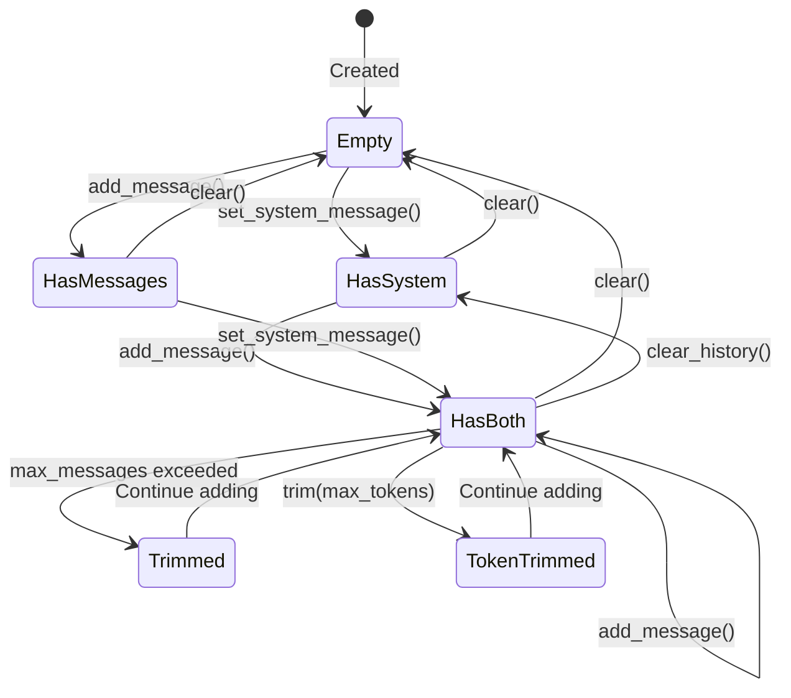

---

## 11. Component Diagram - LangChain Package

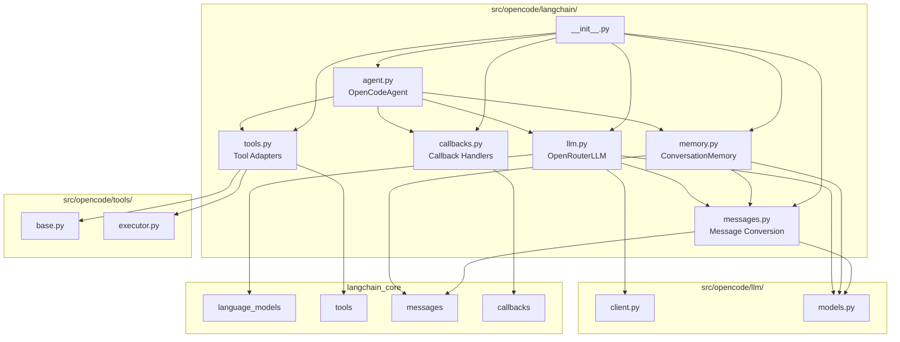

---

## 12. Activity Diagram - Agent Run Flow

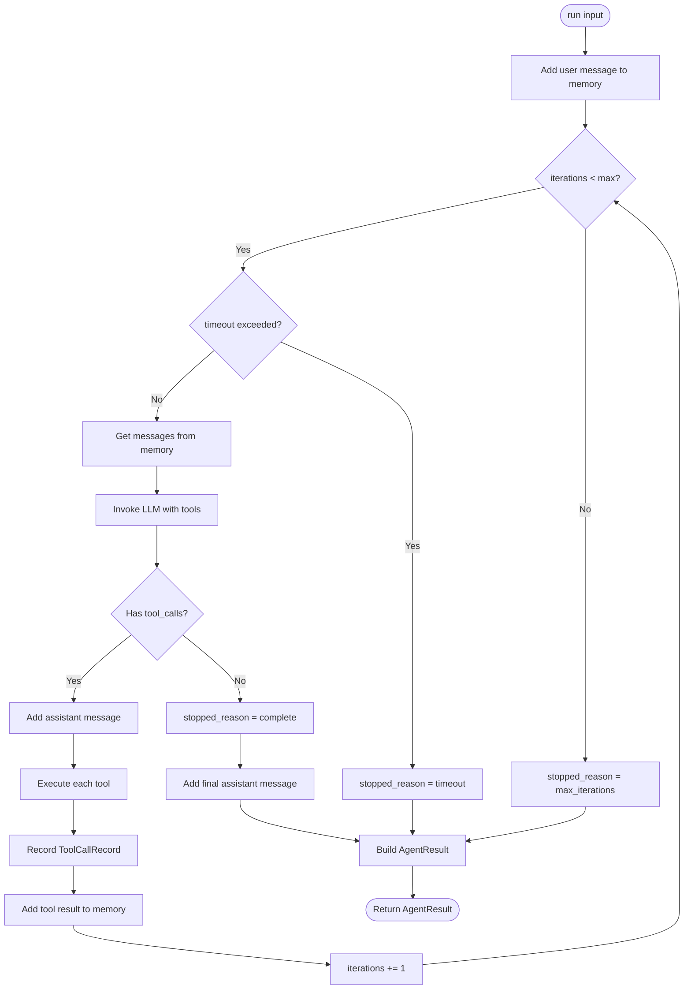

---

## 13. Data Flow Diagram - Message Conversion

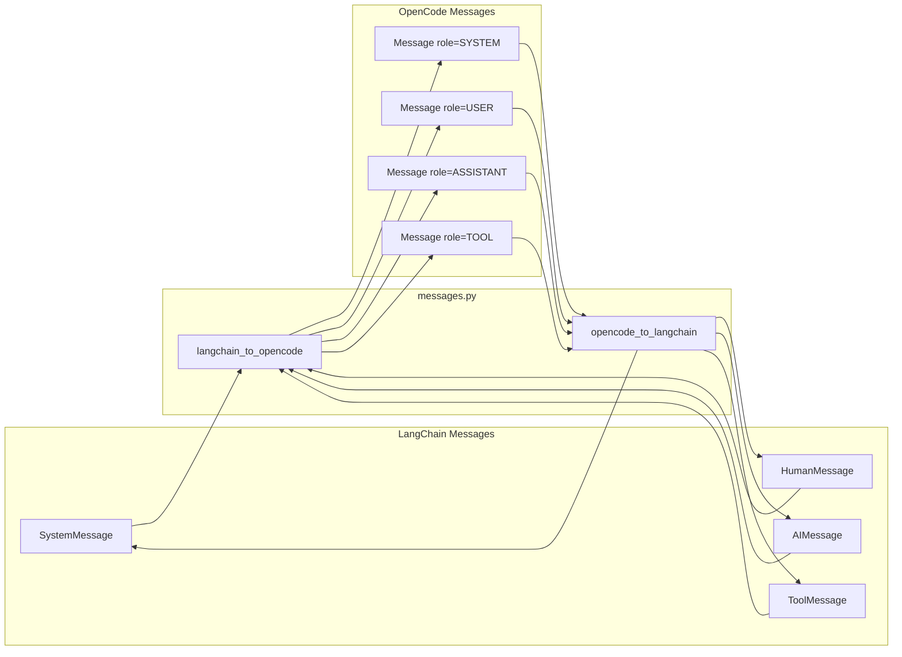

---

## 14. Integration Architecture

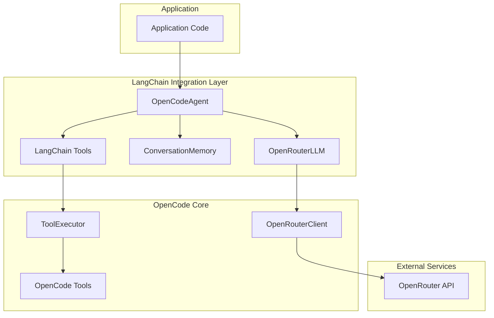

---

## Notes

- OpenRouterLLM extends LangChain's BaseChatModel for compatibility
- Tool adapters work bidirectionally (OpenCode ↔ LangChain)
- Memory supports multiple strategies (basic, sliding window, summary)
- Agent implements ReAct-style tool-calling loop
- Callbacks integrate with LangChain's callback system
- Message conversion handles all standard message types including tool calls
