# Phase 4.1: Permission System - UML Diagrams

**Phase:** 4.1
**Name:** Permission System
**Dependencies:** Phase 2.1 (Tool System Foundation)

---

## 1. Class Diagram - Permission Models

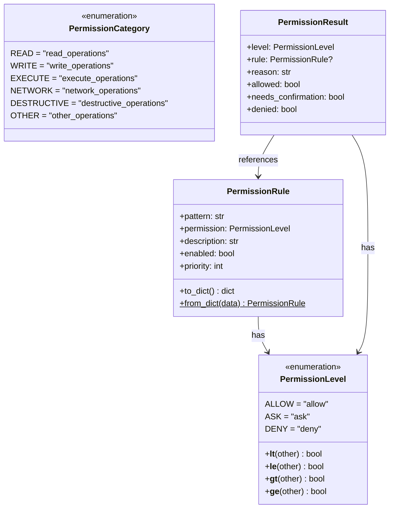

---

## 2. Class Diagram - Rules and Matching

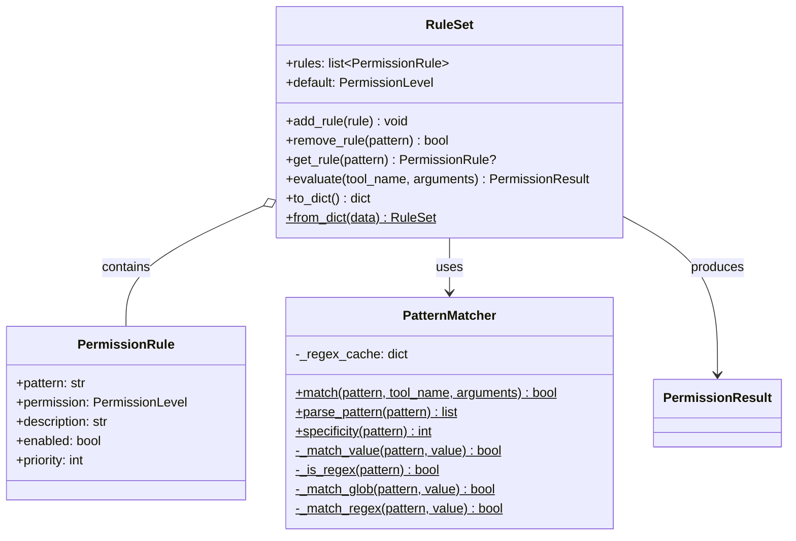

---

## 3. Class Diagram - Permission Checker

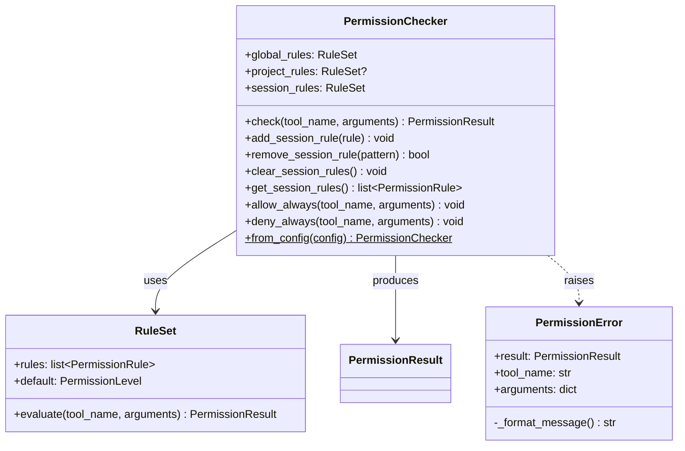

---

## 4. Class Diagram - Confirmation Prompts

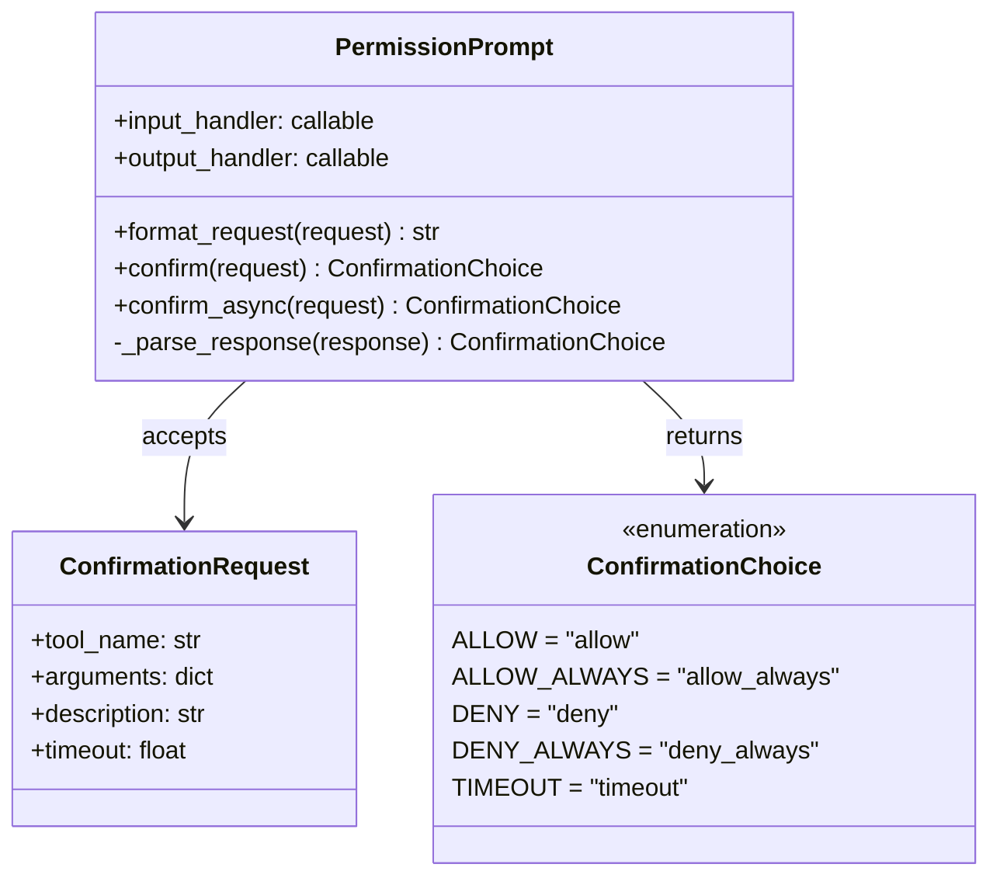

---

## 5. Class Diagram - Configuration

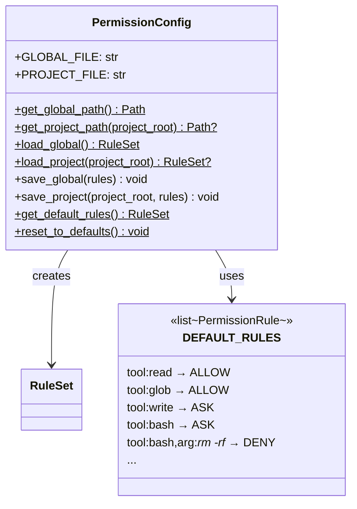

---

## 6. Sequence Diagram - Permission Check Flow

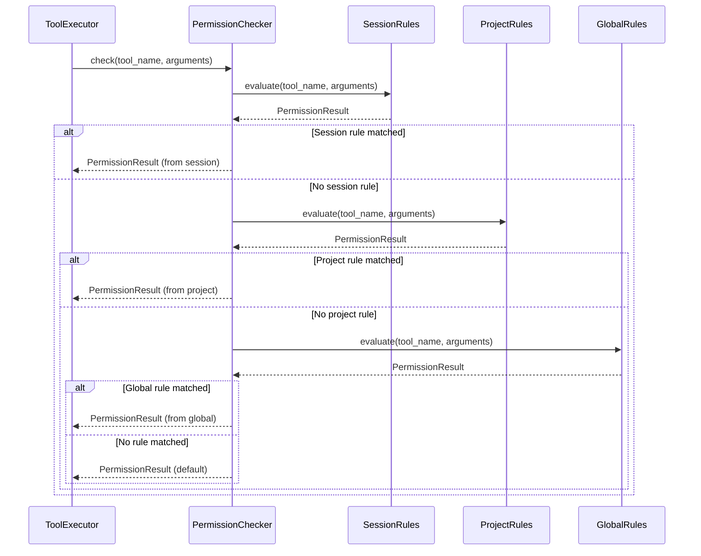

---

## 7. Sequence Diagram - User Confirmation Flow

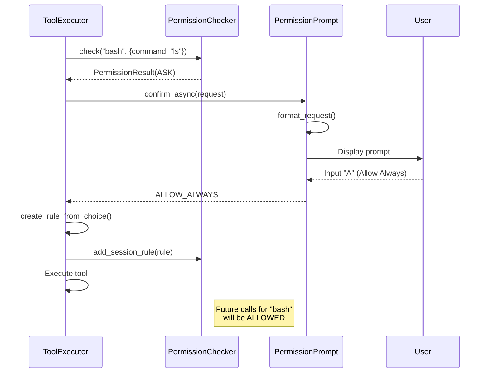

---

## 8. Sequence Diagram - Rule Evaluation

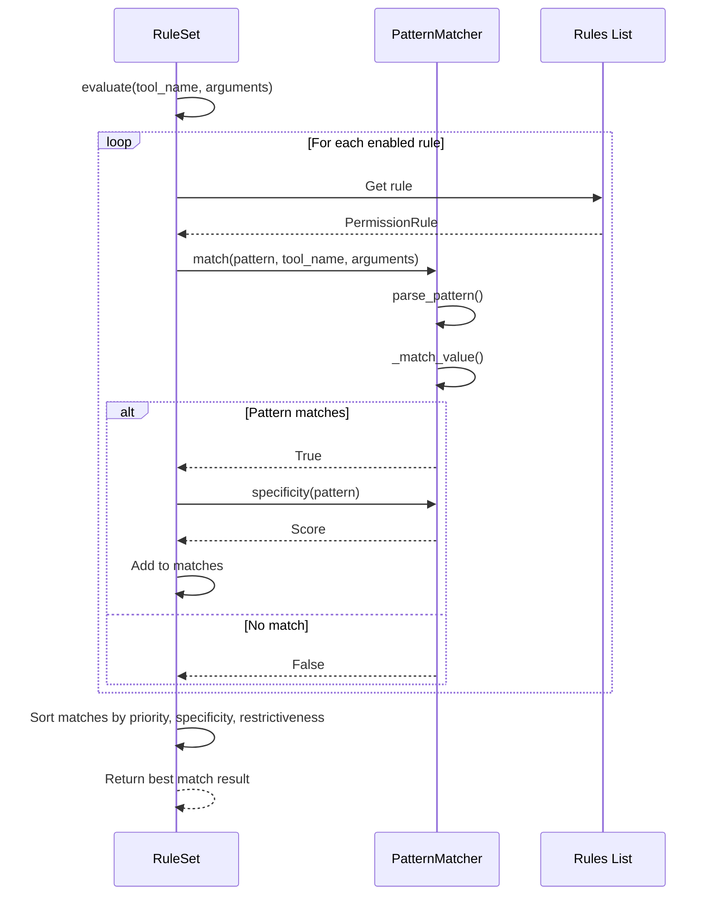

---

## 9. State Diagram - Permission Check States

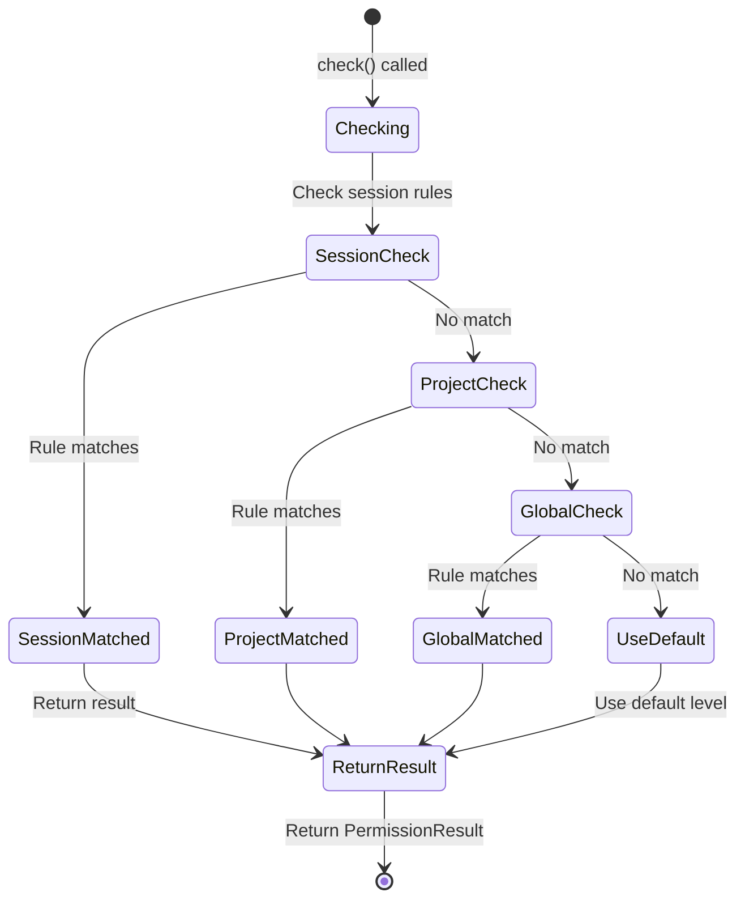

---

## 10. State Diagram - Confirmation Flow

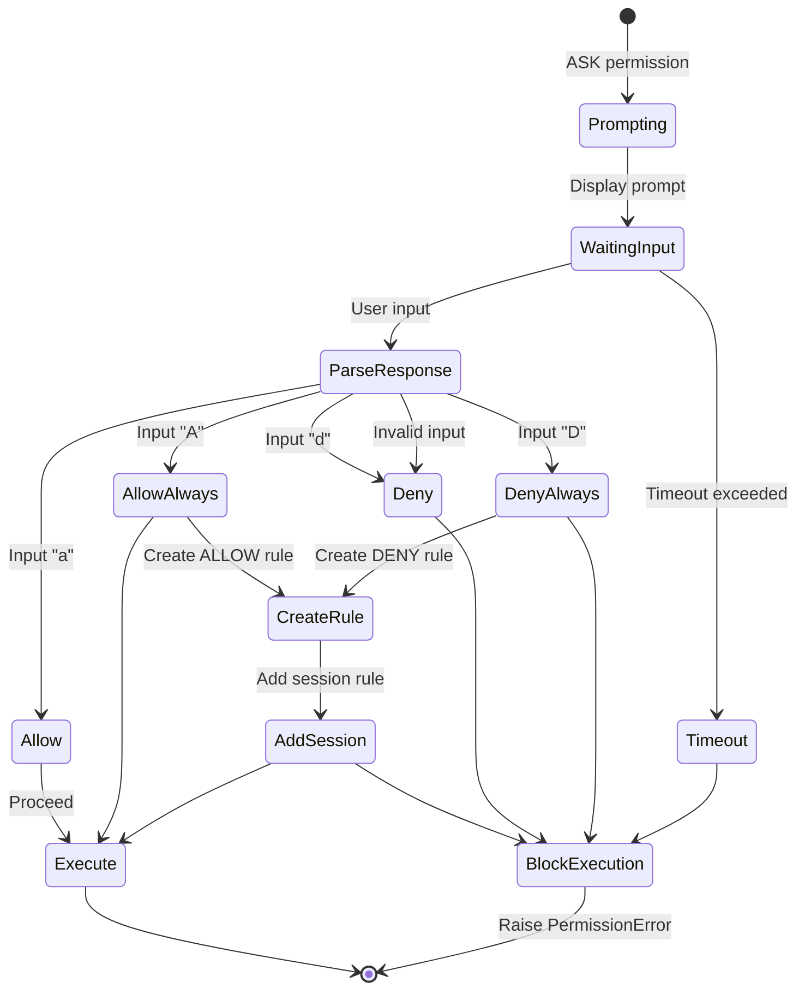

---

## 11. Activity Diagram - Pattern Matching

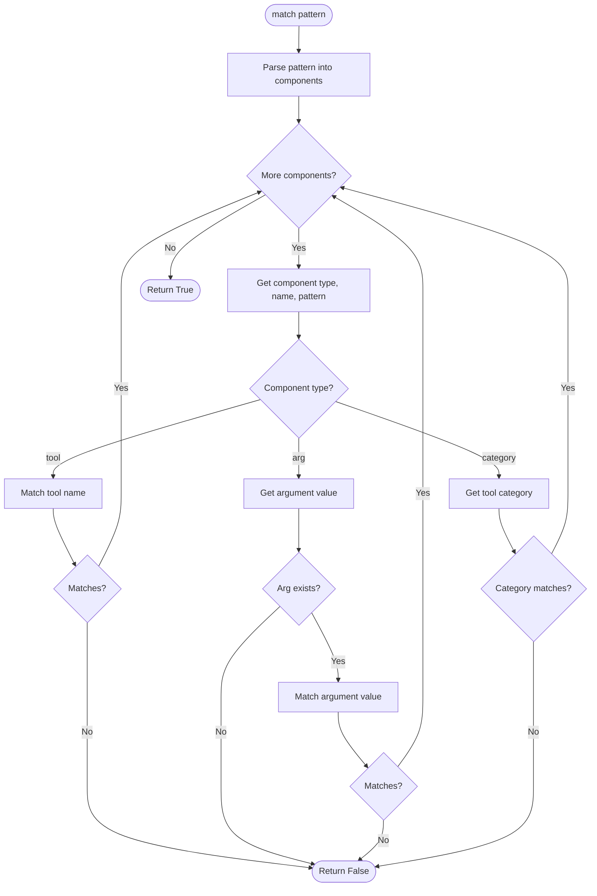

---

## 12. Component Diagram - Permission Package

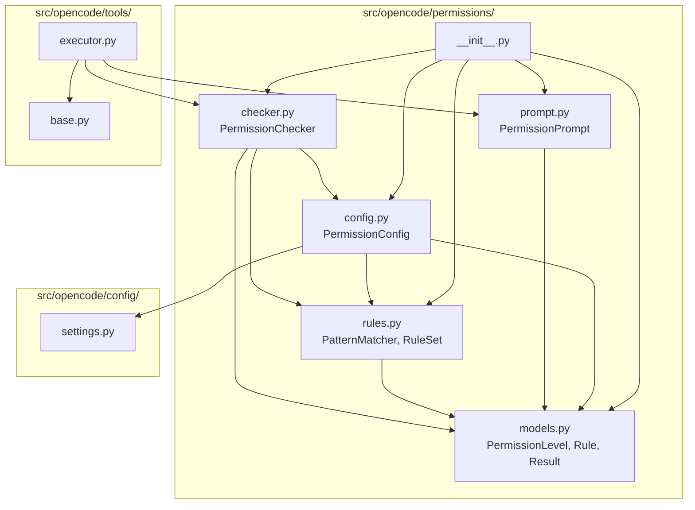

---

## 13. Data Flow Diagram - Permission Decision

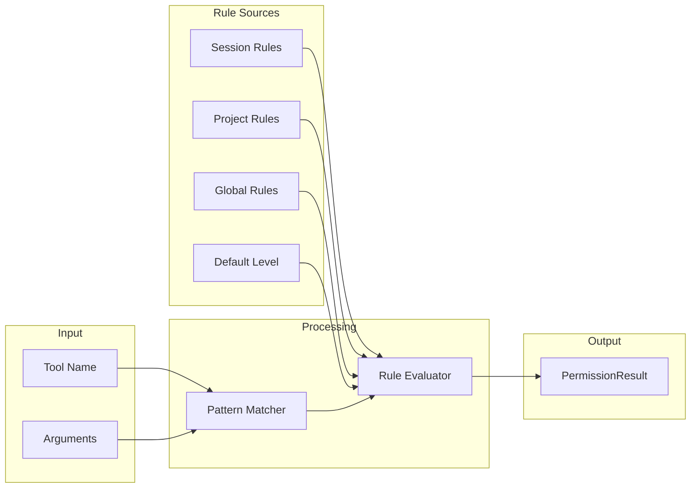

---

## 14. Entity Relationship - Permission Configuration

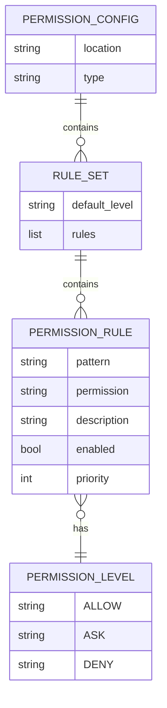

---

## 15. Confirmation Prompt Display

```
┌────────────────────────────────────────────────────────────────┐
│  Permission Required                                            │
├────────────────────────────────────────────────────────────────┤
│  Tool: bash                                                     │
│  command: git commit -m "Update readme"                         │
│                                                                 │
│  Confirm shell commands                                         │
│                                                                 │
│  [a] Allow    [A] Allow Always    [d] Deny    [D] Deny Always   │
└────────────────────────────────────────────────────────────────┘
```

---

## Notes

- Permission levels are comparable: ALLOW < ASK < DENY
- More specific rules take precedence over general rules
- Session rules have highest priority
- Default rules block dangerous operations
- User can create session rules via "Allow/Deny Always"
- Pattern matching supports glob and regex
