# Phase 4.2: Hooks System - UML Diagrams

**Phase:** 4.2
**Name:** Hooks System
**Dependencies:** Phase 2.1 (Tool System Foundation), Phase 4.1 (Permission System)

---

## 1. Class Diagram - Event Types

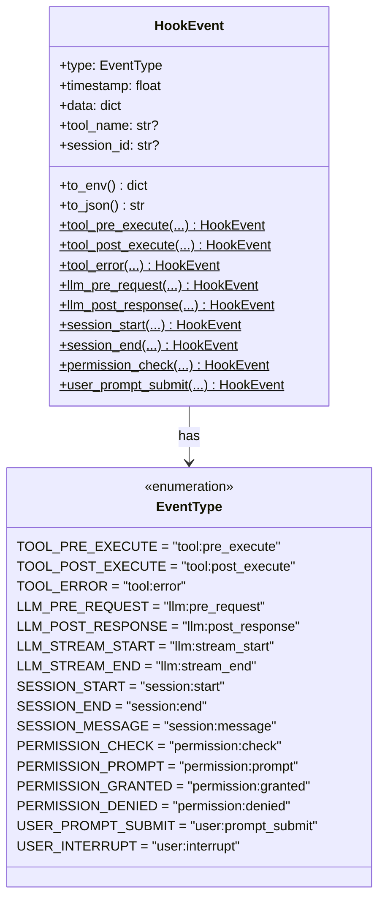

---

## 2. Class Diagram - Hook Registry

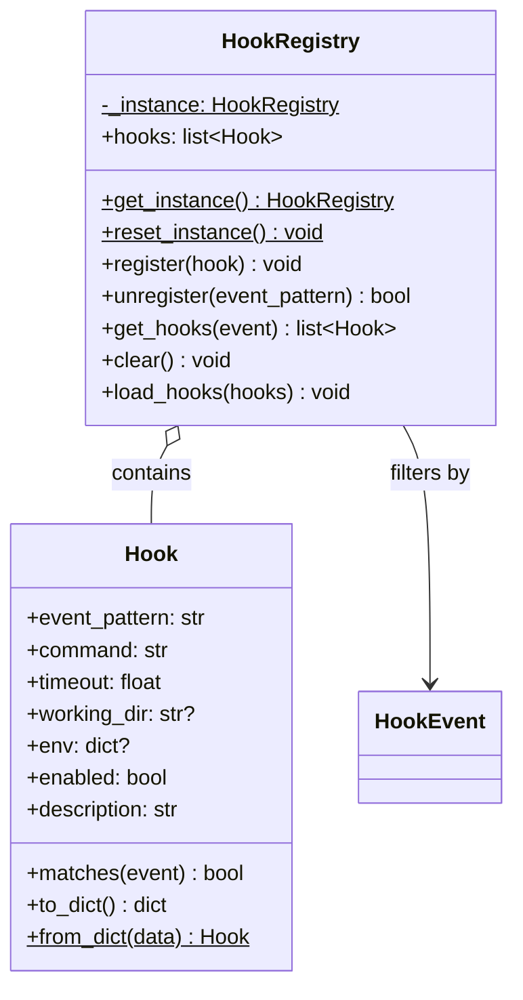

---

## 3. Class Diagram - Hook Executor

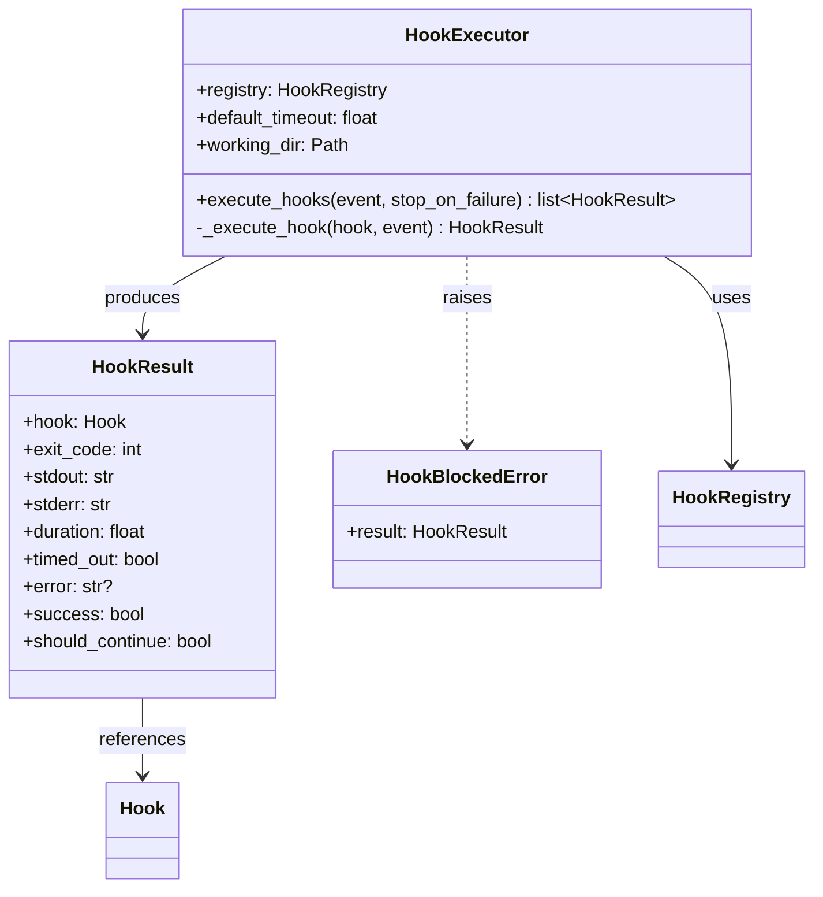

---

## 4. Class Diagram - Configuration

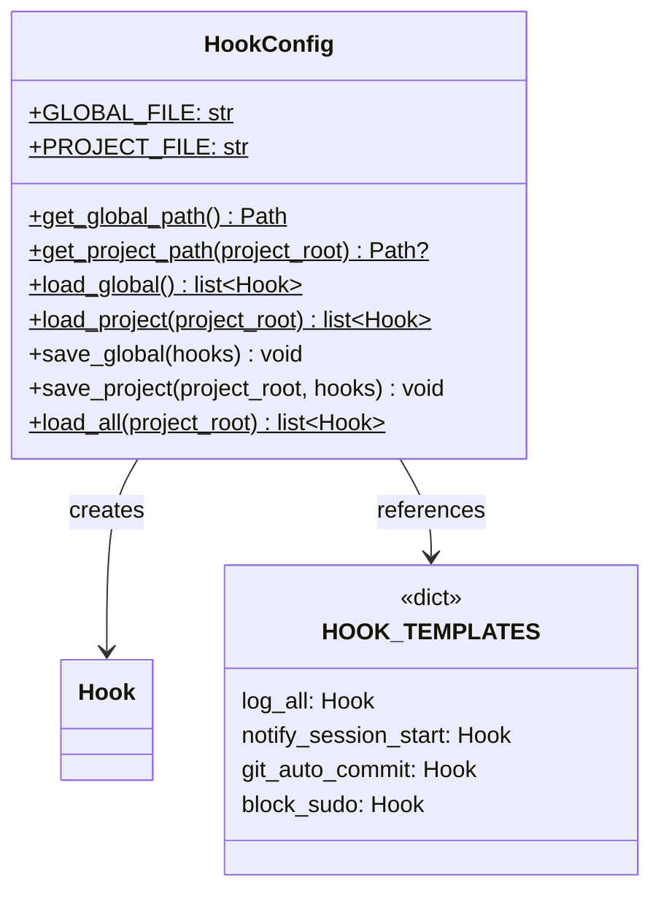

---

## 5. Sequence Diagram - Tool Pre-Execute Hook

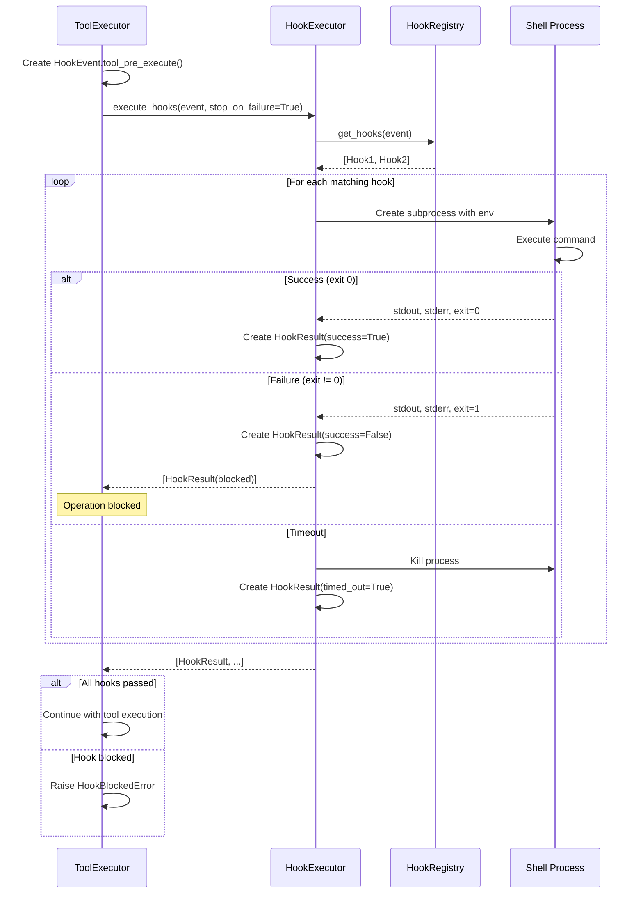

---

## 6. Sequence Diagram - Tool Lifecycle with Hooks

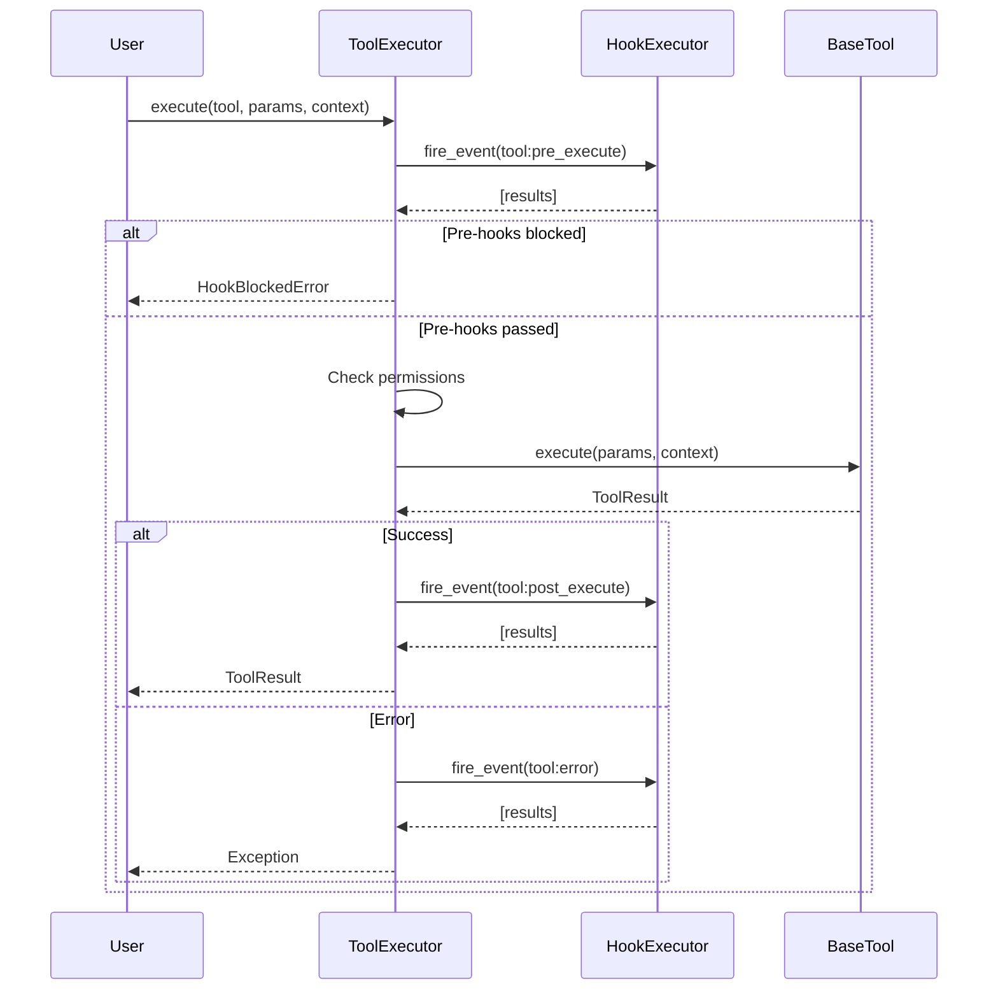

---

## 7. Sequence Diagram - Hook Pattern Matching

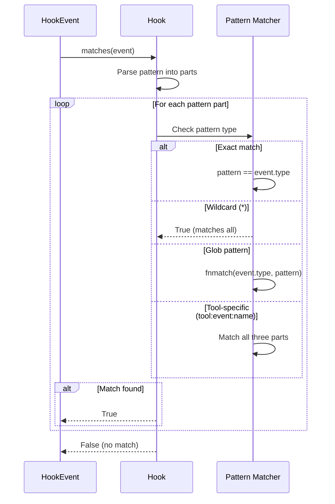

---

## 8. State Diagram - Hook Execution

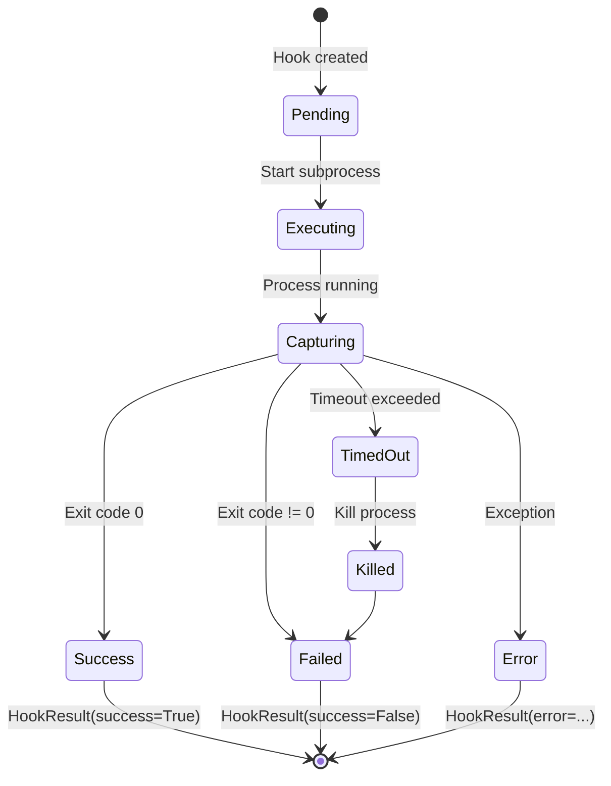

---

## 9. State Diagram - Hook Chain Execution

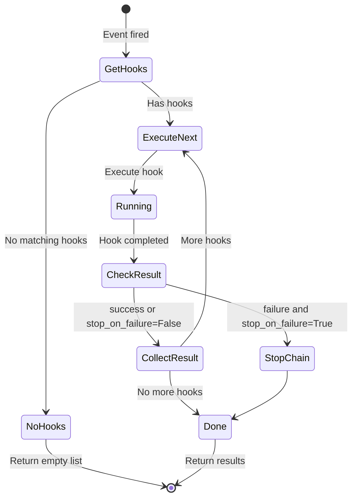

---

## 10. Activity Diagram - Fire Event Flow

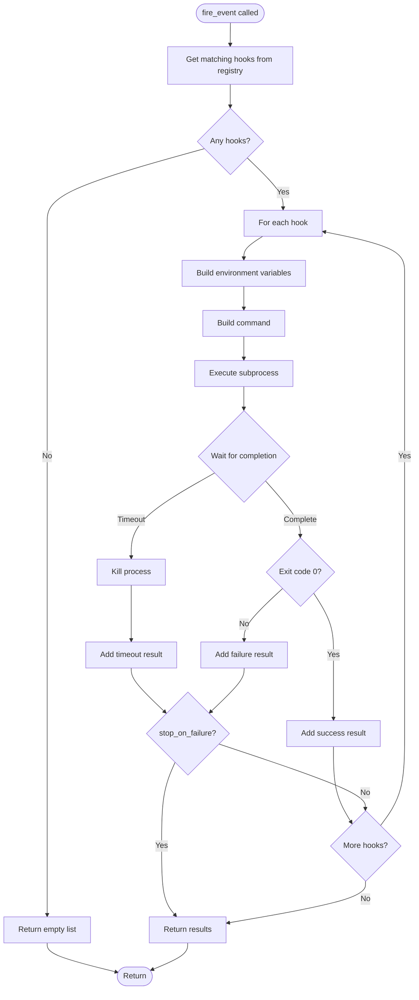

---

## 11. Component Diagram - Hooks Package

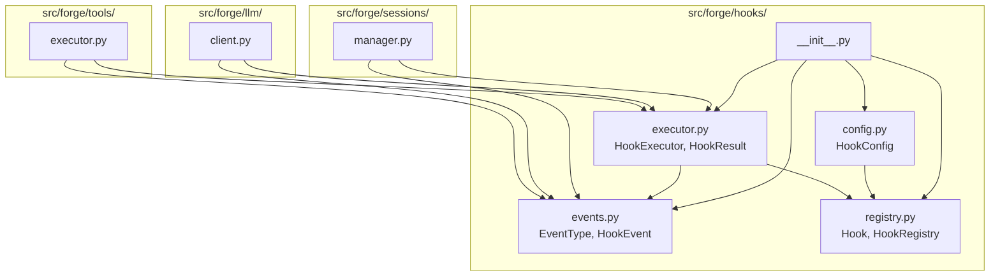

---

## 12. Data Flow Diagram - Hook Event Processing

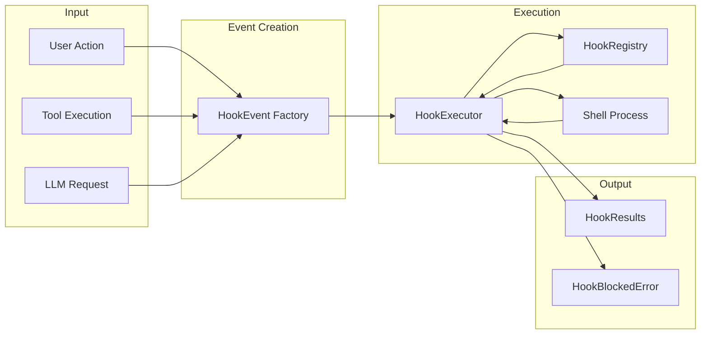

---

## 13. Environment Variables Diagram

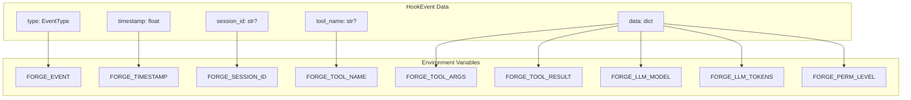

---

## 14. Hook Pattern Matching Examples

```
Pattern: "tool:pre_execute"
├── Matches: tool:pre_execute
└── Does not match: tool:post_execute, llm:pre_request

Pattern: "tool:*"
├── Matches: tool:pre_execute, tool:post_execute, tool:error
└── Does not match: llm:pre_request, session:start

Pattern: "tool:pre_execute:bash"
├── Matches: tool:pre_execute (when tool_name=bash)
└── Does not match: tool:pre_execute (when tool_name=read)

Pattern: "tool:*:write"
├── Matches: tool:pre_execute:write, tool:post_execute:write
└── Does not match: tool:pre_execute:bash

Pattern: "*"
└── Matches: Everything

Pattern: "session:start,session:end"
├── Matches: session:start, session:end
└── Does not match: session:message
```

---

## Notes

- Hooks execute shell commands in subprocesses
- Environment variables provide event context to hooks
- Pre-execute hooks can block operations (exit != 0)
- Hooks are configured in JSON files (global and project)
- Timeout prevents hung hooks from blocking the system
- HookRegistry is a singleton for consistent state
