# Phase 5.1: Session Management - UML Diagrams

**Phase:** 5.1
**Name:** Session Management
**Dependencies:** Phase 3.2 (LangChain Integration), Phase 4.2 (Hooks System)

---

## 1. Class Diagram - Session Models

---

## 2. Class Diagram - Storage Layer

---

## 3. Class Diagram - Index Layer

```mermaid
classDiagram
    class SessionSummary {
        +id: str
        +title: str
        +created_at: datetime
        +updated_at: datetime
        +message_count: int
        +total_tokens: int
        +tags: list~str~
        +working_dir: str
        +model: str
        +to_dict() dict
        +from_dict(data)$ SessionSummary
        +from_session(session)$ SessionSummary
    }

    class SessionIndex {
        +storage: SessionStorage
        -_index: dict~str, SessionSummary~
        -_dirty: bool
        +INDEX_FILE: str$
        +INDEX_VERSION: int$
        +index_path: Path
        +__init__(storage)
        +rebuild() void
        +add(session) void
        +update(session) void
        +remove(session_id) bool
        +get(session_id) SessionSummary?
        +count() int
        +list(...) list~SessionSummary~
        +get_recent(count) list~SessionSummary~
        +get_by_working_dir(dir) list~SessionSummary~
        +save_if_dirty() void
    }

    SessionIndex --> SessionStorage : uses
    SessionIndex o-- SessionSummary : contains
    SessionSummary ..> Session : summarizes
```

---

## 4. Class Diagram - Session Manager

---

## 5. Package Diagram

---

## 6. Sequence Diagram - Create Session

---

## 7. Sequence Diagram - Resume Session

---

## 8. Sequence Diagram - Auto-Save

---

## 9. Sequence Diagram - Session Close

---

## 10. Sequence Diagram - List Sessions

---

## 11. State Diagram - Session Lifecycle

---

## 12. State Diagram - Storage Operations

---

## 13. Activity Diagram - Session Create Flow

---

## 14. Activity Diagram - Resume Flow

---

## 15. Component Diagram - Session Storage

---

## 16. Data Flow Diagram - Message Flow

---

## 17. Entity Relationship Diagram

---

## Notes

- Session uses UUID-based IDs for uniqueness
- Storage uses atomic writes for data safety
- Index provides fast session listing without loading full sessions
- Manager is singleton for consistent state
- Auto-save runs in background asyncio task
- Hooks integrate with Phase 4.2 hooks system
- Sessions are JSON files for human readability
