# Phase 5.2: Context Management - UML Diagrams

**Phase:** 5.2
**Name:** Context Management
**Dependencies:** Phase 5.1 (Session Management), Phase 3.2 (LangChain Integration)

---

## 1. Class Diagram - Token Counting

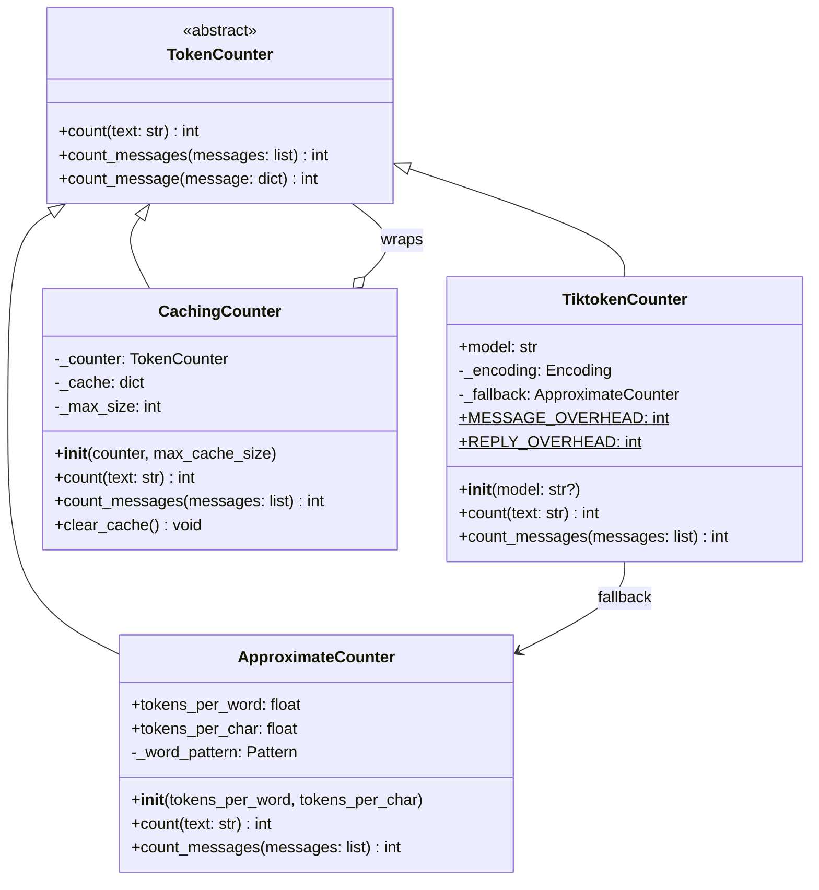

---

## 2. Class Diagram - Context Limits

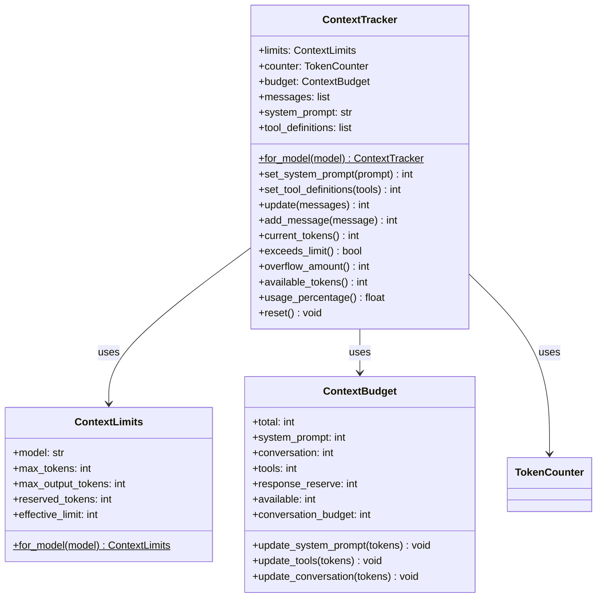

---

## 3. Class Diagram - Truncation Strategies

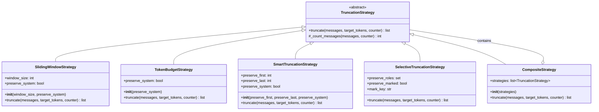

---

## 4. Class Diagram - Compaction

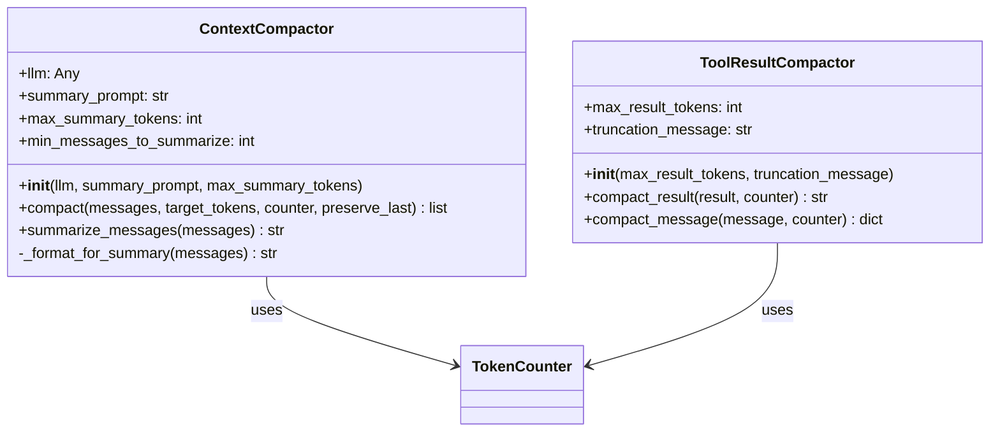

---

## 5. Class Diagram - Context Manager

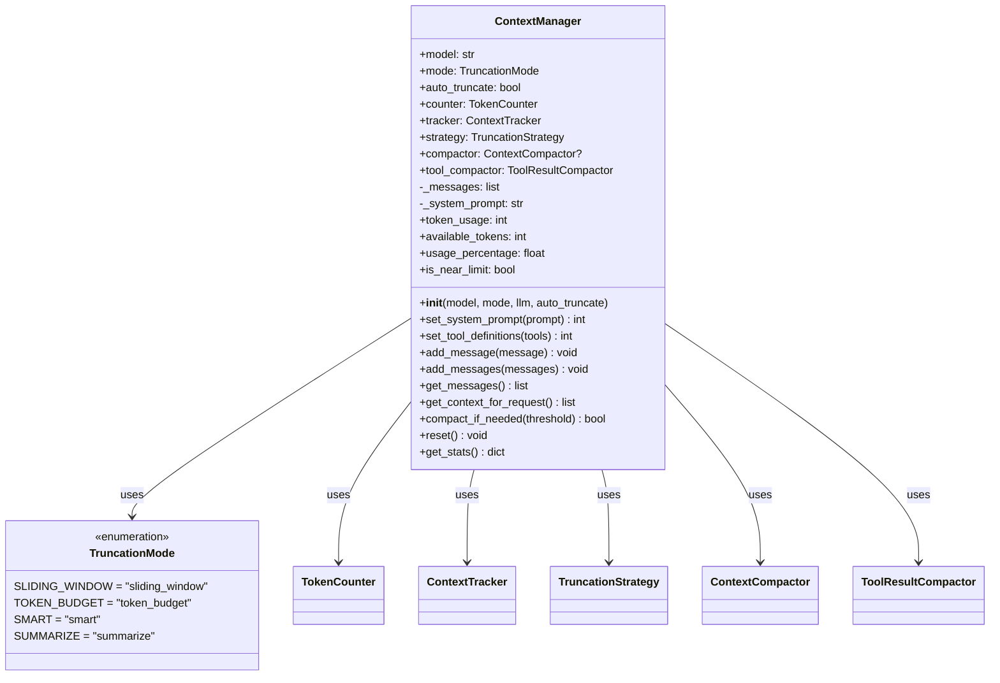

---

## 6. Package Diagram

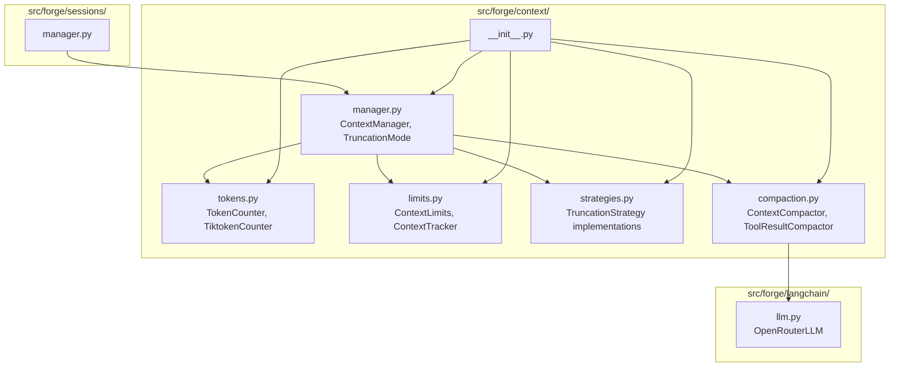

---

## 7. Sequence Diagram - Add Message with Truncation

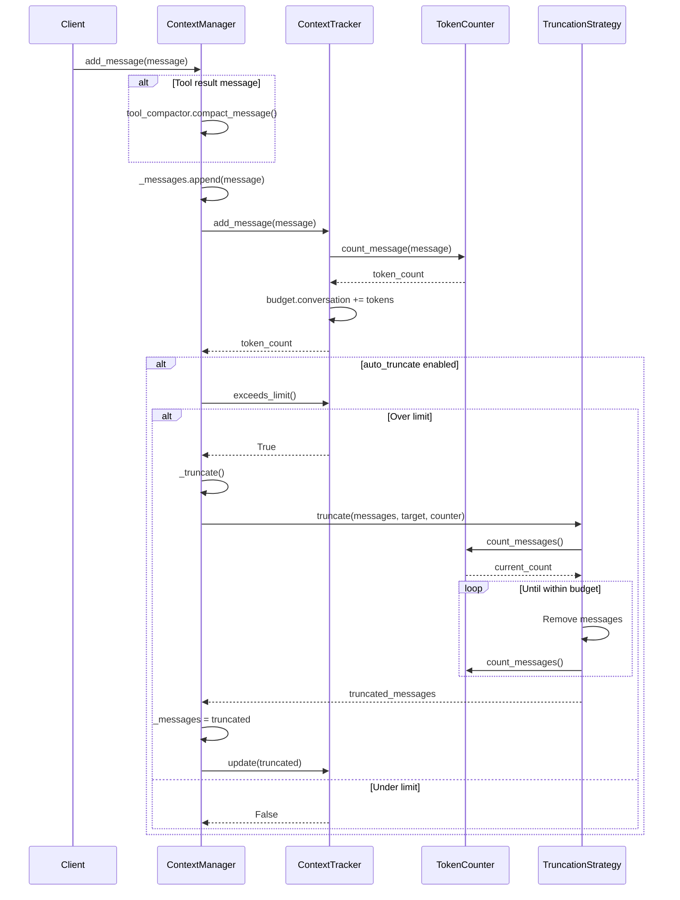

---

## 8. Sequence Diagram - Smart Truncation

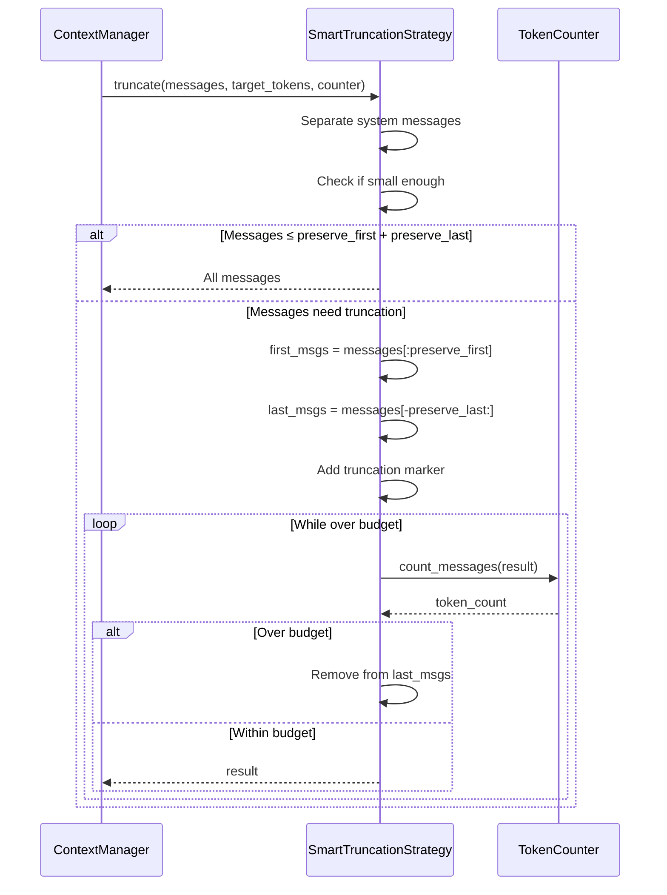

---

## 9. Sequence Diagram - Context Compaction

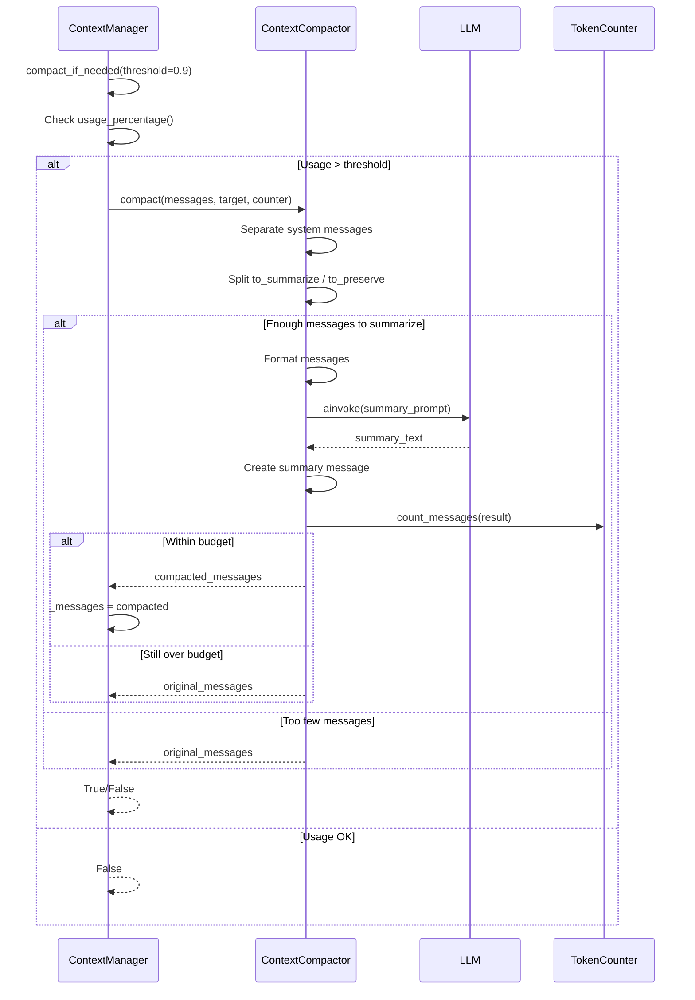

---

## 10. State Diagram - Context State

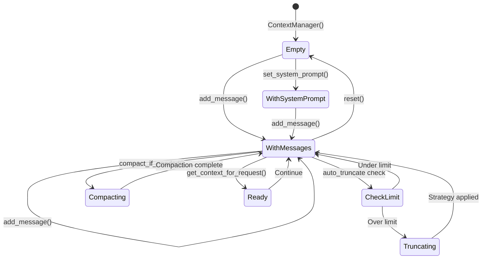

---

## 11. State Diagram - Token Budget

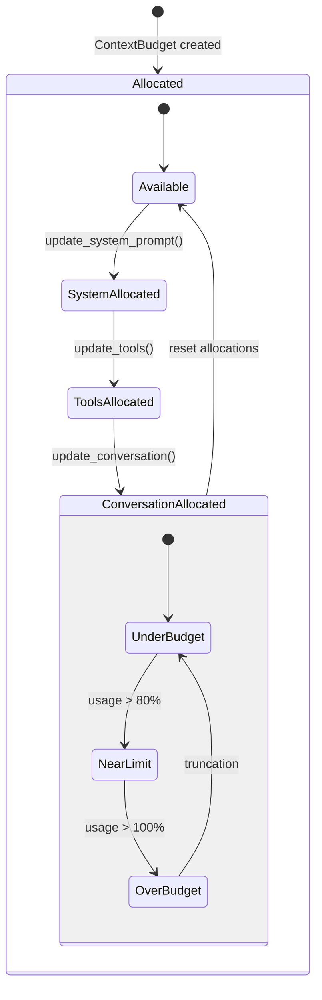

---

## 12. Activity Diagram - Message Addition Flow

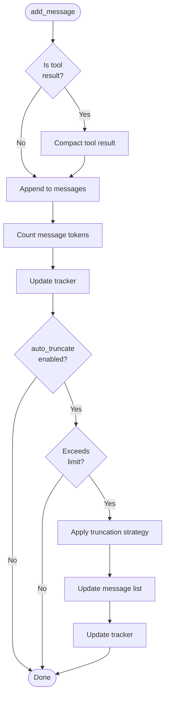

---

## 13. Activity Diagram - Truncation Strategy Selection

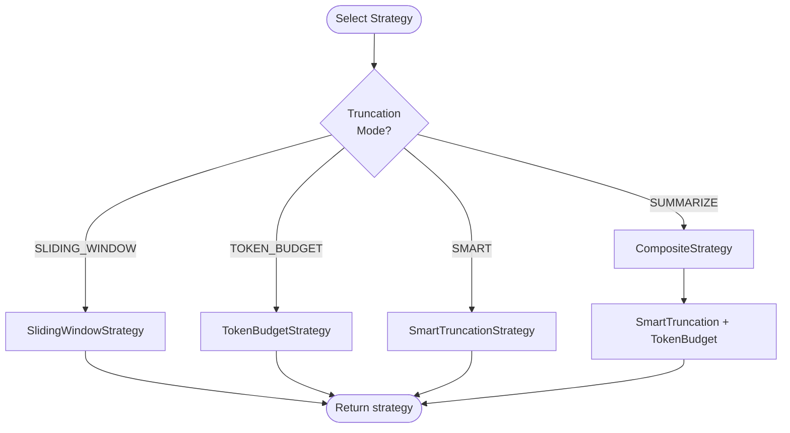

---

## 14. Data Flow Diagram

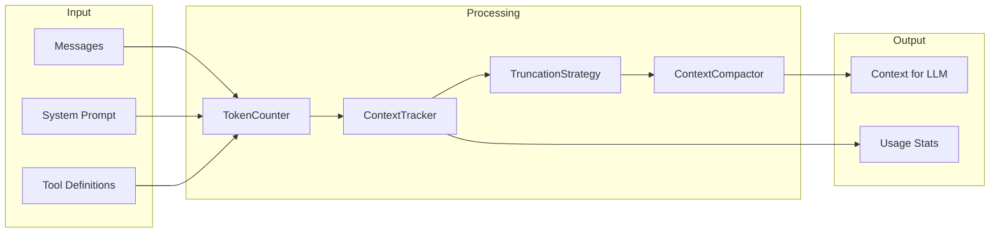

---

## 15. Component Interaction

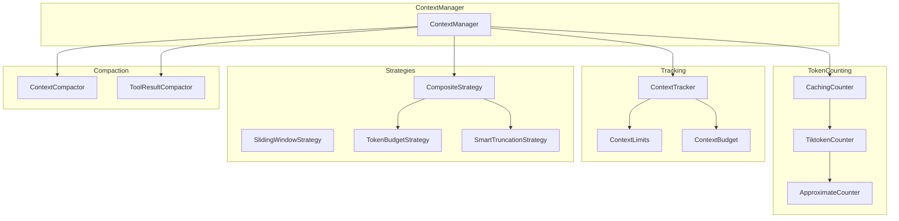

---

## 16. Token Budget Visualization

```
Total Context Window: 200,000 tokens
├── System Prompt:      2,000 tokens (1%)
├── Tool Definitions:   5,000 tokens (2.5%)
├── Response Reserve:   4,096 tokens (2%)
└── Conversation:     188,904 tokens (94.5%)
    ├── Used:          50,000 tokens
    └── Available:    138,904 tokens

Effective Limit = Total - Response Reserve - Reserved
                = 200,000 - 4,096 - 1,000
                = 194,904 tokens
```

---

## Notes

- Token counting uses tiktoken when available, falls back to approximation
- Caching improves performance for repeated text
- Multiple truncation strategies available for different use cases
- Summarization requires LLM but provides best context preservation
- Tool result compaction prevents large outputs from consuming context
- Auto-truncation ensures context never exceeds model limits
