# Phase 6.1: Slash Commands - UML Diagrams

**Phase:** 6.1
**Name:** Slash Commands
**Dependencies:** Phase 1.3 (Basic REPL Shell), Phase 5.1 (Session Management)

---

## 1. Class Diagram - Command Parsing

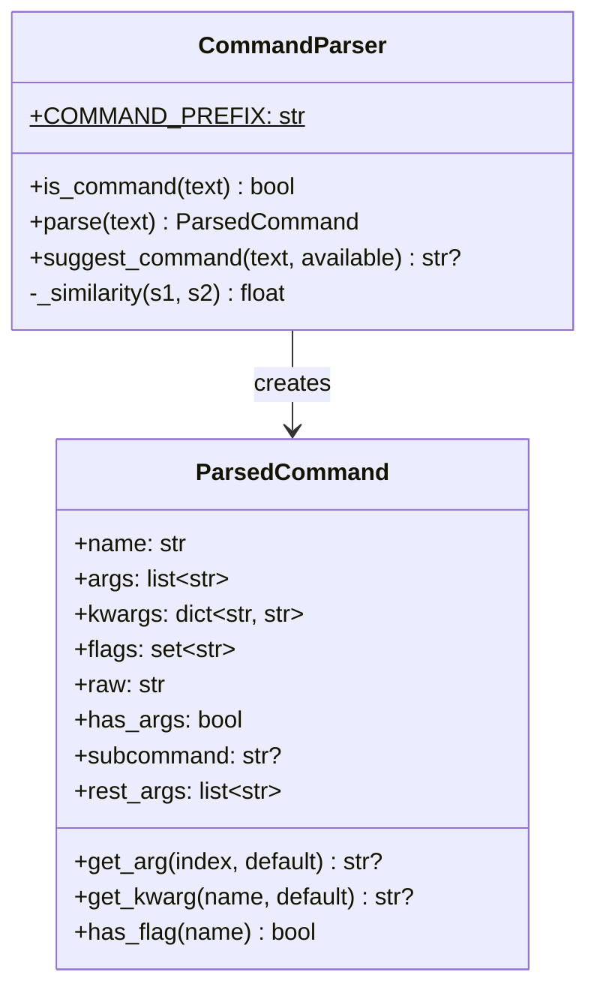

---

## 2. Class Diagram - Command Base

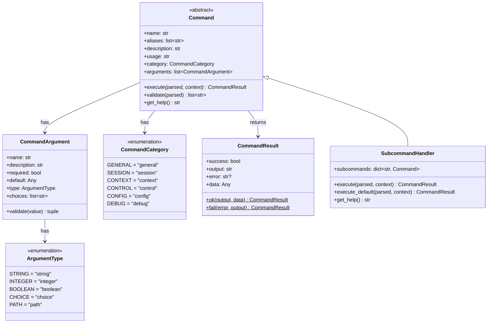

---

## 3. Class Diagram - Command Registry

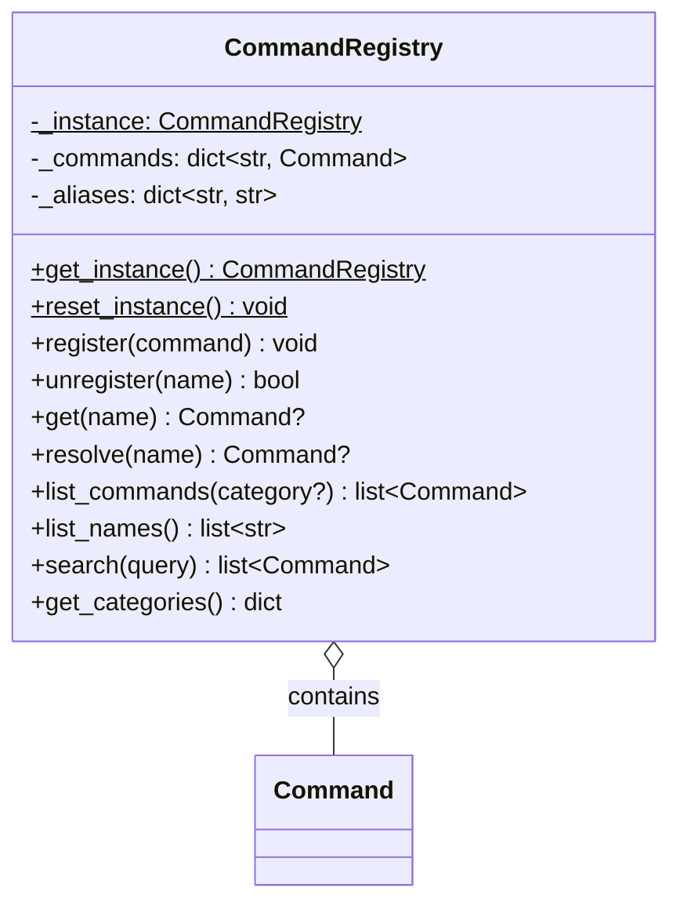

---

## 4. Class Diagram - Command Execution

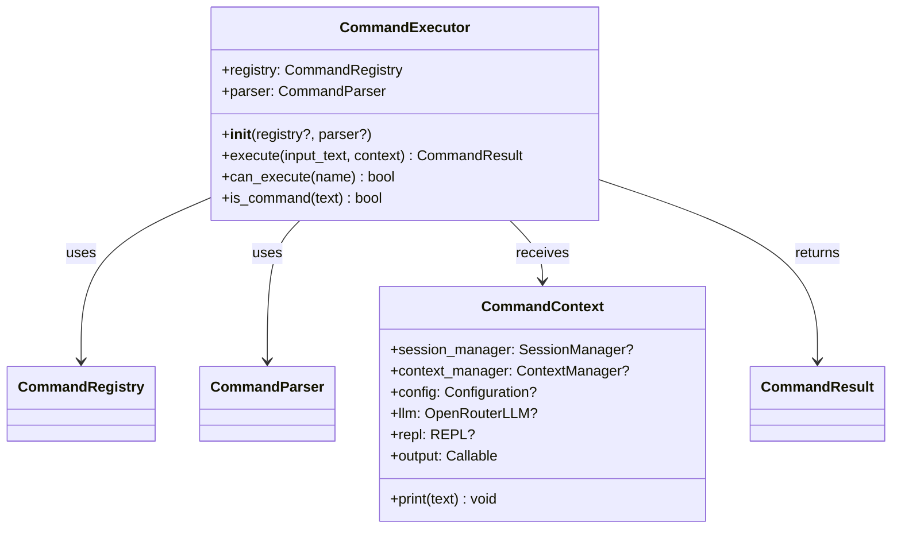

---

## 5. Class Diagram - Built-in Commands

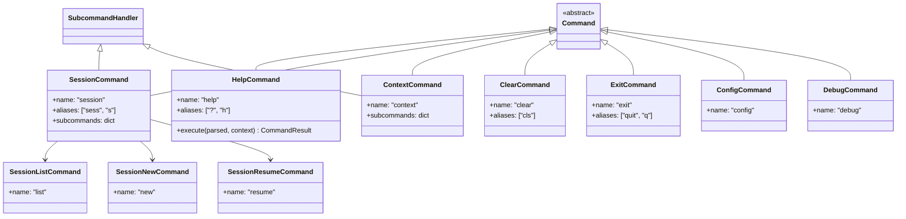

---

## 6. Package Diagram

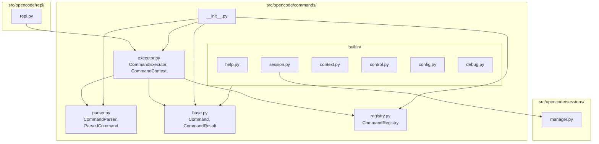

---

## 7. Sequence Diagram - Command Execution

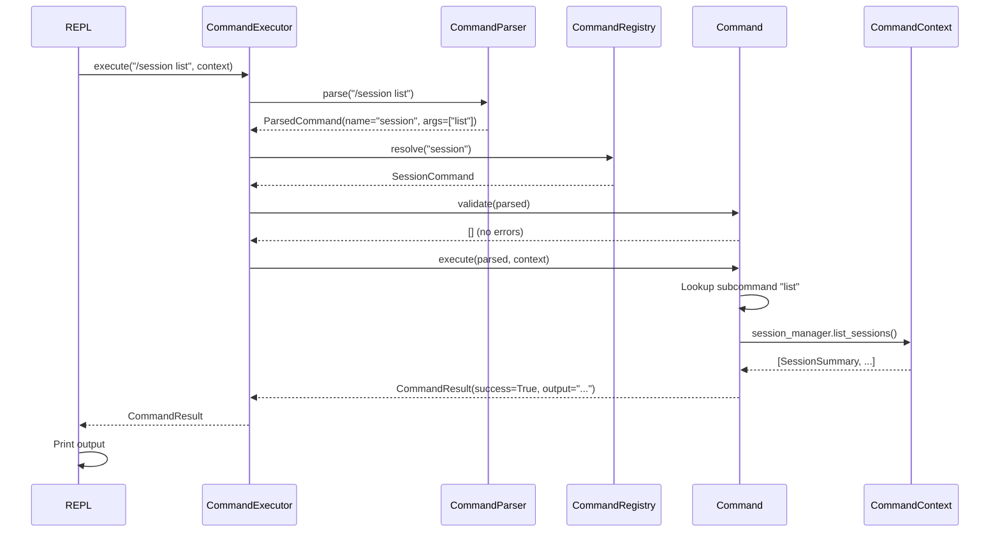

---

## 8. Sequence Diagram - Command with Subcommands

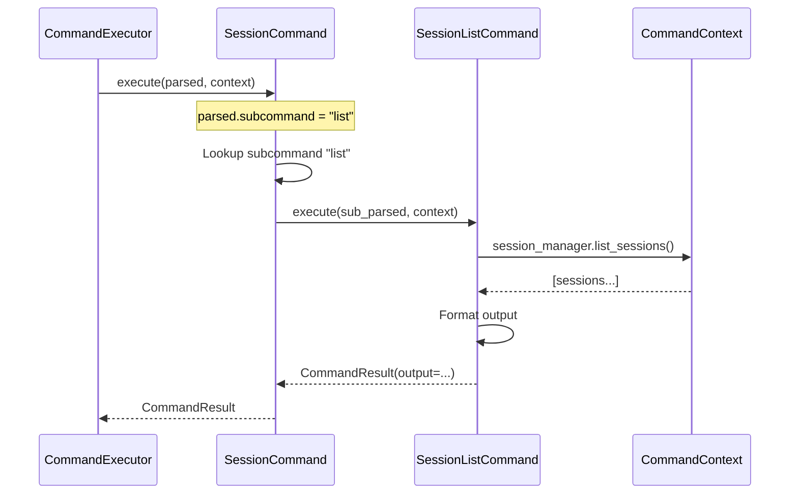

---

## 9. Sequence Diagram - Command Parsing

```mermaid
sequenceDiagram
    participant Parser as CommandParser
    participant Shlex

    Parser->>Parser: is_command("/session list --limit 10")

    Note over Parser: Starts with /, has alpha after /

    Parser-->>Parser: True

    Parser->>Parser: parse("/session list --limit 10")

    Parser->>Parser: Remove prefix "/"
    Parser->>Shlex: split("session list --limit 10")
    Shlex-->>Parser: ["session", "list", "--limit", "10"]

    Parser->>Parser: name = "session"

    loop For each token
        Parser->>Parser: Check if --key, -f, or positional
    end

    Parser-->>Parser: ParsedCommand(
        name="session",
        args=["list"],
        kwargs={"limit": "10"},
        flags=set()
    )
```

---

## 10. State Diagram - Command Execution

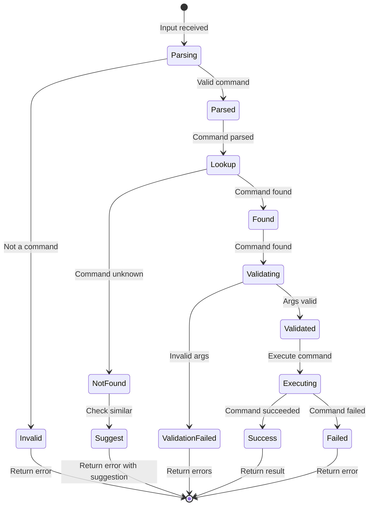

---

## 11. Activity Diagram - Parse Command

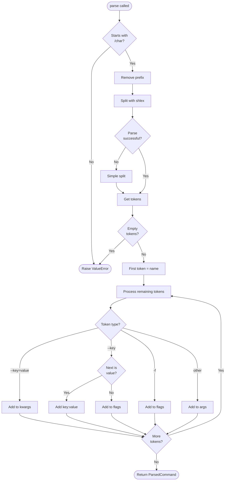

---

## 12. Activity Diagram - Execute Command

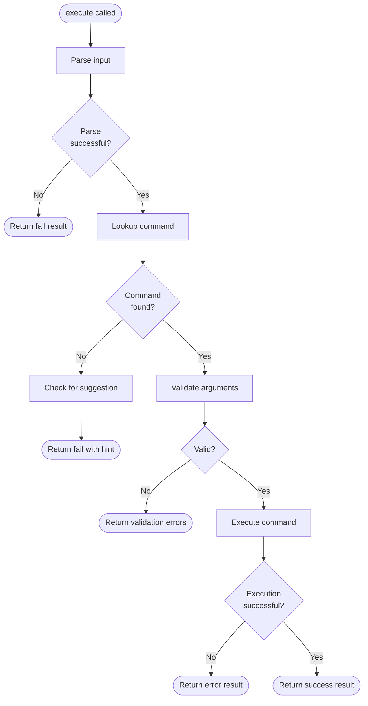

---

## 13. Component Diagram - Command Flow

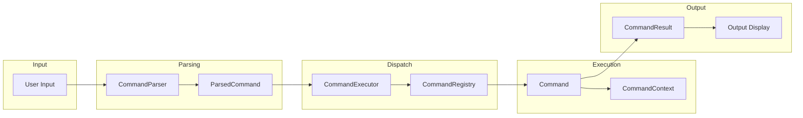

---

## 14. Command Category Organization

```
CommandRegistry
├── GENERAL
│   ├── /help
│   └── /commands
├── SESSION
│   ├── /session
│   ├── /session list
│   ├── /session new
│   ├── /session resume
│   ├── /session delete
│   └── /session title
├── CONTEXT
│   ├── /context
│   ├── /context compact
│   ├── /context reset
│   └── /context mode
├── CONTROL
│   ├── /clear
│   ├── /exit
│   ├── /reset
│   └── /stop
├── CONFIG
│   ├── /config
│   ├── /config get
│   ├── /config set
│   └── /model
└── DEBUG
    ├── /debug
    ├── /tokens
    ├── /history
    └── /tools
```

---

## 15. Command Argument Flow

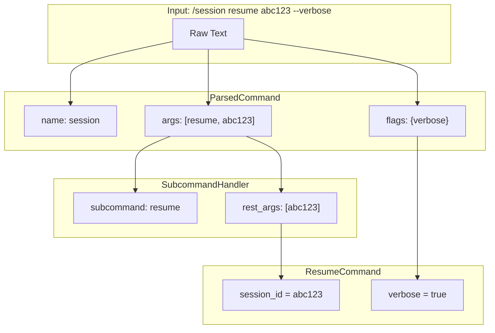

---

## Notes

- Commands are identified by `/` prefix
- Command names are case-insensitive
- Subcommand pattern allows hierarchical commands
- CommandContext provides access to system components
- CommandResult carries success/error and output
- Registry is singleton for consistent state
- Built-in commands organized by category
