# Phase 6.2: Operating Modes - UML Diagrams

**Phase:** 6.2
**Name:** Operating Modes
**Dependencies:** Phase 1.3 (Basic REPL Shell), Phase 3.2 (LangChain Integration)

---

## 1. Class Diagram - Mode Base Classes

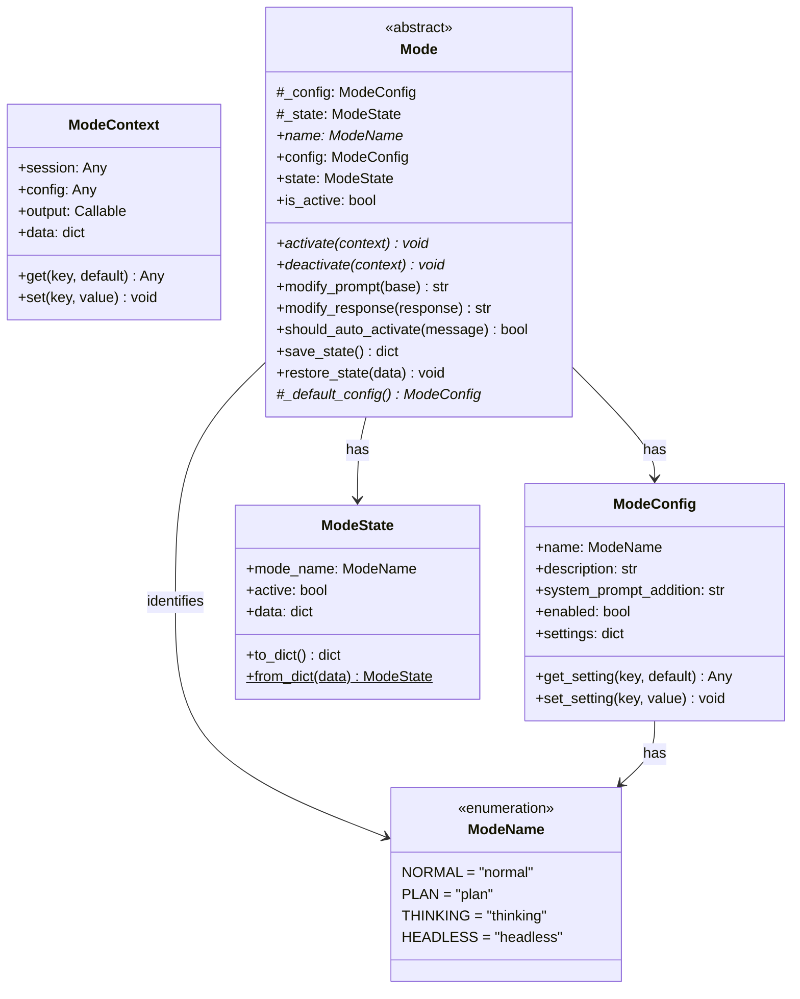

---

## 2. Class Diagram - Concrete Modes

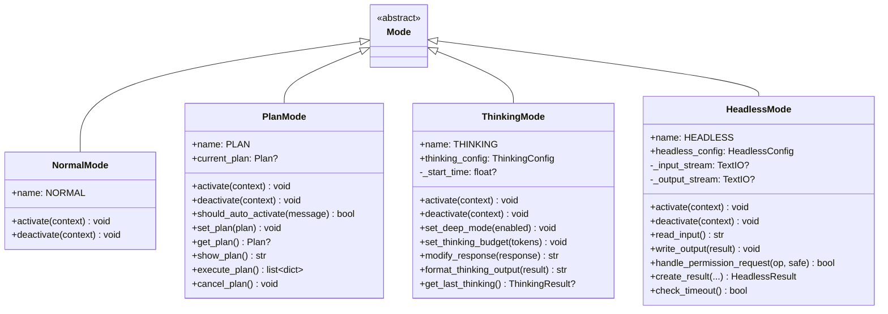

---

## 3. Class Diagram - Plan Mode Data

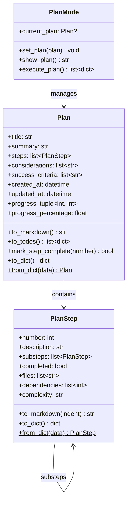

---

## 4. Class Diagram - Thinking Mode Data

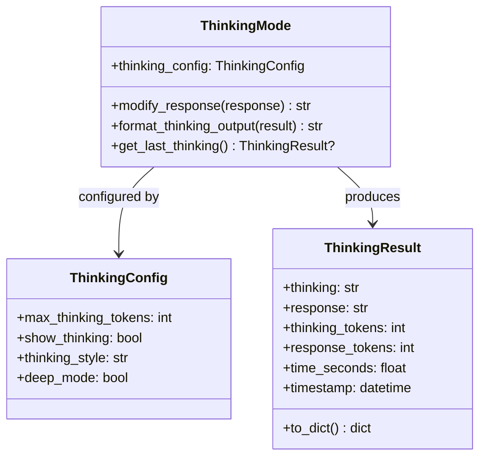

---

## 5. Class Diagram - Headless Mode Data

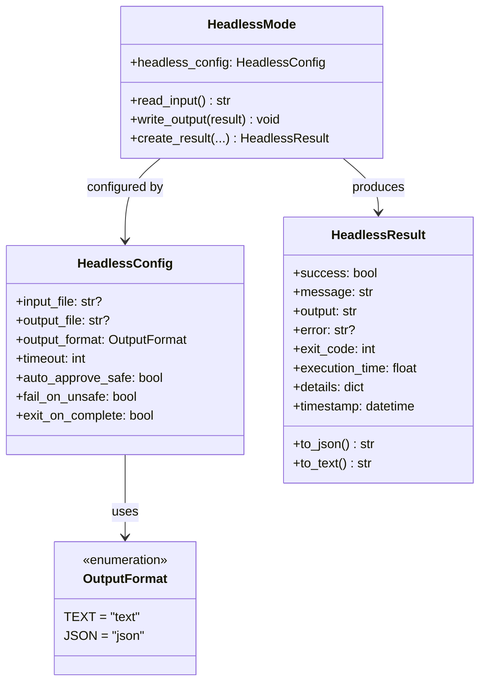

---

## 6. Class Diagram - Mode Manager

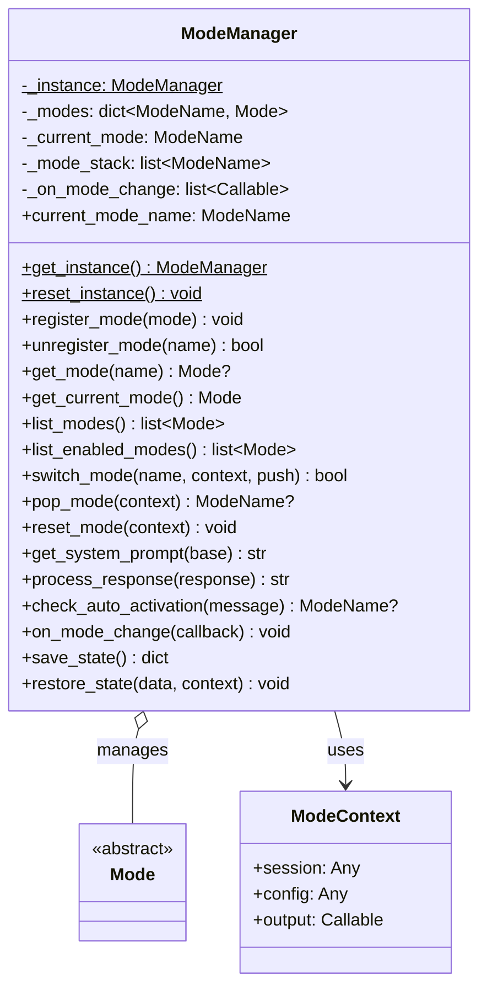

---

## 7. Package Diagram

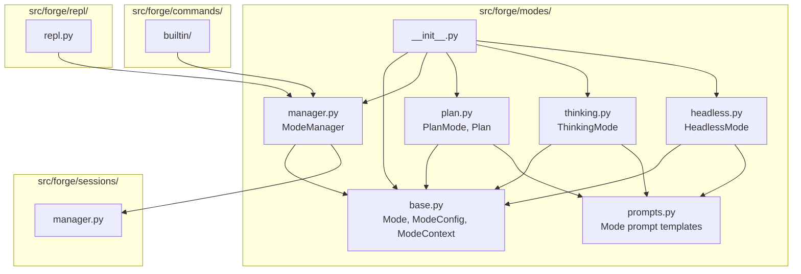

---

## 8. Sequence Diagram - Mode Switch

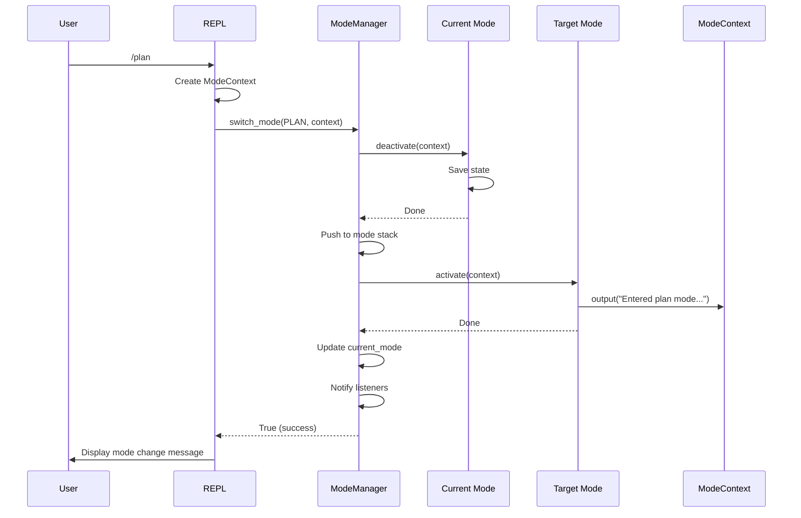

---

## 9. Sequence Diagram - Plan Creation

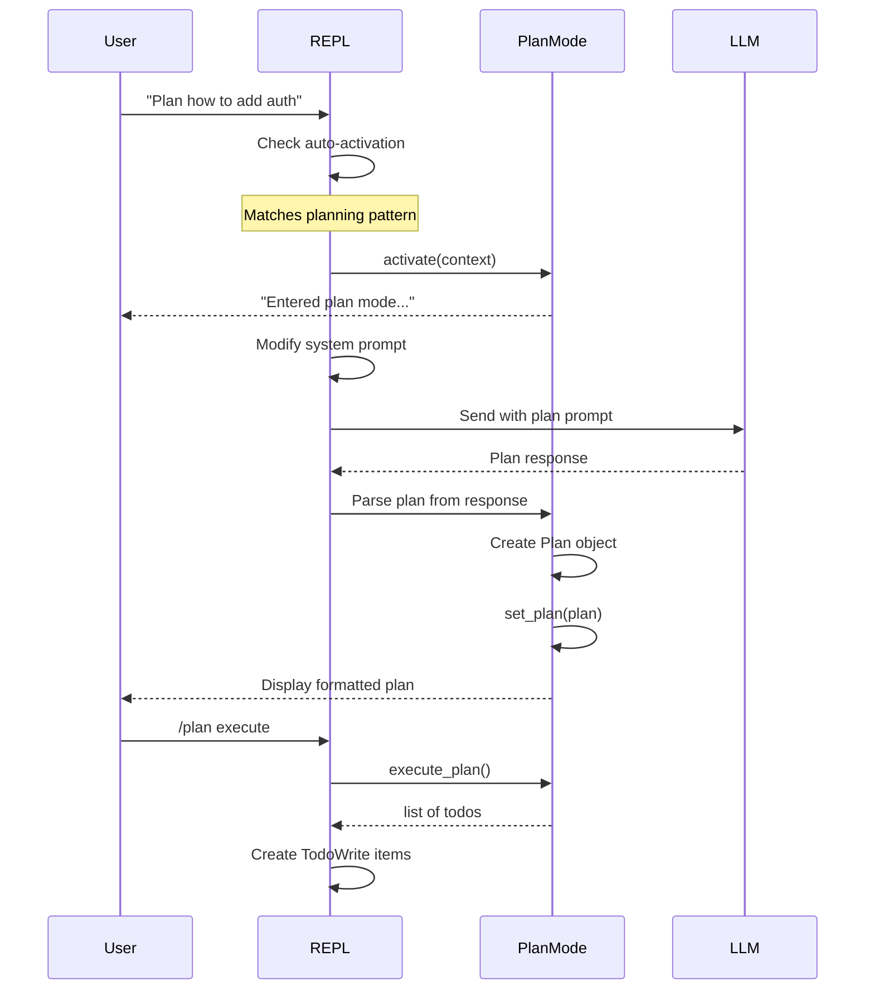

---

## 10. Sequence Diagram - Thinking Response

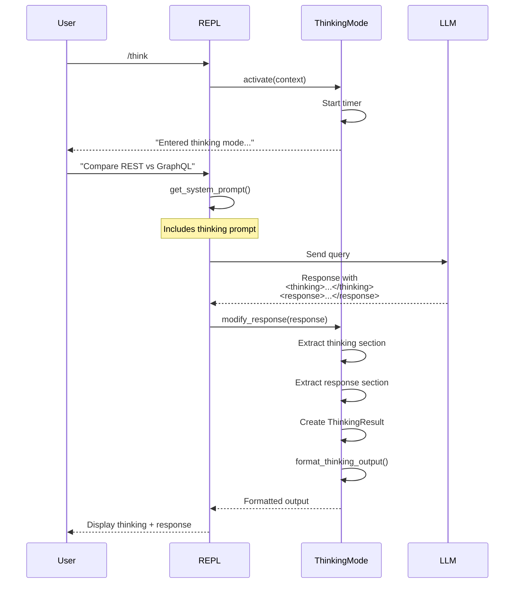

---

## 11. Sequence Diagram - Headless Execution

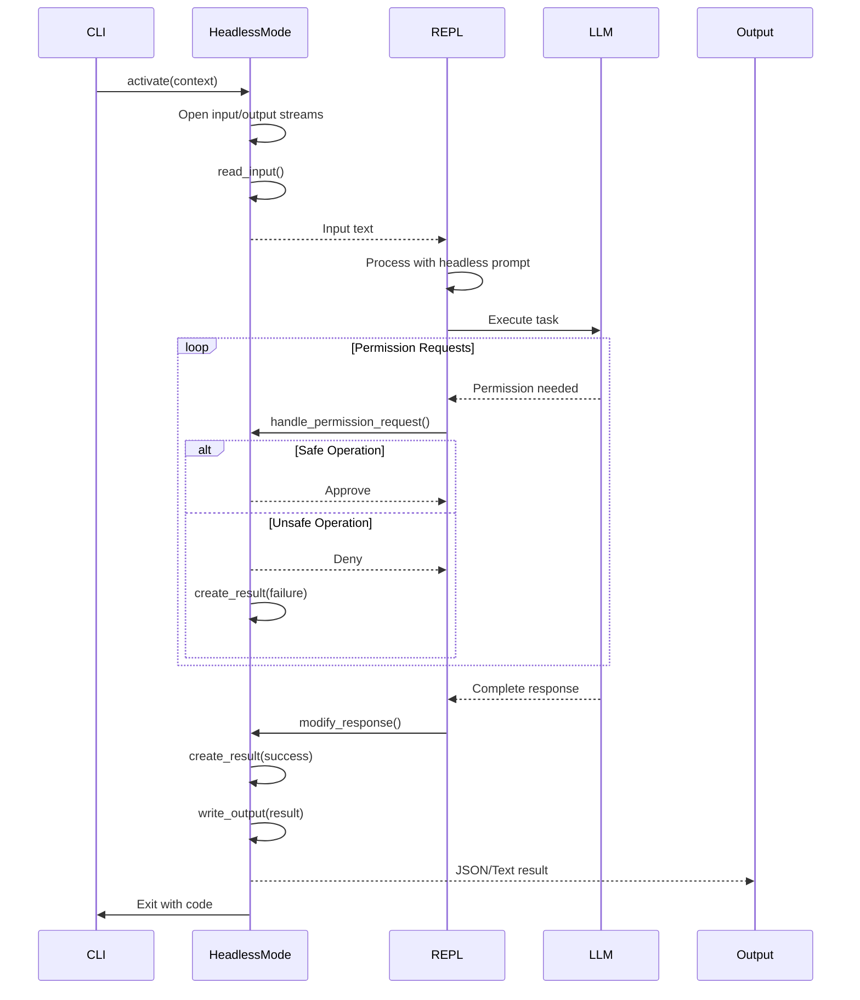

---

## 12. State Diagram - Mode Lifecycle

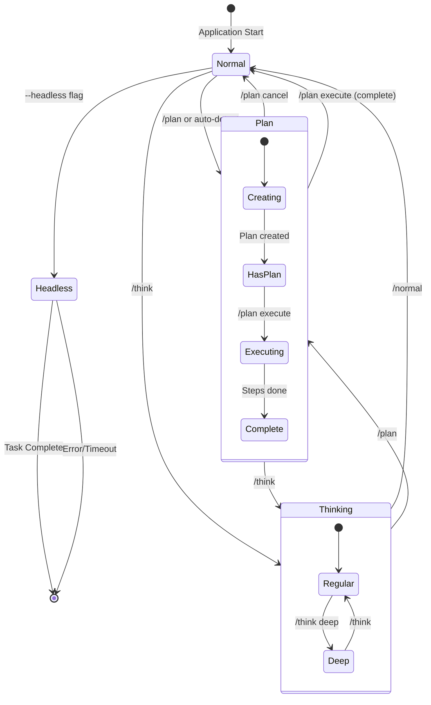

---

## 13. Activity Diagram - Auto-Activation

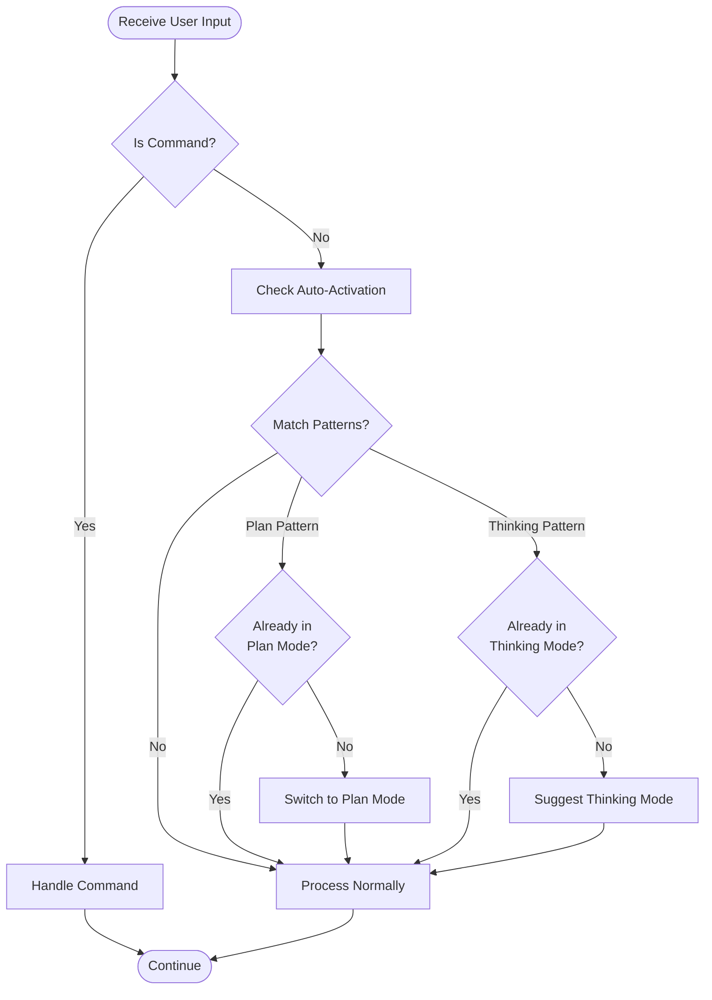

---

## 14. Activity Diagram - Response Processing

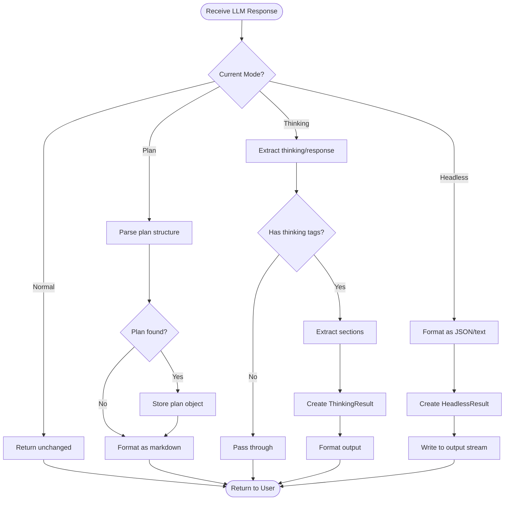

---

## 15. Component Diagram - Mode System

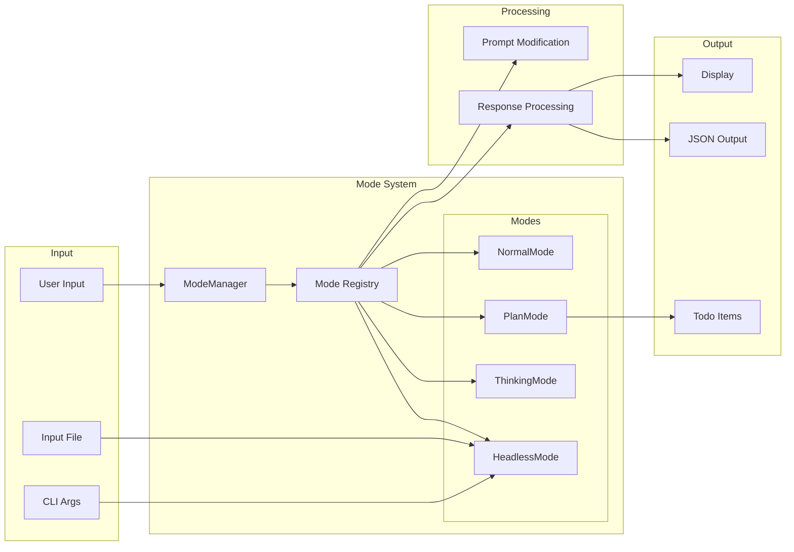

---

## 16. Mode Interaction Overview

```
                    ModeManager (Singleton)
                           |
           +---------------+---------------+
           |               |               |
      NormalMode       PlanMode      ThinkingMode      HeadlessMode
           |               |               |               |
           |          +----+----+    +-----+-----+    +----+----+
           |          |         |    |           |    |         |
           |        Plan    PlanStep  ThinkingResult   HeadlessResult
           |                          ThinkingConfig   HeadlessConfig

    Flow:
    1. ModeManager tracks current mode
    2. REPL queries manager for prompt modifications
    3. Modes process responses as needed
    4. State persisted in session
    5. Commands trigger mode switches
```

---

## Notes

- Mode is an abstract base class for extensibility
- ModeManager is singleton for global state
- Each mode has its own data structures
- Modes modify system prompt and responses
- State is serializable for session persistence
- Headless mode has special I/O handling
- Auto-activation uses regex pattern matching
