# Phase 7.1: Subagents System - UML Diagrams

**Phase:** 7.1
**Name:** Subagents System
**Dependencies:** Phase 3.2 (LangChain Integration), Phase 2.1 (Tool System)

---

## 1. Class Diagram - Agent Base Classes

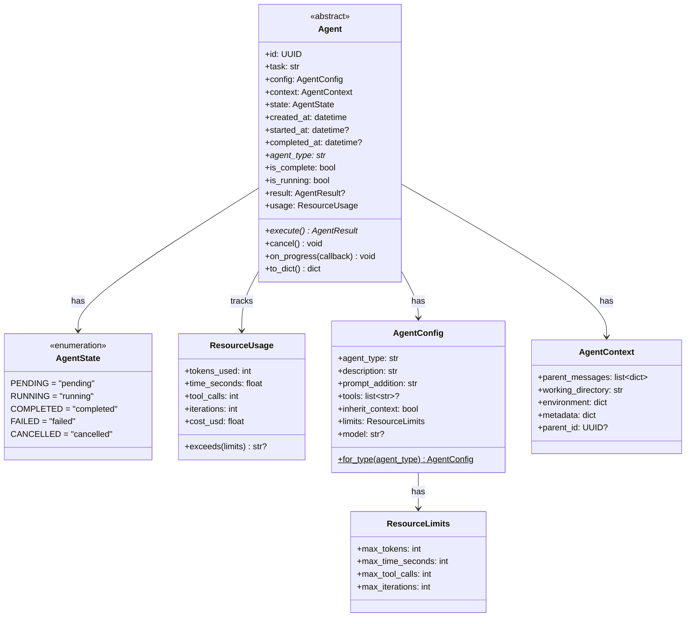

---

## 2. Class Diagram - Agent Types

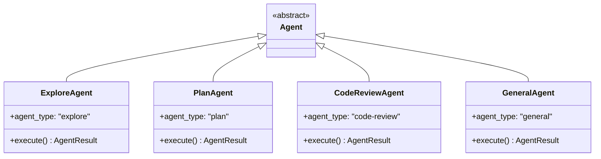

---

## 3. Class Diagram - Results

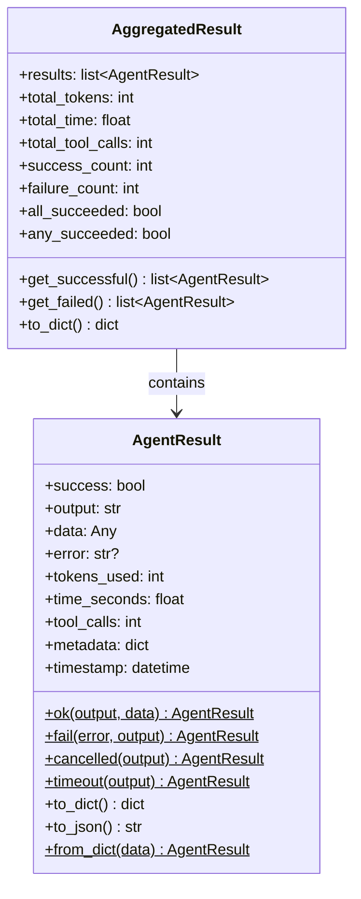

---

## 4. Class Diagram - Type Registry

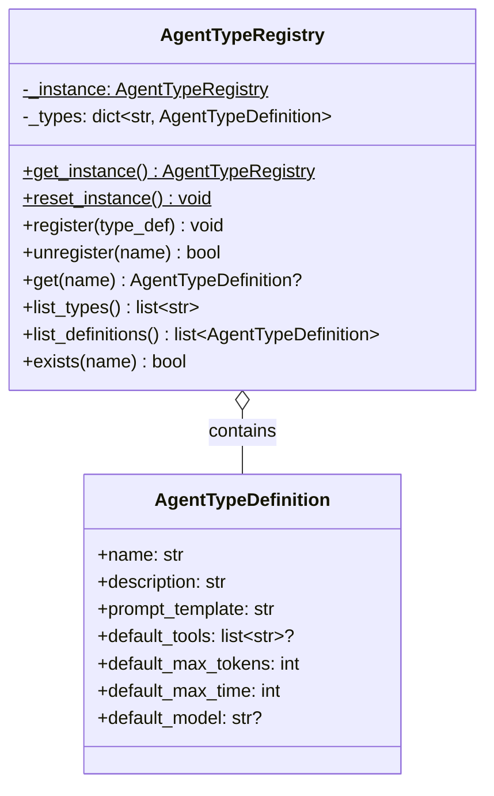

---

## 5. Class Diagram - Executor and Manager

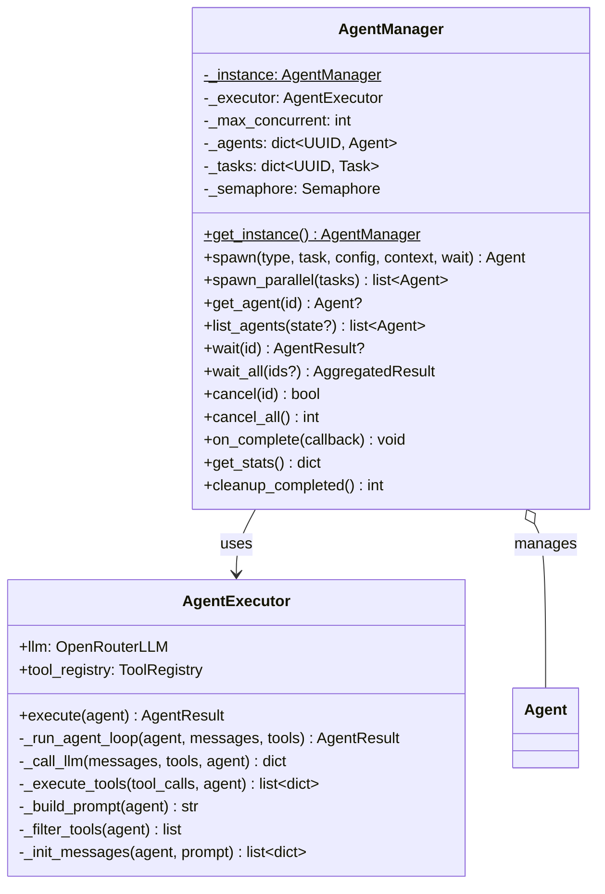

---

## 6. Package Diagram

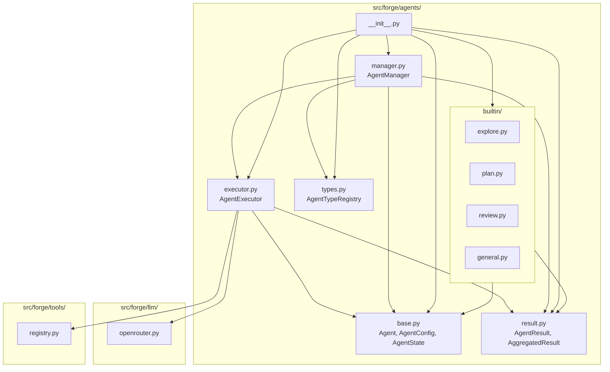

---

## 7. Sequence Diagram - Spawn and Execute Agent

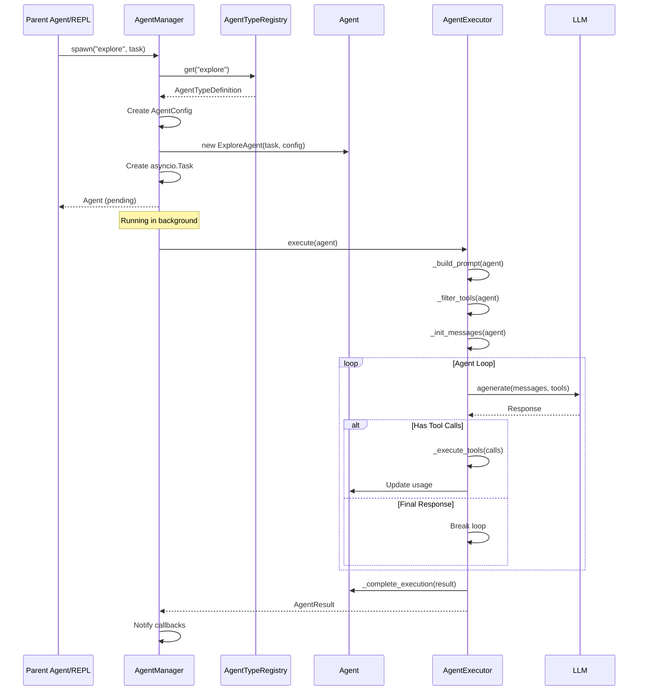

---

## 8. Sequence Diagram - Parallel Execution

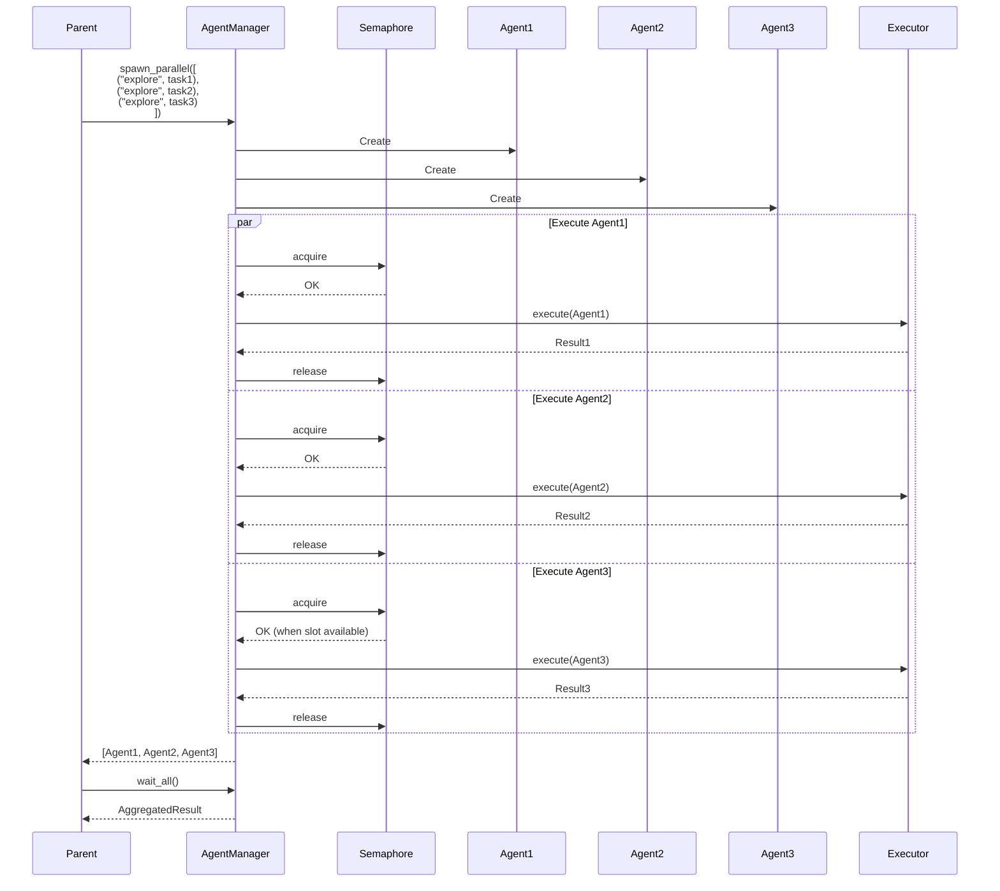

---

## 9. Sequence Diagram - Resource Limit Exceeded

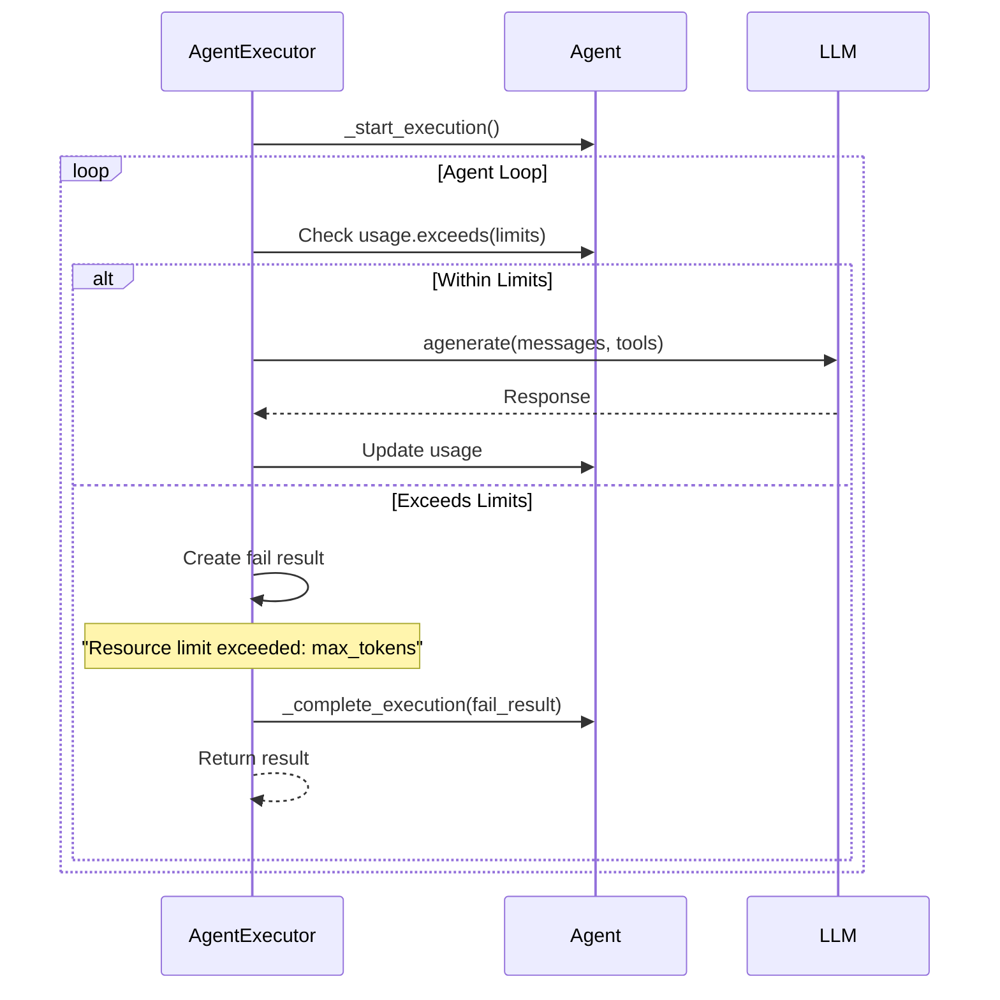

---

## 10. Sequence Diagram - Cancellation

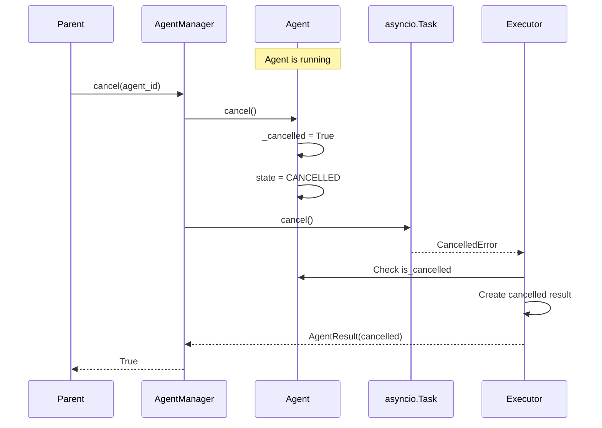

---

## 11. State Diagram - Agent Lifecycle

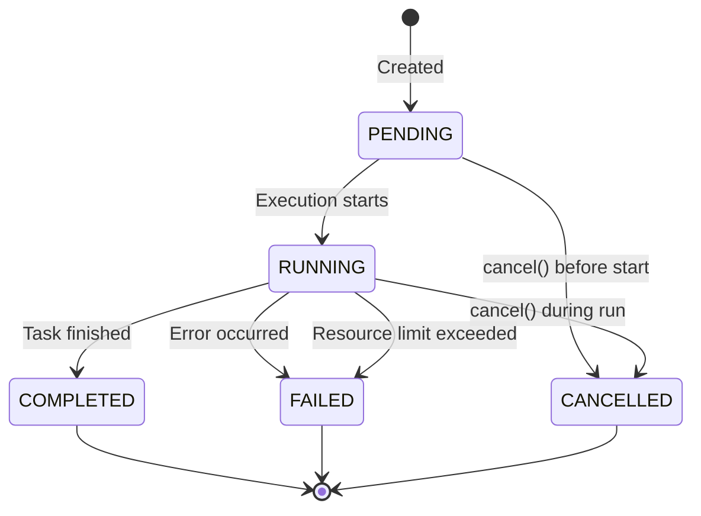

---

## 12. Activity Diagram - Agent Execution Loop

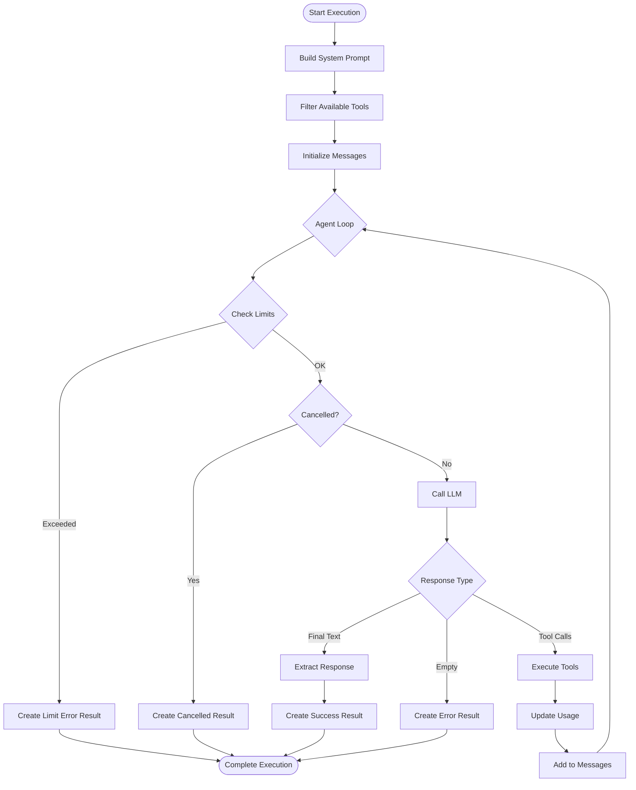

---

## 13. Component Diagram - Agent System

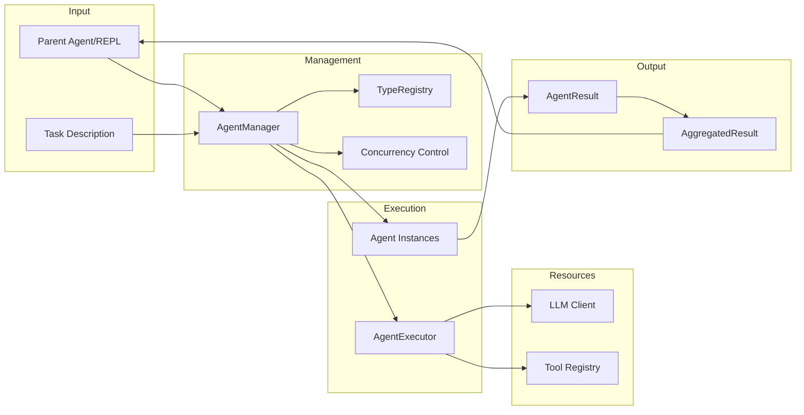

---

## 14. Agent Type Hierarchy

```
AgentTypeRegistry
├── explore
│   ├── Tools: glob, grep, read
│   ├── Max Tokens: 30,000
│   └── Max Time: 180s
├── plan
│   ├── Tools: glob, grep, read
│   ├── Max Tokens: 40,000
│   └── Max Time: 240s
├── code-review
│   ├── Tools: glob, grep, read, bash
│   ├── Max Tokens: 40,000
│   └── Max Time: 300s
└── general
    ├── Tools: all
    ├── Max Tokens: 50,000
    └── Max Time: 300s
```

---

## 15. Resource Tracking Flow

```mermaid
flowchart TB
    subgraph Limits["ResourceLimits"]
        MAX_TOK[max_tokens: 50000]
        MAX_TIME[max_time_seconds: 300]
        MAX_CALLS[max_tool_calls: 100]
        MAX_ITER[max_iterations: 50]
    end

    subgraph Usage["ResourceUsage"]
        TOKENS[tokens_used: 0]
        TIME[time_seconds: 0]
        CALLS[tool_calls: 0]
        ITER[iterations: 0]
    end

    subgraph Loop["Execution Loop"]
        LLM_CALL[LLM Call]
        TOOL_CALL[Tool Execution]
        CHECK[Check exceeds()]
    end

    LLM_CALL --> |add response tokens| TOKENS
    TOOL_CALL --> |increment| CALLS
    Loop --> |track elapsed| TIME
    Loop --> |increment| ITER

    CHECK --> |compare| Limits
    CHECK --> |if exceeded| ABORT[Abort with Error]
```

---

## Notes

- Agents run asynchronously and independently
- Semaphore controls concurrent agent count
- Each agent has isolated message history
- Resource limits prevent runaway execution
- Results aggregated for parallel agents
- Agent state persisted for tracking
- Cancellation is cooperative (checked in loop)
