# OpenCode UML Diagrams
## Comprehensive System Architecture Visualization

**Version:** 1.0
**Date:** December 2025
**Standard:** UML 2.5 with Mermaid Syntax

---

## Table of Contents

1. [System Context Diagram](#1-system-context-diagram)
2. [Container Diagram](#2-container-diagram)
3. [Component Diagrams](#3-component-diagrams)
4. [Class Diagrams](#4-class-diagrams)
5. [Sequence Diagrams](#5-sequence-diagrams)
6. [State Diagrams](#6-state-diagrams)
7. [Activity Diagrams](#7-activity-diagrams)
8. [Entity Relationship Diagrams](#8-entity-relationship-diagrams)
9. [Deployment Diagrams](#9-deployment-diagrams)

---

## 1. System Context Diagram

### 1.1 High-Level System Context

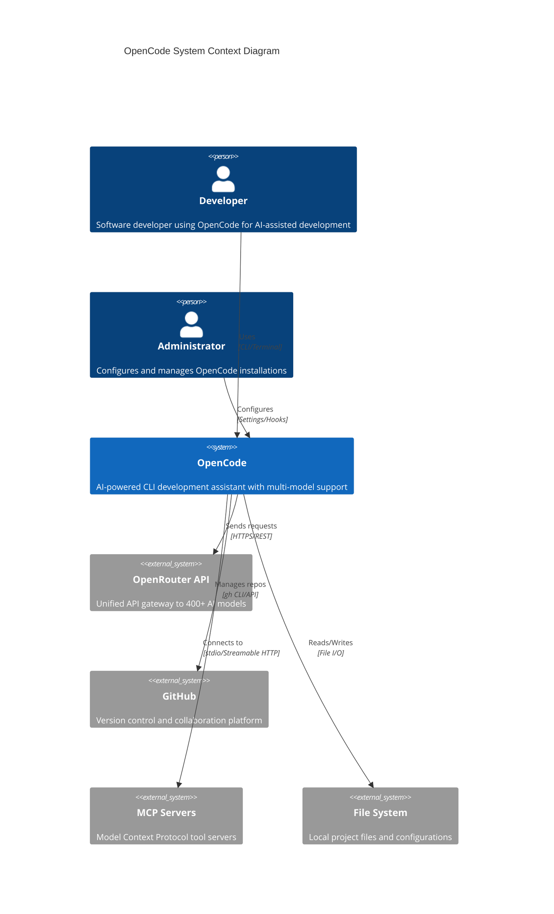
```mermaid
C4Context
    title OpenCode System Context Diagram

    Person(developer, "Developer", "Software developer using OpenCode for AI-assisted development")
    Person(admin, "Administrator", "Configures and manages OpenCode installations")

    System(opencode, "OpenCode", "AI-powered CLI development assistant with multi-model support")

    System_Ext(openrouter, "OpenRouter API", "Unified API gateway to 400+ AI models")
    System_Ext(github, "GitHub", "Version control and collaboration platform")
    System_Ext(mcp_servers, "MCP Servers", "Model Context Protocol tool servers")
    System_Ext(filesystem, "File System", "Local project files and configurations")

    Rel(developer, opencode, "Uses", "CLI/Terminal")
    Rel(admin, opencode, "Configures", "Settings/Hooks")
    Rel(opencode, openrouter, "Sends requests", "HTTPS/REST")
    Rel(opencode, github, "Manages repos", "gh CLI/API")
    Rel(opencode, mcp_servers, "Connects to", "stdio/Streamable HTTP")
    Rel(opencode, filesystem, "Reads/Writes", "File I/O")
```

### 1.2 External Integrations

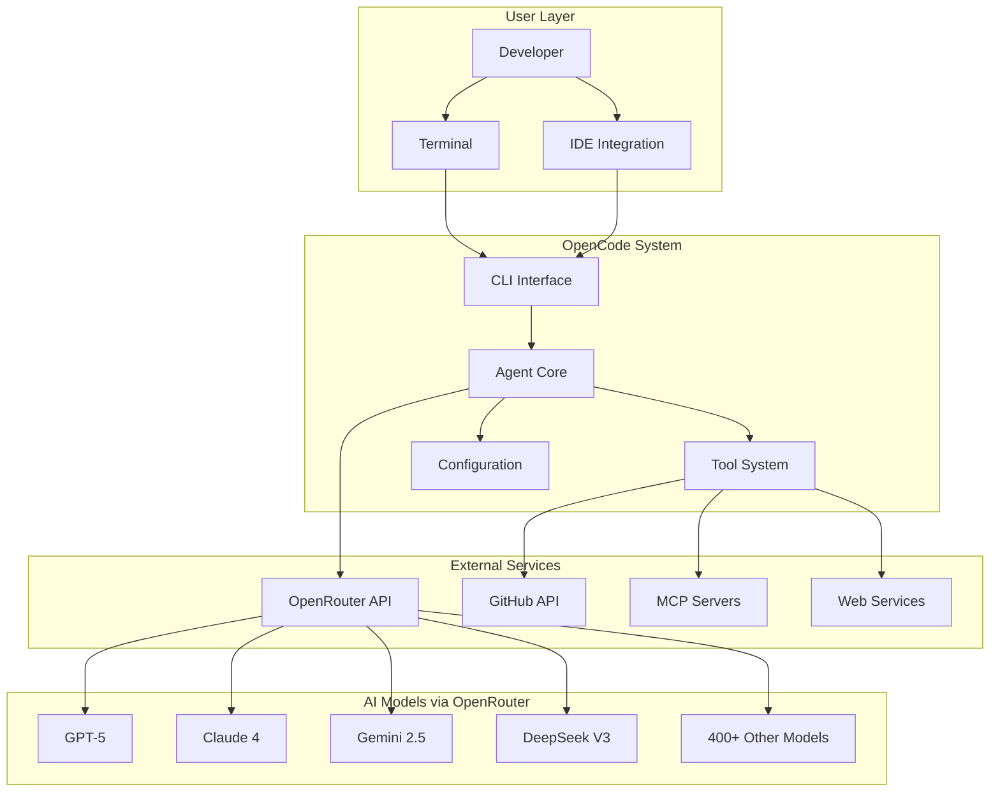
```mermaid
flowchart TB
    subgraph User["User Layer"]
        DEV[Developer]
        TERM[Terminal]
        IDE[IDE Integration]
    end

    subgraph OpenCode["OpenCode System"]
        CLI[CLI Interface]
        AGENT[Agent Core]
        TOOLS[Tool System]
        CONFIG[Configuration]
    end

    subgraph External["External Services"]
        OR[OpenRouter API]
        GH[GitHub API]
        MCP[MCP Servers]
        WEB[Web Services]
    end

    subgraph Models["AI Models via OpenRouter"]
        GPT5[GPT-5]
        CLAUDE[Claude 4]
        GEMINI[Gemini 2.5]
        DEEPSEEK[DeepSeek V3]
        OTHER[400+ Other Models]
    end

    DEV --> TERM
    DEV --> IDE
    TERM --> CLI
    IDE --> CLI
    CLI --> AGENT
    AGENT --> TOOLS
    AGENT --> CONFIG
    AGENT --> OR
    TOOLS --> GH
    TOOLS --> MCP
    TOOLS --> WEB
    OR --> GPT5
    OR --> CLAUDE
    OR --> GEMINI
    OR --> DEEPSEEK
    OR --> OTHER
```

---

## 2. Container Diagram

### 2.1 System Containers

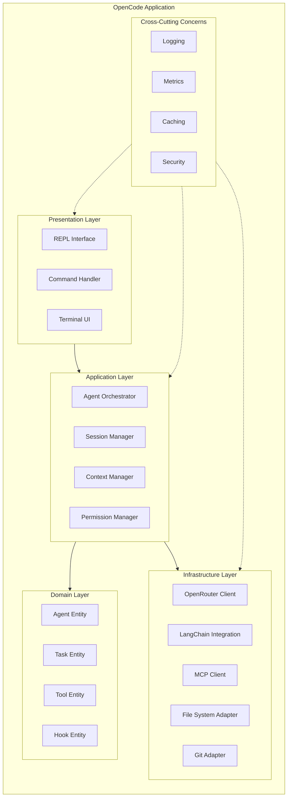
```mermaid
flowchart TB
    subgraph OpenCode["OpenCode Application"]
        direction TB

        subgraph Presentation["Presentation Layer"]
            REPL[REPL Interface]
            CMDS[Command Handler]
            UI[Terminal UI]
        end

        subgraph Application["Application Layer"]
            ORCH[Agent Orchestrator]
            SESS[Session Manager]
            CTX[Context Manager]
            PERM[Permission Manager]
        end

        subgraph Domain["Domain Layer"]
            AGENT[Agent Entity]
            TASK[Task Entity]
            TOOL[Tool Entity]
            HOOK[Hook Entity]
        end

        subgraph Infrastructure["Infrastructure Layer"]
            OR_CLIENT[OpenRouter Client]
            LC_INT[LangChain Integration]
            MCP_CLIENT[MCP Client]
            FS[File System Adapter]
            GIT[Git Adapter]
        end

        subgraph CrossCutting["Cross-Cutting Concerns"]
            LOG[Logging]
            METRICS[Metrics]
            CACHE[Caching]
            SEC[Security]
        end
    end

    Presentation --> Application
    Application --> Domain
    Application --> Infrastructure
    CrossCutting -.-> Presentation
    CrossCutting -.-> Application
    CrossCutting -.-> Infrastructure
```

### 2.2 Data Flow Container

```mermaid
flowchart LR
    subgraph Input["Input Processing"]
        USER_INPUT[User Input]
        PARSER[Command Parser]
        VALIDATOR[Input Validator]
    end

    subgraph Processing["Core Processing"]
        ROUTER[Request Router]
        MIDDLEWARE[Middleware Pipeline]
        EXECUTOR[Tool Executor]
    end

    subgraph Output["Output Generation"]
        FORMATTER[Response Formatter]
        STREAMER[Stream Handler]
        RENDERER[Terminal Renderer]
    end

    USER_INPUT --> PARSER
    PARSER --> VALIDATOR
    VALIDATOR --> ROUTER
    ROUTER --> MIDDLEWARE
    MIDDLEWARE --> EXECUTOR
    EXECUTOR --> FORMATTER
    FORMATTER --> STREAMER
    STREAMER --> RENDERER
```

---

## 3. Component Diagrams

### 3.1 Agent Orchestrator Components

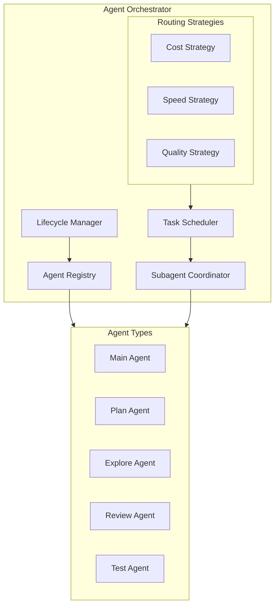
```mermaid
flowchart TB
    subgraph AgentOrchestrator["Agent Orchestrator"]
        direction TB

        LIFECYCLE[Lifecycle Manager]
        REGISTRY[Agent Registry]
        SCHEDULER[Task Scheduler]
        COORDINATOR[Subagent Coordinator]

        subgraph Strategies["Routing Strategies"]
            COST[Cost Strategy]
            SPEED[Speed Strategy]
            QUALITY[Quality Strategy]
        end
    end

    subgraph AgentTypes["Agent Types"]
        MAIN[Main Agent]
        PLAN[Plan Agent]
        EXPLORE[Explore Agent]
        REVIEW[Review Agent]
        TEST[Test Agent]
    end

    LIFECYCLE --> REGISTRY
    REGISTRY --> AgentTypes
    SCHEDULER --> COORDINATOR
    COORDINATOR --> AgentTypes
    Strategies --> SCHEDULER
```

### 3.2 Tool System Components

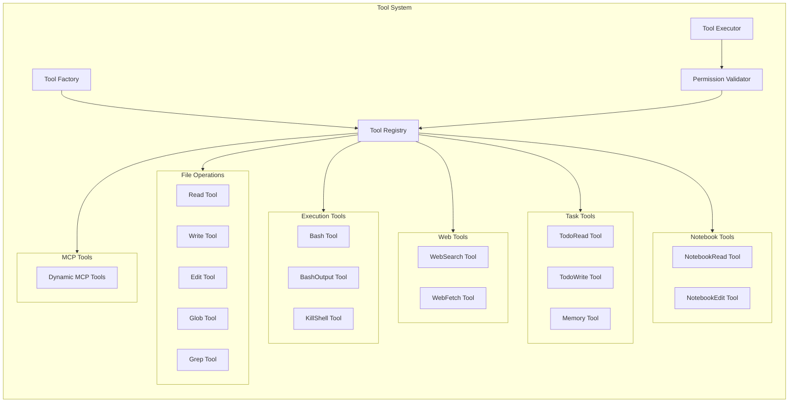
```mermaid
flowchart TB
    subgraph ToolSystem["Tool System"]
        direction TB

        FACTORY[Tool Factory]
        REGISTRY[Tool Registry]
        EXECUTOR[Tool Executor]
        VALIDATOR[Permission Validator]

        subgraph FileTools["File Operations"]
            READ[Read Tool]
            WRITE[Write Tool]
            EDIT[Edit Tool]
            GLOB[Glob Tool]
            GREP[Grep Tool]
        end

        subgraph ExecTools["Execution Tools"]
            BASH[Bash Tool]
            BASH_OUT[BashOutput Tool]
            KILL[KillShell Tool]
        end

        subgraph WebTools["Web Tools"]
            SEARCH[WebSearch Tool]
            FETCH[WebFetch Tool]
        end

        subgraph TaskTools["Task Tools"]
            TODO_R[TodoRead Tool]
            TODO_W[TodoWrite Tool]
            MEMORY[Memory Tool]
        end

        subgraph NotebookTools["Notebook Tools"]
            NB_READ[NotebookRead Tool]
            NB_EDIT[NotebookEdit Tool]
        end

        subgraph MCPTools["MCP Tools"]
            MCP_DYN[Dynamic MCP Tools]
        end
    end

    FACTORY --> REGISTRY
    REGISTRY --> FileTools
    REGISTRY --> ExecTools
    REGISTRY --> WebTools
    REGISTRY --> TaskTools
    REGISTRY --> NotebookTools
    REGISTRY --> MCPTools
    EXECUTOR --> VALIDATOR
    VALIDATOR --> REGISTRY
```

### 3.3 Configuration System Components

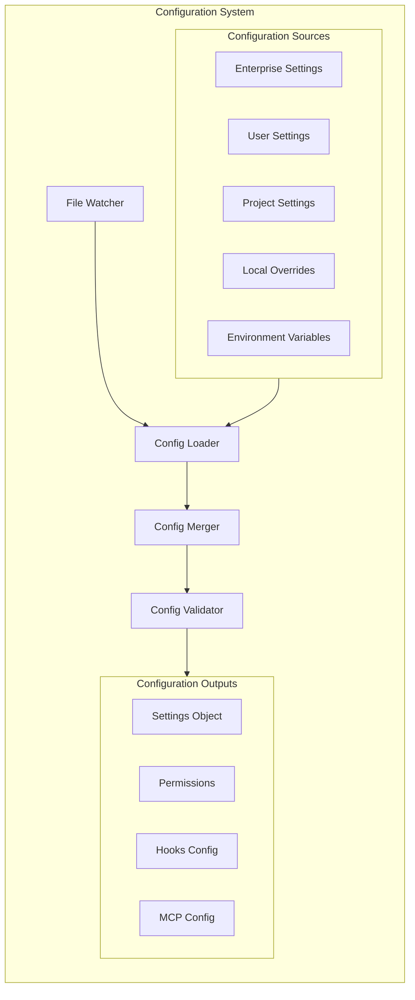
```mermaid
flowchart TB
    subgraph ConfigSystem["Configuration System"]
        direction TB

        LOADER[Config Loader]
        MERGER[Config Merger]
        VALIDATOR[Config Validator]
        WATCHER[File Watcher]

        subgraph Sources["Configuration Sources"]
            ENTERPRISE[Enterprise Settings]
            USER[User Settings]
            PROJECT[Project Settings]
            LOCAL[Local Overrides]
            ENV[Environment Variables]
        end

        subgraph Outputs["Configuration Outputs"]
            SETTINGS[Settings Object]
            PERMS[Permissions]
            HOOKS[Hooks Config]
            MCP_CFG[MCP Config]
        end
    end

    Sources --> LOADER
    LOADER --> MERGER
    MERGER --> VALIDATOR
    VALIDATOR --> Outputs
    WATCHER --> LOADER
```

### 3.4 Hooks System Components

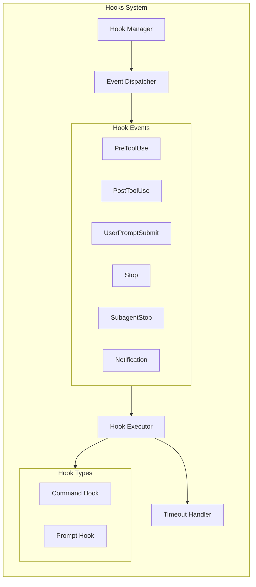
```mermaid
flowchart TB
    subgraph HooksSystem["Hooks System"]
        direction TB

        MANAGER[Hook Manager]
        DISPATCHER[Event Dispatcher]
        EXECUTOR[Hook Executor]
        TIMEOUT[Timeout Handler]

        subgraph Events["Hook Events"]
            PRE_TOOL[PreToolUse]
            POST_TOOL[PostToolUse]
            USER_SUBMIT[UserPromptSubmit]
            STOP[Stop]
            SUBAGENT_STOP[SubagentStop]
            NOTIFY[Notification]
        end

        subgraph Types["Hook Types"]
            CMD_HOOK[Command Hook]
            PROMPT_HOOK[Prompt Hook]
        end
    end

    MANAGER --> DISPATCHER
    DISPATCHER --> Events
    Events --> EXECUTOR
    EXECUTOR --> Types
    EXECUTOR --> TIMEOUT
```

### 3.5 LangChain Integration Components

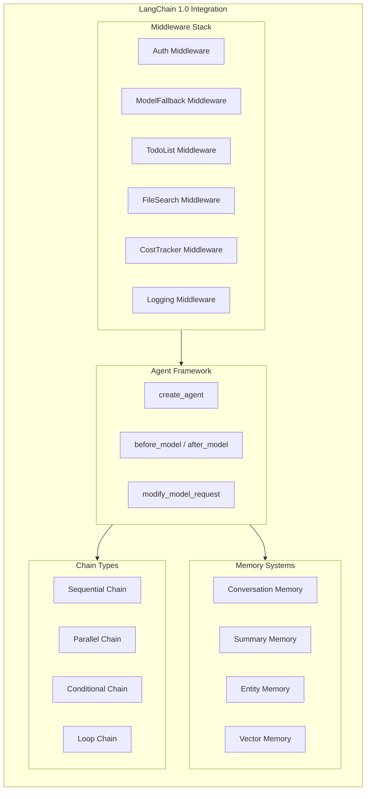
```mermaid
flowchart TB
    subgraph LangChainIntegration["LangChain 1.0 Integration"]
        direction TB

        subgraph Middleware["Middleware Stack"]
            AUTH[Auth Middleware]
            FALLBACK[ModelFallback Middleware]
            TODO_MW[TodoList Middleware]
            FILESEARCH[FileSearch Middleware]
            COST[CostTracker Middleware]
            LOG_MW[Logging Middleware]
        end

        subgraph Agents["Agent Framework"]
            CREATE[create_agent]
            HOOKS_LC[before_model / after_model]
            MODIFY[modify_model_request]
        end

        subgraph Memory["Memory Systems"]
            CONV[Conversation Memory]
            SUMMARY[Summary Memory]
            ENTITY[Entity Memory]
            VECTOR[Vector Memory]
        end

        subgraph Chains["Chain Types"]
            SEQ[Sequential Chain]
            PARALLEL[Parallel Chain]
            COND[Conditional Chain]
            LOOP[Loop Chain]
        end
    end

    Middleware --> Agents
    Agents --> Memory
    Agents --> Chains
```

---

## 4. Class Diagrams

### 4.1 Core Domain Classes

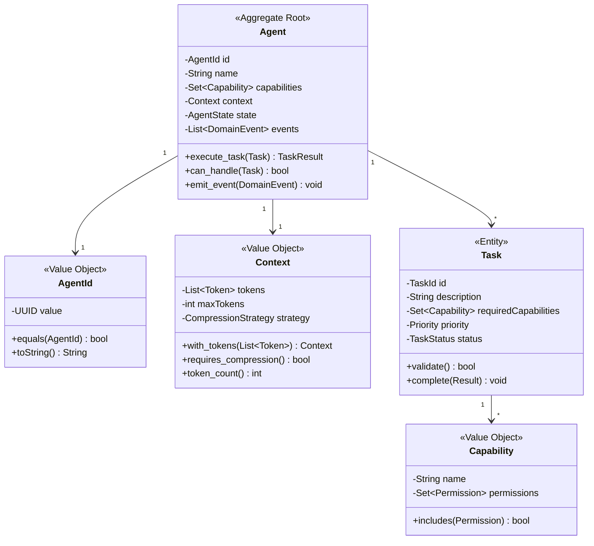
```mermaid
classDiagram
    class Agent {
        <<Aggregate Root>>
        -AgentId id
        -String name
        -Set~Capability~ capabilities
        -Context context
        -AgentState state
        -List~DomainEvent~ events
        +execute_task(Task) TaskResult
        +can_handle(Task) bool
        +emit_event(DomainEvent) void
    }

    class AgentId {
        <<Value Object>>
        -UUID value
        +equals(AgentId) bool
        +toString() String
    }

    class Context {
        <<Value Object>>
        -List~Token~ tokens
        -int maxTokens
        -CompressionStrategy strategy
        +with_tokens(List~Token~) Context
        +requires_compression() bool
        +token_count() int
    }

    class Task {
        <<Entity>>
        -TaskId id
        -String description
        -Set~Capability~ requiredCapabilities
        -Priority priority
        -TaskStatus status
        +validate() bool
        +complete(Result) void
    }

    class Capability {
        <<Value Object>>
        -String name
        -Set~Permission~ permissions
        +includes(Permission) bool
    }

    Agent "1" --> "1" AgentId
    Agent "1" --> "1" Context
    Agent "1" --> "*" Task
    Task "1" --> "*" Capability
```

### 4.2 Tool System Classes

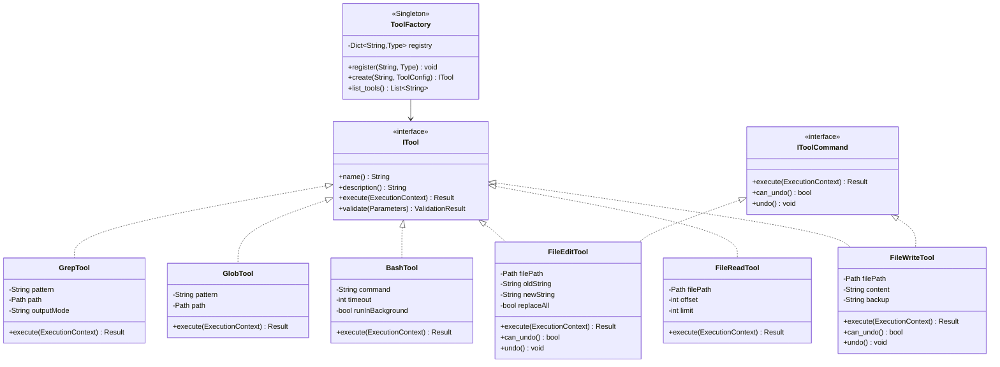
```mermaid
classDiagram
    class ITool {
        <<interface>>
        +name() String
        +description() String
        +execute(ExecutionContext) Result
        +validate(Parameters) ValidationResult
    }

    class IToolCommand {
        <<interface>>
        +execute(ExecutionContext) Result
        +can_undo() bool
        +undo() void
    }

    class ToolFactory {
        <<Singleton>>
        -Dict~String,Type~ registry
        +register(String, Type) void
        +create(String, ToolConfig) ITool
        +list_tools() List~String~
    }

    class FileReadTool {
        -Path filePath
        -int offset
        -int limit
        +execute(ExecutionContext) Result
    }

    class FileWriteTool {
        -Path filePath
        -String content
        -String backup
        +execute(ExecutionContext) Result
        +can_undo() bool
        +undo() void
    }

    class FileEditTool {
        -Path filePath
        -String oldString
        -String newString
        -bool replaceAll
        +execute(ExecutionContext) Result
        +can_undo() bool
        +undo() void
    }

    class BashTool {
        -String command
        -int timeout
        -bool runInBackground
        +execute(ExecutionContext) Result
    }

    class GlobTool {
        -String pattern
        -Path path
        +execute(ExecutionContext) Result
    }

    class GrepTool {
        -String pattern
        -Path path
        -String outputMode
        +execute(ExecutionContext) Result
    }

    ITool <|.. FileReadTool
    ITool <|.. FileWriteTool
    ITool <|.. FileEditTool
    ITool <|.. BashTool
    ITool <|.. GlobTool
    ITool <|.. GrepTool
    IToolCommand <|.. FileWriteTool
    IToolCommand <|.. FileEditTool
    ToolFactory --> ITool
```

### 4.3 Permission System Classes

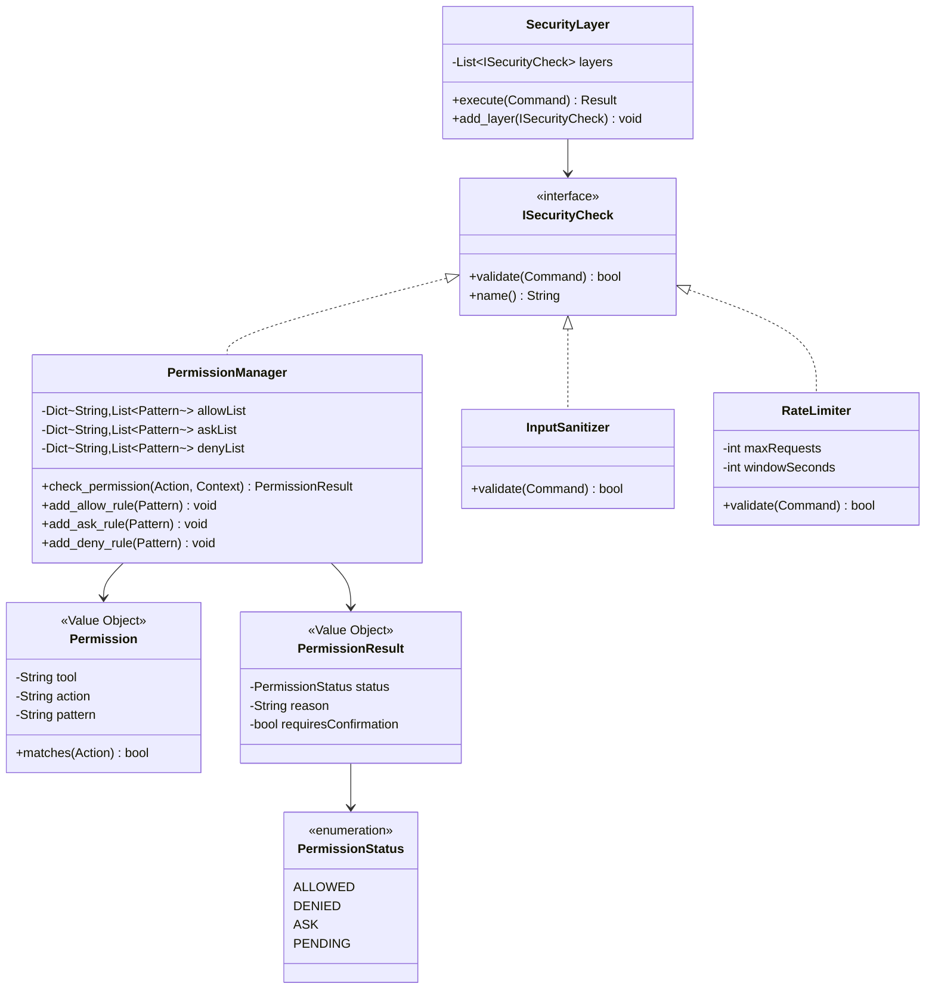
```mermaid
classDiagram
    class PermissionManager {
        -Dict~String,List~Pattern~~ allowList
        -Dict~String,List~Pattern~~ askList
        -Dict~String,List~Pattern~~ denyList
        +check_permission(Action, Context) PermissionResult
        +add_allow_rule(Pattern) void
        +add_ask_rule(Pattern) void
        +add_deny_rule(Pattern) void
    }

    class Permission {
        <<Value Object>>
        -String tool
        -String action
        -String pattern
        +matches(Action) bool
    }

    class PermissionResult {
        <<Value Object>>
        -PermissionStatus status
        -String reason
        -bool requiresConfirmation
    }

    class PermissionStatus {
        <<enumeration>>
        ALLOWED
        DENIED
        ASK
        PENDING
    }

    class SecurityLayer {
        -List~ISecurityCheck~ layers
        +execute(Command) Result
        +add_layer(ISecurityCheck) void
    }

    class ISecurityCheck {
        <<interface>>
        +validate(Command) bool
        +name() String
    }

    class InputSanitizer {
        +validate(Command) bool
    }

    class RateLimiter {
        -int maxRequests
        -int windowSeconds
        +validate(Command) bool
    }

    PermissionManager --> Permission
    PermissionManager --> PermissionResult
    PermissionResult --> PermissionStatus
    SecurityLayer --> ISecurityCheck
    ISecurityCheck <|.. InputSanitizer
    ISecurityCheck <|.. RateLimiter
    ISecurityCheck <|.. PermissionManager
```

### 4.4 OpenRouter Client Classes

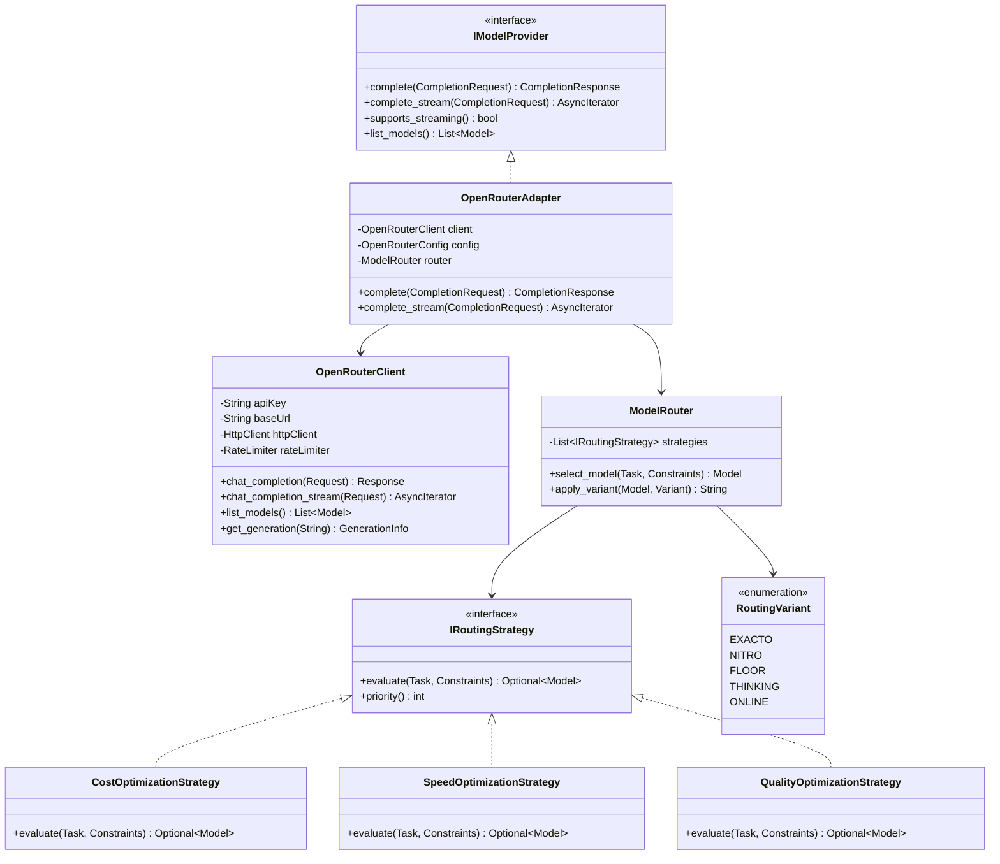
```mermaid
classDiagram
    class IModelProvider {
        <<interface>>
        +complete(CompletionRequest) CompletionResponse
        +complete_stream(CompletionRequest) AsyncIterator
        +supports_streaming() bool
        +list_models() List~Model~
    }

    class OpenRouterClient {
        -String apiKey
        -String baseUrl
        -HttpClient httpClient
        -RateLimiter rateLimiter
        +chat_completion(Request) Response
        +chat_completion_stream(Request) AsyncIterator
        +list_models() List~Model~
        +get_generation(String) GenerationInfo
    }

    class OpenRouterAdapter {
        -OpenRouterClient client
        -OpenRouterConfig config
        -ModelRouter router
        +complete(CompletionRequest) CompletionResponse
        +complete_stream(CompletionRequest) AsyncIterator
    }

    class ModelRouter {
        -List~IRoutingStrategy~ strategies
        +select_model(Task, Constraints) Model
        +apply_variant(Model, Variant) String
    }

    class IRoutingStrategy {
        <<interface>>
        +evaluate(Task, Constraints) Optional~Model~
        +priority() int
    }

    class CostOptimizationStrategy {
        +evaluate(Task, Constraints) Optional~Model~
    }

    class SpeedOptimizationStrategy {
        +evaluate(Task, Constraints) Optional~Model~
    }

    class QualityOptimizationStrategy {
        +evaluate(Task, Constraints) Optional~Model~
    }

    class RoutingVariant {
        <<enumeration>>
        EXACTO
        NITRO
        FLOOR
        THINKING
        ONLINE
    }

    IModelProvider <|.. OpenRouterAdapter
    OpenRouterAdapter --> OpenRouterClient
    OpenRouterAdapter --> ModelRouter
    ModelRouter --> IRoutingStrategy
    IRoutingStrategy <|.. CostOptimizationStrategy
    IRoutingStrategy <|.. SpeedOptimizationStrategy
    IRoutingStrategy <|.. QualityOptimizationStrategy
    ModelRouter --> RoutingVariant
```

### 4.5 Session Management Classes

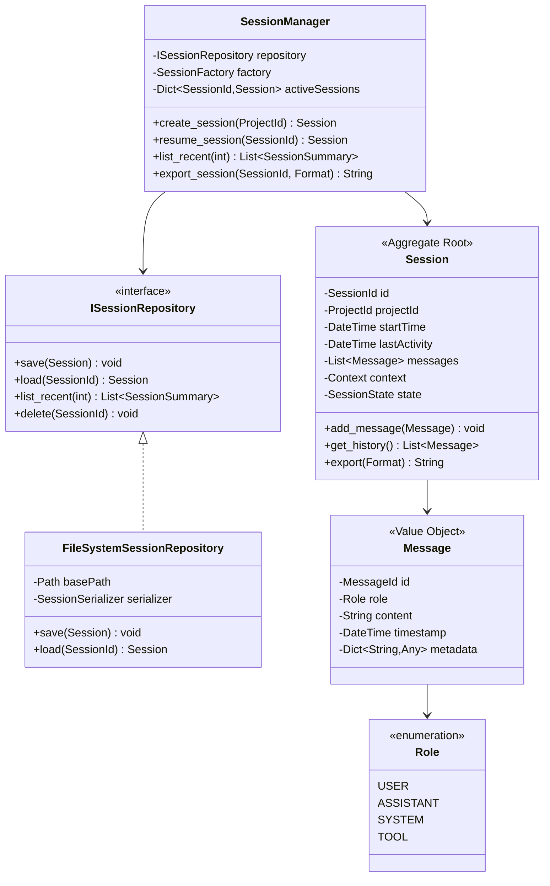
```mermaid
classDiagram
    class Session {
        <<Aggregate Root>>
        -SessionId id
        -ProjectId projectId
        -DateTime startTime
        -DateTime lastActivity
        -List~Message~ messages
        -Context context
        -SessionState state
        +add_message(Message) void
        +get_history() List~Message~
        +export(Format) String
    }

    class SessionManager {
        -ISessionRepository repository
        -SessionFactory factory
        -Dict~SessionId,Session~ activeSessions
        +create_session(ProjectId) Session
        +resume_session(SessionId) Session
        +list_recent(int) List~SessionSummary~
        +export_session(SessionId, Format) String
    }

    class ISessionRepository {
        <<interface>>
        +save(Session) void
        +load(SessionId) Session
        +list_recent(int) List~SessionSummary~
        +delete(SessionId) void
    }

    class FileSystemSessionRepository {
        -Path basePath
        -SessionSerializer serializer
        +save(Session) void
        +load(SessionId) Session
    }

    class Message {
        <<Value Object>>
        -MessageId id
        -Role role
        -String content
        -DateTime timestamp
        -Dict~String,Any~ metadata
    }

    class Role {
        <<enumeration>>
        USER
        ASSISTANT
        SYSTEM
        TOOL
    }

    SessionManager --> ISessionRepository
    SessionManager --> Session
    ISessionRepository <|.. FileSystemSessionRepository
    Session --> Message
    Message --> Role
```

### 4.6 Hooks System Classes

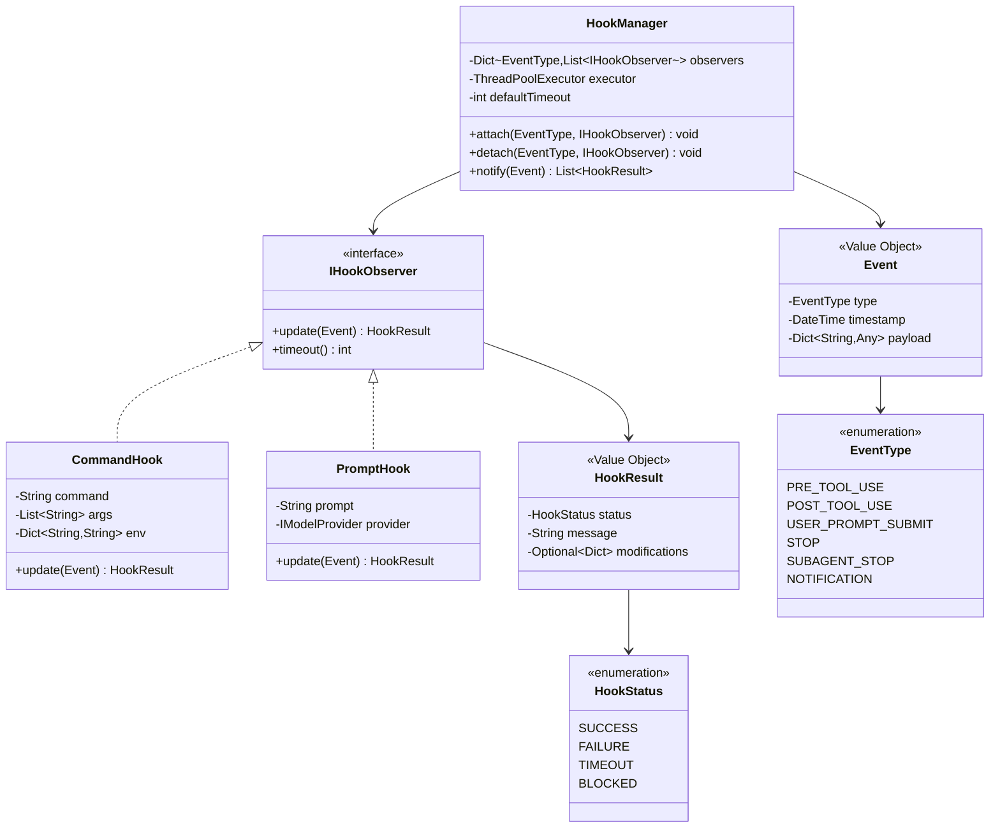
```mermaid
classDiagram
    class HookManager {
        -Dict~EventType,List~IHookObserver~~ observers
        -ThreadPoolExecutor executor
        -int defaultTimeout
        +attach(EventType, IHookObserver) void
        +detach(EventType, IHookObserver) void
        +notify(Event) List~HookResult~
    }

    class IHookObserver {
        <<interface>>
        +update(Event) HookResult
        +timeout() int
    }

    class CommandHook {
        -String command
        -List~String~ args
        -Dict~String,String~ env
        +update(Event) HookResult
    }

    class PromptHook {
        -String prompt
        -IModelProvider provider
        +update(Event) HookResult
    }

    class Event {
        <<Value Object>>
        -EventType type
        -DateTime timestamp
        -Dict~String,Any~ payload
    }

    class EventType {
        <<enumeration>>
        PRE_TOOL_USE
        POST_TOOL_USE
        USER_PROMPT_SUBMIT
        STOP
        SUBAGENT_STOP
        NOTIFICATION
    }

    class HookResult {
        <<Value Object>>
        -HookStatus status
        -String message
        -Optional~Dict~ modifications
    }

    class HookStatus {
        <<enumeration>>
        SUCCESS
        FAILURE
        TIMEOUT
        BLOCKED
    }

    HookManager --> IHookObserver
    IHookObserver <|.. CommandHook
    IHookObserver <|.. PromptHook
    HookManager --> Event
    Event --> EventType
    IHookObserver --> HookResult
    HookResult --> HookStatus
```

### 4.7 MCP Protocol Classes

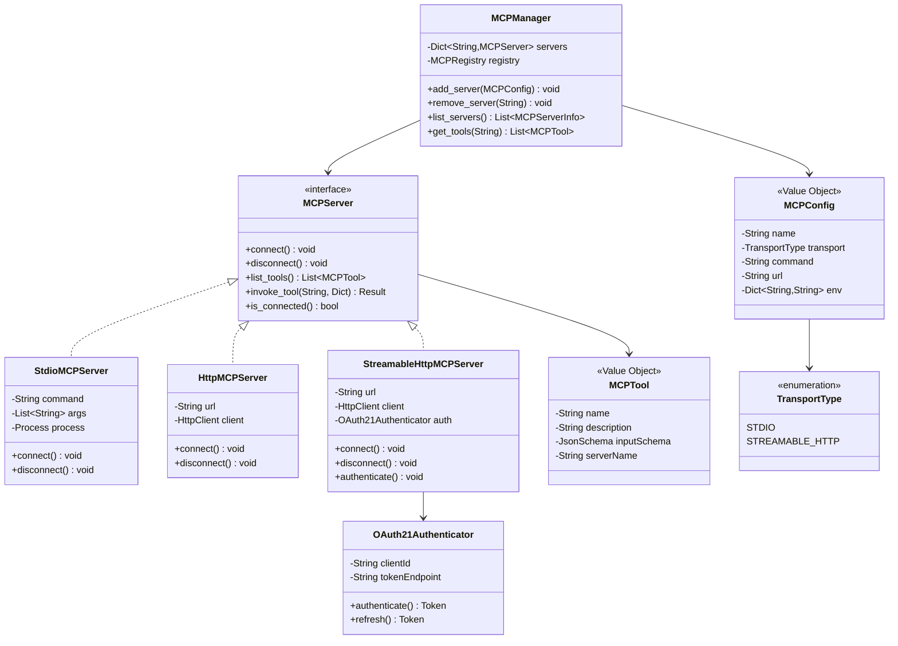
```mermaid
classDiagram
    class MCPManager {
        -Dict~String,MCPServer~ servers
        -MCPRegistry registry
        +add_server(MCPConfig) void
        +remove_server(String) void
        +list_servers() List~MCPServerInfo~
        +get_tools(String) List~MCPTool~
    }

    class MCPServer {
        <<interface>>
        +connect() void
        +disconnect() void
        +list_tools() List~MCPTool~
        +invoke_tool(String, Dict) Result
        +is_connected() bool
    }

    class StdioMCPServer {
        -String command
        -List~String~ args
        -Process process
        +connect() void
        +disconnect() void
    }

    class HttpMCPServer {
        -String url
        -HttpClient client
        +connect() void
        +disconnect() void
    }

    class StreamableHttpMCPServer {
        -String url
        -HttpClient client
        -OAuth21Authenticator auth
        +connect() void
        +disconnect() void
        +authenticate() void
    }

    class MCPTool {
        <<Value Object>>
        -String name
        -String description
        -JsonSchema inputSchema
        -String serverName
    }

    class MCPConfig {
        <<Value Object>>
        -String name
        -TransportType transport
        -String command
        -String url
        -Dict~String,String~ env
    }

    class TransportType {
        <<enumeration>>
        STDIO
        STREAMABLE_HTTP
    }

    class OAuth21Authenticator {
        -String clientId
        -String tokenEndpoint
        +authenticate() Token
        +refresh() Token
    }

    MCPManager --> MCPServer
    MCPServer <|.. StdioMCPServer
    MCPServer <|.. HttpMCPServer
    MCPServer <|.. StreamableHttpMCPServer
    MCPServer --> MCPTool
    MCPManager --> MCPConfig
    MCPConfig --> TransportType
    StreamableHttpMCPServer --> OAuth21Authenticator
```

### 4.8 Subagent and Skills Classes

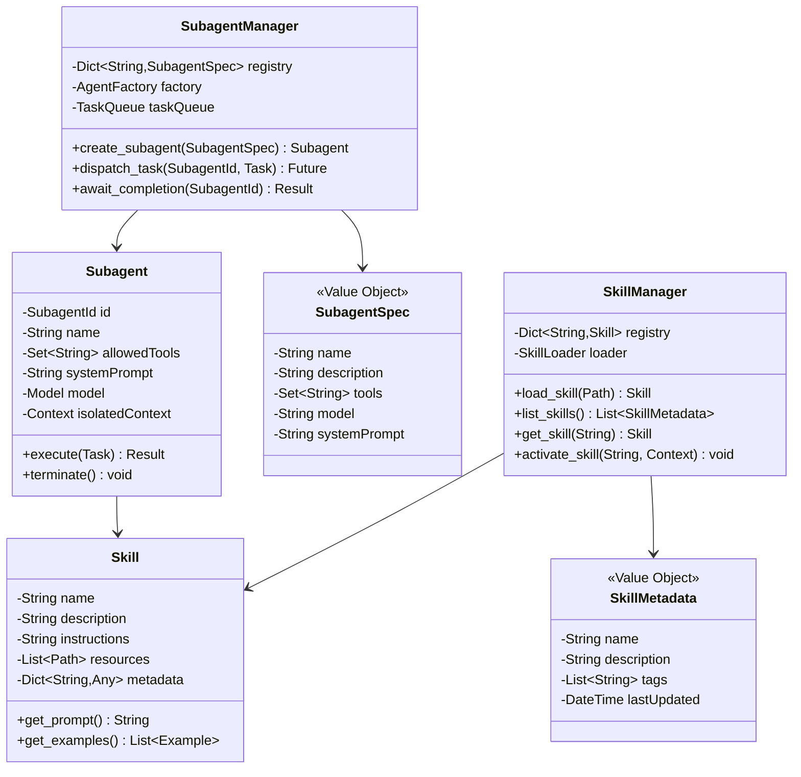
```mermaid
classDiagram
    class SubagentManager {
        -Dict~String,SubagentSpec~ registry
        -AgentFactory factory
        -TaskQueue taskQueue
        +create_subagent(SubagentSpec) Subagent
        +dispatch_task(SubagentId, Task) Future
        +await_completion(SubagentId) Result
    }

    class Subagent {
        -SubagentId id
        -String name
        -Set~String~ allowedTools
        -String systemPrompt
        -Model model
        -Context isolatedContext
        +execute(Task) Result
        +terminate() void
    }

    class SubagentSpec {
        <<Value Object>>
        -String name
        -String description
        -Set~String~ tools
        -String model
        -String systemPrompt
    }

    class SkillManager {
        -Dict~String,Skill~ registry
        -SkillLoader loader
        +load_skill(Path) Skill
        +list_skills() List~SkillMetadata~
        +get_skill(String) Skill
        +activate_skill(String, Context) void
    }

    class Skill {
        -String name
        -String description
        -String instructions
        -List~Path~ resources
        -Dict~String,Any~ metadata
        +get_prompt() String
        +get_examples() List~Example~
    }

    class SkillMetadata {
        <<Value Object>>
        -String name
        -String description
        -List~String~ tags
        -DateTime lastUpdated
    }

    SubagentManager --> Subagent
    SubagentManager --> SubagentSpec
    Subagent --> Skill
    SkillManager --> Skill
    SkillManager --> SkillMetadata
```

---

## 5. Sequence Diagrams

### 5.1 User Command Execution Flow

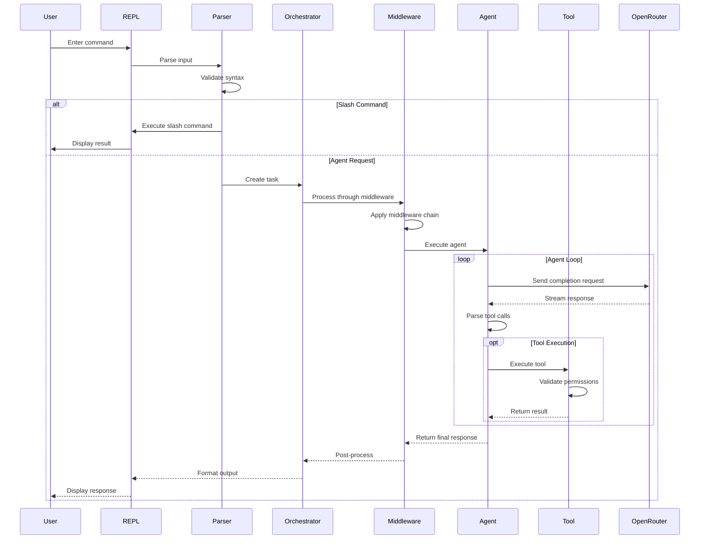
```mermaid
sequenceDiagram
    participant U as User
    participant R as REPL
    participant P as Parser
    participant O as Orchestrator
    participant M as Middleware
    participant A as Agent
    participant T as Tool
    participant OR as OpenRouter

    U->>R: Enter command
    R->>P: Parse input
    P->>P: Validate syntax

    alt Slash Command
        P->>R: Execute slash command
        R->>U: Display result
    else Agent Request
        P->>O: Create task
        O->>M: Process through middleware
        M->>M: Apply middleware chain
        M->>A: Execute agent

        loop Agent Loop
            A->>OR: Send completion request
            OR-->>A: Stream response
            A->>A: Parse tool calls

            opt Tool Execution
                A->>T: Execute tool
                T->>T: Validate permissions
                T-->>A: Return result
            end
        end

        A-->>M: Return final response
        M-->>O: Post-process
        O-->>R: Format output
        R-->>U: Display response
    end
```

### 5.2 Tool Execution with Permissions

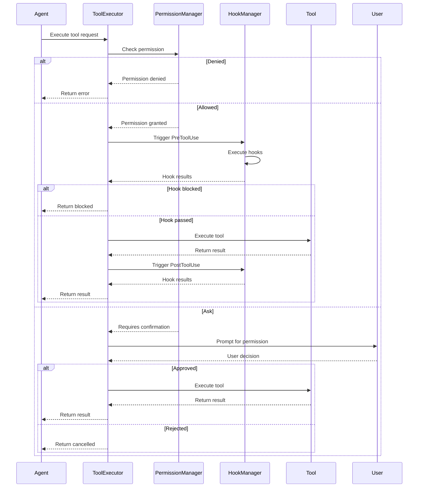
```mermaid
sequenceDiagram
    participant A as Agent
    participant TE as ToolExecutor
    participant PM as PermissionManager
    participant H as HookManager
    participant T as Tool
    participant U as User

    A->>TE: Execute tool request
    TE->>PM: Check permission

    alt Denied
        PM-->>TE: Permission denied
        TE-->>A: Return error
    else Allowed
        PM-->>TE: Permission granted
        TE->>H: Trigger PreToolUse
        H->>H: Execute hooks
        H-->>TE: Hook results

        alt Hook blocked
            TE-->>A: Return blocked
        else Hook passed
            TE->>T: Execute tool
            T-->>TE: Return result
            TE->>H: Trigger PostToolUse
            H-->>TE: Hook results
            TE-->>A: Return result
        end
    else Ask
        PM-->>TE: Requires confirmation
        TE->>U: Prompt for permission
        U-->>TE: User decision

        alt Approved
            TE->>T: Execute tool
            T-->>TE: Return result
            TE-->>A: Return result
        else Rejected
            TE-->>A: Return cancelled
        end
    end
```

### 5.3 OpenRouter Model Selection

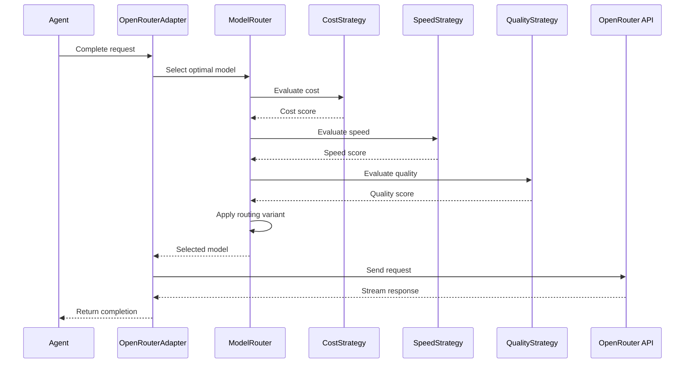
```mermaid
sequenceDiagram
    participant A as Agent
    participant OR as OpenRouterAdapter
    participant MR as ModelRouter
    participant CS as CostStrategy
    participant SS as SpeedStrategy
    participant QS as QualityStrategy
    participant API as OpenRouter API

    A->>OR: Complete request
    OR->>MR: Select optimal model

    MR->>CS: Evaluate cost
    CS-->>MR: Cost score

    MR->>SS: Evaluate speed
    SS-->>MR: Speed score

    MR->>QS: Evaluate quality
    QS-->>MR: Quality score

    MR->>MR: Apply routing variant
    MR-->>OR: Selected model

    OR->>API: Send request
    API-->>OR: Stream response
    OR-->>A: Return completion
```

### 5.4 Session Resume Flow

```mermaid
sequenceDiagram
    participant U as User
    participant CLI as CLI
    participant SM as SessionManager
    participant SR as SessionRepository
    participant CM as ContextManager
    participant A as Agent

    U->>CLI: opencode --resume
    CLI->>SM: List recent sessions

    SM->>SR: Load session list
    SR-->>SM: Session summaries

    SM-->>CLI: Display sessions
    CLI-->>U: Show session picker

    U->>CLI: Select session
    CLI->>SM: Resume session

    SM->>SR: Load full session
    SR-->>SM: Session data

    SM->>CM: Restore context
    CM->>CM: Decompress if needed
    CM-->>SM: Context ready

    SM->>A: Initialize with context
    A-->>SM: Agent ready

    SM-->>CLI: Session resumed
    CLI-->>U: Ready for input
```

### 5.5 Subagent Parallel Execution

```mermaid
sequenceDiagram
    participant MA as Main Agent
    participant SM as SubagentManager
    participant S1 as Explore Subagent
    participant S2 as Review Subagent
    participant OR as OpenRouter

    MA->>SM: Create subagents

    par Parallel Execution
        SM->>S1: Dispatch explore task
        S1->>OR: Query for exploration
        OR-->>S1: Response
        S1-->>SM: Explore results
    and
        SM->>S2: Dispatch review task
        S2->>OR: Query for review
        OR-->>S2: Response
        S2-->>SM: Review results
    end

    SM->>SM: Aggregate results
    SM-->>MA: Combined results
    MA->>MA: Continue with insights
```

### 5.6 Context Compaction Flow

```mermaid
sequenceDiagram
    participant A as Agent
    participant CM as ContextManager
    participant TC as TokenCounter
    participant CS as CompressionStrategy
    participant OR as OpenRouter

    A->>CM: Add new content
    CM->>TC: Count tokens

    TC-->>CM: Token count

    alt Over threshold
        CM->>CS: Compress context

        alt Summary Strategy
            CS->>OR: Summarize old messages
            OR-->>CS: Summary
            CS->>CM: Replace with summary
        else Window Strategy
            CS->>CS: Truncate oldest
            CS->>CM: Return windowed context
        end

        CM-->>A: Compressed context
    else Under threshold
        CM-->>A: Original context
    end
```

---

## 6. State Diagrams

### 6.1 Agent State Machine

```mermaid
stateDiagram-v2
    [*] --> Idle: Initialize

    Idle --> Processing: Receive task
    Processing --> ToolExecution: Tool call needed
    Processing --> Streaming: Generate response
    Processing --> WaitingPermission: Permission required

    ToolExecution --> Processing: Tool complete
    ToolExecution --> Error: Tool failed

    Streaming --> Idle: Response complete
    Streaming --> Cancelled: User interrupt

    WaitingPermission --> Processing: Permission granted
    WaitingPermission --> Idle: Permission denied

    Error --> Idle: Error handled
    Error --> [*]: Fatal error

    Cancelled --> Idle: Cleanup complete

    state Processing {
        [*] --> Thinking
        Thinking --> Planning: Plan mode
        Planning --> Thinking: Plan approved
        Thinking --> Acting: Action decided
        Acting --> Verifying: Action complete
        Verifying --> [*]: Verified
        Verifying --> Acting: Retry needed
    }
```

### 6.2 Permission State Machine

```mermaid
stateDiagram-v2
    [*] --> Checking: Permission request

    Checking --> Allowed: In allowlist
    Checking --> Denied: In denylist
    Checking --> Prompting: In asklist
    Checking --> DefaultDeny: Not in any list

    Prompting --> Allowed: User approved
    Prompting --> Denied: User rejected
    Prompting --> Timeout: No response

    Allowed --> [*]: Execute action
    Denied --> [*]: Block action
    DefaultDeny --> [*]: Block action
    Timeout --> Denied: Apply timeout policy
```

### 6.3 Session State Machine

```mermaid
stateDiagram-v2
    [*] --> New: Create session

    New --> Active: First interaction
    Active --> Paused: User inactive
    Active --> Compacting: Context full

    Paused --> Active: User returns
    Paused --> Saved: Auto-save triggered

    Compacting --> Active: Compaction complete
    Compacting --> Error: Compaction failed

    Saved --> Resumed: User resumes
    Resumed --> Active: Context restored

    Active --> Exporting: Export requested
    Exporting --> Active: Export complete

    Active --> Closed: User exits
    Closed --> [*]: Cleanup complete

    Error --> Active: Error recovered
    Error --> Closed: Unrecoverable
```

### 6.4 MCP Server State Machine

```mermaid
stateDiagram-v2
    [*] --> Disconnected: Initialize

    Disconnected --> Connecting: Connect requested
    Connecting --> Authenticating: Remote server (OAuth 2.1)
    Connecting --> Connected: Local stdio (no auth)
    Connecting --> Error: Connection failed

    Authenticating --> Connected: Auth successful
    Authenticating --> Error: Auth failed

    Connected --> Discovering: List tools
    Discovering --> Ready: Tools loaded
    Discovering --> Error: Discovery failed

    Ready --> Invoking: Tool invocation
    Invoking --> Ready: Invocation complete
    Invoking --> Error: Invocation failed

    Ready --> Reconnecting: Connection lost
    Ready --> Reauthenticating: Token expired
    Reconnecting --> Authenticating: Remote reconnect
    Reconnecting --> Connected: Local reconnect
    Reconnecting --> Disconnected: Reconnection failed
    Reauthenticating --> Ready: Token refreshed
    Reauthenticating --> Error: Refresh failed

    Error --> Disconnected: Reset
    Connected --> Disconnected: Disconnect requested
    Ready --> Disconnected: Disconnect requested

    Disconnected --> [*]: Cleanup

    note right of Authenticating
        OAuth 2.1 required for
        remote HTTP MCP servers
        (2025 MCP spec mandate)
    end note
```

### 6.5 Operating Mode State Machine

```mermaid
stateDiagram-v2
    [*] --> Normal: Start

    Normal --> Plan: Shift+Tab (x2)
    Normal --> AutoAccept: Toggle auto-accept
    Normal --> ReadOnly: Toggle read-only
    Normal --> Thinking: Tab pressed

    Plan --> Normal: Exit plan mode
    Plan --> Thinking: Tab pressed

    AutoAccept --> Normal: Toggle off

    ReadOnly --> Normal: Toggle off

    Thinking --> Normal: Tab pressed
    Thinking --> ThinkHard: "think hard"
    ThinkHard --> ThinkHarder: "think harder"
    ThinkHarder --> Ultrathink: "ultrathink"
    Ultrathink --> Normal: Complete

    state Plan {
        [*] --> Researching
        Researching --> Drafting: Research complete
        Drafting --> Reviewing: Draft complete
        Reviewing --> Approved: User approves
        Reviewing --> Drafting: Revisions needed
        Approved --> [*]
    }
```

---

## 7. Activity Diagrams

### 7.1 Complete Request Processing

```mermaid
flowchart TD
    START([User Input]) --> PARSE[Parse Input]
    PARSE --> CHECK_SLASH{Is Slash Command?}

    CHECK_SLASH -->|Yes| EXEC_SLASH[Execute Slash Command]
    EXEC_SLASH --> DISPLAY_RESULT[Display Result]
    DISPLAY_RESULT --> END([Complete])

    CHECK_SLASH -->|No| CREATE_TASK[Create Task]
    CREATE_TASK --> CHECK_MODE{Check Operating Mode}

    CHECK_MODE -->|Plan| PLAN_MODE[Enter Plan Mode]
    CHECK_MODE -->|Normal| NORMAL_MODE[Normal Processing]
    CHECK_MODE -->|ReadOnly| READONLY_MODE[Read-Only Processing]

    PLAN_MODE --> RESEARCH[Research & Analyze]
    RESEARCH --> DRAFT_PLAN[Draft Plan]
    DRAFT_PLAN --> REVIEW_PLAN{User Approves?}
    REVIEW_PLAN -->|Yes| NORMAL_MODE
    REVIEW_PLAN -->|No| DRAFT_PLAN

    NORMAL_MODE --> MIDDLEWARE[Apply Middleware]
    READONLY_MODE --> MIDDLEWARE

    MIDDLEWARE --> AGENT_LOOP[Agent Loop]

    subgraph AgentLoop[Agent Processing Loop]
        AGENT_LOOP --> SEND_REQUEST[Send to Model]
        SEND_REQUEST --> STREAM_RESPONSE[Stream Response]
        STREAM_RESPONSE --> CHECK_TOOLS{Tool Calls?}
        CHECK_TOOLS -->|Yes| EXEC_TOOLS[Execute Tools]
        EXEC_TOOLS --> CHECK_MORE{More Work?}
        CHECK_MORE -->|Yes| SEND_REQUEST
        CHECK_MORE -->|No| FINALIZE
        CHECK_TOOLS -->|No| FINALIZE[Finalize Response]
    end

    FINALIZE --> POST_PROCESS[Post-Process]
    POST_PROCESS --> FORMAT[Format Output]
    FORMAT --> DISPLAY_RESULT
```

### 7.2 Tool Execution Activity

```mermaid
flowchart TD
    START([Tool Request]) --> VALIDATE[Validate Parameters]
    VALIDATE --> CHECK_VALID{Valid?}

    CHECK_VALID -->|No| RETURN_ERROR[Return Validation Error]
    RETURN_ERROR --> END([Complete])

    CHECK_VALID -->|Yes| CHECK_PERM[Check Permissions]
    CHECK_PERM --> PERM_RESULT{Permission Result}

    PERM_RESULT -->|Denied| LOG_DENIED[Log Security Event]
    LOG_DENIED --> RETURN_DENIED[Return Permission Denied]
    RETURN_DENIED --> END

    PERM_RESULT -->|Ask| PROMPT_USER[Prompt User]
    PROMPT_USER --> USER_RESPONSE{User Response}
    USER_RESPONSE -->|Deny| RETURN_DENIED
    USER_RESPONSE -->|Allow| EXEC_HOOKS

    PERM_RESULT -->|Allow| EXEC_HOOKS[Execute PreToolUse Hooks]
    EXEC_HOOKS --> HOOK_RESULT{Hook Result}

    HOOK_RESULT -->|Block| RETURN_BLOCKED[Return Blocked]
    RETURN_BLOCKED --> END

    HOOK_RESULT -->|Pass| EXECUTE[Execute Tool]
    EXECUTE --> CHECK_RESULT{Success?}

    CHECK_RESULT -->|No| HANDLE_ERROR[Handle Error]
    HANDLE_ERROR --> RETURN_ERROR

    CHECK_RESULT -->|Yes| POST_HOOKS[Execute PostToolUse Hooks]
    POST_HOOKS --> FORMAT_RESULT[Format Result]
    FORMAT_RESULT --> RETURN_SUCCESS[Return Success]
    RETURN_SUCCESS --> END
```

### 7.3 Configuration Loading Activity

```mermaid
flowchart TD
    START([Load Config]) --> LOAD_ENTERPRISE[Load Enterprise Settings]
    LOAD_ENTERPRISE --> CHECK_ENTERPRISE{Exists?}

    CHECK_ENTERPRISE -->|Yes| MERGE_ENTERPRISE[Add to Config Stack]
    CHECK_ENTERPRISE -->|No| SKIP_ENTERPRISE[Skip]

    MERGE_ENTERPRISE --> LOAD_USER
    SKIP_ENTERPRISE --> LOAD_USER[Load User Settings]

    LOAD_USER --> CHECK_USER{Exists?}
    CHECK_USER -->|Yes| MERGE_USER[Add to Config Stack]
    CHECK_USER -->|No| SKIP_USER[Skip]

    MERGE_USER --> LOAD_PROJECT
    SKIP_USER --> LOAD_PROJECT[Load Project Settings]

    LOAD_PROJECT --> CHECK_PROJECT{Exists?}
    CHECK_PROJECT -->|Yes| MERGE_PROJECT[Add to Config Stack]
    CHECK_PROJECT -->|No| SKIP_PROJECT[Skip]

    MERGE_PROJECT --> LOAD_LOCAL
    SKIP_PROJECT --> LOAD_LOCAL[Load Local Overrides]

    LOAD_LOCAL --> CHECK_LOCAL{Exists?}
    CHECK_LOCAL -->|Yes| MERGE_LOCAL[Add to Config Stack]
    CHECK_LOCAL -->|No| SKIP_LOCAL[Skip]

    MERGE_LOCAL --> LOAD_ENV
    SKIP_LOCAL --> LOAD_ENV[Load Environment Variables]

    LOAD_ENV --> MERGE_ALL[Merge All Configs]
    MERGE_ALL --> VALIDATE[Validate Combined Config]

    VALIDATE --> CHECK_VALID{Valid?}
    CHECK_VALID -->|No| USE_DEFAULTS[Use Defaults + Log Warning]
    CHECK_VALID -->|Yes| APPLY[Apply Configuration]

    USE_DEFAULTS --> APPLY
    APPLY --> SETUP_WATCHER[Setup File Watcher]
    SETUP_WATCHER --> END([Config Ready])
```

---

## 8. Entity Relationship Diagrams

### 8.1 Core Data Model

```mermaid
erDiagram
    SESSION ||--o{ MESSAGE : contains
    SESSION ||--o{ TOOL_EXECUTION : logs
    SESSION }|--|| PROJECT : belongs_to
    SESSION }|--|| USER : owned_by

    MESSAGE {
        uuid id PK
        uuid session_id FK
        enum role
        text content
        timestamp created_at
        json metadata
    }

    SESSION {
        uuid id PK
        uuid project_id FK
        uuid user_id FK
        timestamp start_time
        timestamp last_activity
        enum state
        json context
        float total_cost
    }

    PROJECT {
        uuid id PK
        string name
        string path
        json settings
        timestamp created_at
    }

    USER {
        uuid id PK
        string name
        json preferences
        json api_keys
    }

    TOOL_EXECUTION ||--|| MESSAGE : triggered_by
    TOOL_EXECUTION {
        uuid id PK
        uuid session_id FK
        uuid message_id FK
        string tool_name
        json parameters
        json result
        enum status
        float duration_ms
        timestamp executed_at
    }

    PERMISSION_RULE }|--|| PROJECT : scoped_to
    PERMISSION_RULE {
        uuid id PK
        uuid project_id FK
        enum type
        string pattern
        enum action
        timestamp created_at
    }

    HOOK_CONFIG }|--|| PROJECT : belongs_to
    HOOK_CONFIG {
        uuid id PK
        uuid project_id FK
        enum event_type
        enum hook_type
        json config
        bool enabled
    }

    MCP_SERVER }|--|| PROJECT : configured_for
    MCP_SERVER {
        uuid id PK
        uuid project_id FK
        string name
        enum transport
        json config
        enum status
    }
```

### 8.2 Configuration Data Model

```mermaid
erDiagram
    CONFIG_FILE ||--o{ CONFIG_SECTION : contains
    CONFIG_FILE {
        uuid id PK
        string path
        enum scope
        timestamp modified_at
        string hash
    }

    CONFIG_SECTION ||--o{ CONFIG_VALUE : contains
    CONFIG_SECTION {
        uuid id PK
        uuid file_id FK
        string name
        int order
    }

    CONFIG_VALUE {
        uuid id PK
        uuid section_id FK
        string key
        json value
        enum type
    }

    SETTINGS_OVERRIDE }|--|| CONFIG_FILE : overrides
    SETTINGS_OVERRIDE {
        uuid id PK
        uuid base_file_id FK
        uuid override_file_id FK
        string key_path
        json original_value
        json override_value
    }
```

### 8.3 Analytics Data Model

```mermaid
erDiagram
    USAGE_METRIC ||--|| SESSION : recorded_for
    USAGE_METRIC {
        uuid id PK
        uuid session_id FK
        string model
        int input_tokens
        int output_tokens
        float cost
        float latency_ms
        timestamp recorded_at
    }

    TOOL_METRIC ||--|| TOOL_EXECUTION : measured_for
    TOOL_METRIC {
        uuid id PK
        uuid execution_id FK
        float duration_ms
        int memory_bytes
        bool success
    }

    ERROR_LOG ||--|| SESSION : occurred_in
    ERROR_LOG {
        uuid id PK
        uuid session_id FK
        string error_type
        text message
        text stack_trace
        json context
        timestamp occurred_at
    }

    DAILY_SUMMARY {
        date date PK
        uuid project_id FK
        int total_sessions
        int total_messages
        int total_tool_calls
        float total_cost
        float avg_latency_ms
    }
```

---

## 9. Deployment Diagrams

### 9.1 Local Development Deployment

```mermaid
flowchart TB
    subgraph UserMachine["User's Machine"]
        subgraph Terminal["Terminal Environment"]
            SHELL[Shell/Terminal]
            OPENCODE[OpenCode Process]
        end

        subgraph LocalStorage["Local Storage"]
            CONFIG[~/.opencode/]
            PROJECT[.opencode/]
            SESSIONS[~/.opencode/sessions/]
        end

        subgraph LocalServices["Local Services (Optional)"]
            DOCKER[Docker Container]
            MCP_LOCAL[Local MCP Servers]
        end
    end

    subgraph Cloud["Cloud Services"]
        OPENROUTER[OpenRouter API]
        GITHUB[GitHub API]
        MCP_REMOTE[Remote MCP Servers]
    end

    SHELL --> OPENCODE
    OPENCODE --> CONFIG
    OPENCODE --> PROJECT
    OPENCODE --> SESSIONS
    OPENCODE --> DOCKER
    OPENCODE --> MCP_LOCAL
    OPENCODE --> OPENROUTER
    OPENCODE --> GITHUB
    OPENCODE --> MCP_REMOTE
```

### 9.2 Container Deployment

```mermaid
flowchart TB
    subgraph DockerHost["Docker Host"]
        subgraph OpenCodeContainer["OpenCode Container"]
            APP[OpenCode Application]
            VENV[Python Virtual Env]
        end

        subgraph MCPContainers["MCP Server Containers"]
            MCP1[MCP Server 1]
            MCP2[MCP Server 2]
            MCP3[MCP Server N]
        end

        subgraph Volumes["Persistent Volumes"]
            VOL_CONFIG[Config Volume]
            VOL_SESSIONS[Sessions Volume]
            VOL_CACHE[Cache Volume]
        end

        NETWORK[Docker Network]
    end

    subgraph External["External Services"]
        OPENROUTER[OpenRouter API]
        GITHUB[GitHub API]
    end

    APP --> VENV
    APP --> VOL_CONFIG
    APP --> VOL_SESSIONS
    APP --> VOL_CACHE
    APP --> NETWORK
    NETWORK --> MCP1
    NETWORK --> MCP2
    NETWORK --> MCP3
    APP --> OPENROUTER
    APP --> GITHUB
```

### 9.3 CI/CD Pipeline Deployment

```mermaid
flowchart LR
    subgraph Development["Development"]
        DEV[Developer]
        LOCAL[Local Testing]
    end

    subgraph CI["CI Pipeline"]
        LINT[Linting]
        TEST[Unit Tests]
        COMPLEXITY[Complexity Check]
        SECURITY[Security Scan]
        BUILD[Build Package]
    end

    subgraph CD["CD Pipeline"]
        STAGE[Staging Deploy]
        INTEGRATION[Integration Tests]
        PERF[Performance Tests]
        PROD[Production Release]
    end

    subgraph Distribution["Distribution"]
        PYPI[PyPI]
        DOCKER_HUB[Docker Hub]
        GITHUB_REL[GitHub Releases]
    end

    DEV --> LOCAL
    LOCAL --> LINT
    LINT --> TEST
    TEST --> COMPLEXITY
    COMPLEXITY --> SECURITY
    SECURITY --> BUILD
    BUILD --> STAGE
    STAGE --> INTEGRATION
    INTEGRATION --> PERF
    PERF --> PROD
    PROD --> PYPI
    PROD --> DOCKER_HUB
    PROD --> GITHUB_REL
```

---

## 10. Package Diagram

### 10.1 Python Package Structure

```mermaid
flowchart TB
    subgraph opencode["opencode (Main Package)"]
        direction TB

        subgraph cli["cli"]
            MAIN[main.py]
            REPL_MOD[repl.py]
            KEYBOARD[keyboard.py]
        end

        subgraph agent["agent"]
            ORCHESTRATOR[orchestrator.py]
            SUBAGENT[subagent.py]
            SKILL[skill.py]
        end

        subgraph tools["tools"]
            FILE_TOOLS[file_ops.py]
            EXEC_TOOLS[exec_ops.py]
            WEB_TOOLS[web_ops.py]
            TASK_TOOLS[task_ops.py]
        end

        subgraph providers["providers"]
            OPENROUTER[openrouter.py]
            LANGCHAIN_PROV[langchain.py]
            MCP_PROV[mcp.py]
        end

        subgraph core["core"]
            CONTEXT[context.py]
            PERMISSIONS[permissions.py]
            HOOKS[hooks.py]
            CONFIG[config.py]
        end

        subgraph session["session"]
            SESSION_MGR[manager.py]
            STORAGE[storage.py]
            EXPORT[export.py]
        end

        subgraph utils["utils"]
            LOGGING[logging.py]
            METRICS[metrics.py]
            CACHE[cache.py]
        end
    end

    cli --> agent
    cli --> core
    agent --> tools
    agent --> providers
    agent --> core
    tools --> core
    providers --> core
    session --> core
    core --> utils
```

---

## Appendix: Diagram Legend

### UML Notation Reference

| Symbol | Meaning |
|--------|---------|
| `<<interface>>` | Interface stereotype |
| `<<abstract>>` | Abstract class stereotype |
| `<<enumeration>>` | Enumeration stereotype |
| `<<Value Object>>` | DDD Value Object |
| `<<Aggregate Root>>` | DDD Aggregate Root |
| `<<Singleton>>` | Singleton pattern |
| `-->` | Association |
| `-->>` | Dependency |
| `--|>` | Inheritance |
| `..|>` | Implementation |
| `--o` | Aggregation |
| `--*` | Composition |

### Color Coding (When Rendered)

| Color | Meaning |
|-------|---------|
| Blue | Core domain components |
| Green | Infrastructure components |
| Orange | External services |
| Purple | Cross-cutting concerns |
| Red | Security-related |

---

*Document Version: 1.0*
*Last Updated: December 2025*
*Maintained By: Architecture Team*